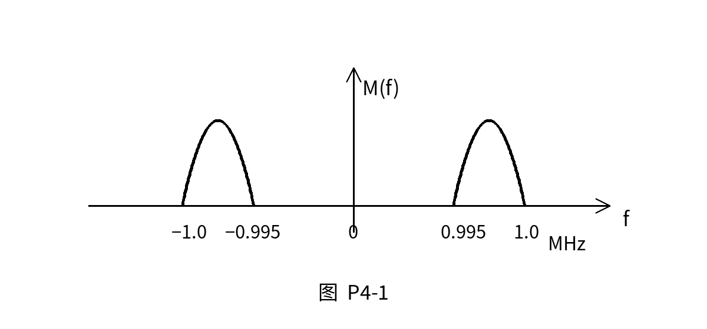

## 第4章 模拟信号的数字传输

### 4.1 引言

#### 1. 模拟信号为什么要数字化
实际通信中的很多信号本来是模拟信号，例如语音、图像、视频等。

为了便于传输、处理、存储和抗干扰，通常要把模拟信号变换成数字信号。

模拟信号数字化的一般过程为：

1. 抽样
2. 量化
3. 编码

也就是：

$$
\text{模拟信号} \rightarrow \text{抽样信号} \rightarrow \text{量化信号} \rightarrow \text{数字码流}
$$

---

#### 2. 波形编码、参量编码和混合编码

1. 波形编码

直接对模拟信号的波形进行抽样、量化和编码，尽量保持原波形的形状。

典型方法：

- PCM
- DPCM
- 增量调制 DM

2. 参量编码

不直接保存整个波形，而是提取信号的特征参数进行编码。

3. 混合编码

同时利用波形信息和参数信息。

---

#### 3. 本章重点
本章主要讨论：

- 抽样
- 量化
- PCM
- A 律 13 折线编码
- DPCM
- 增量调制 DM

---

### 4.2 抽样

#### 1. 抽样的含义
抽样就是把时间连续的模拟信号变成时间离散的信号。

也就是说，原来的模拟信号在任意时刻都有值，而抽样后只保留某些离散时刻的值。

设抽样周期为 $T_s$，抽样频率为 $f_s$，则：

$$
f_s=\frac{1}{T_s}
$$

其中：

- $T_s$：抽样间隔，单位为秒
- $f_s$：抽样频率，单位为 Hz

---

#### 2. 低通信号抽样定理

低通信号是指频谱从低频附近开始，一般可以认为从 $0$ 附近开始，到最高频率 $f_H$ 结束。

若低通信号的最高频率为 $f_H$，为了能由抽样值无失真恢复原信号，抽样频率应满足：

$$
f_s \ge 2f_H
$$

或写成抽样间隔：

$$
T_s \le \frac{1}{2f_H}
$$

其中：

- $f_H$：信号最高频率
- $2f_H$：奈奎斯特抽样速率
- $\frac{1}{2f_H}$：奈奎斯特抽样间隔

---

#### 3. 奈奎斯特抽样速率

对最高频率为 $f_H$ 的低通信号，最低允许抽样频率为：

$$
f_{s,\min}=2f_H
$$

这个最低抽样频率称为奈奎斯特抽样速率。

如果低于这个频率，抽样后频谱会发生混叠，接收端无法无失真恢复原信号。

---

#### 4. 频谱混叠

抽样以后，原信号频谱会以抽样频率 $f_s$ 为间隔周期性重复。

如果抽样频率太低，相邻频谱互相重叠，就会发生频谱混叠。

频谱混叠的结果是：

- 原信号的不同频率成分混在一起
- 接收端低通滤波器无法把原信号完整分离出来
- 原信号不能无失真恢复

避免混叠的基本条件是：

$$
f_s \ge 2f_H
$$

---

#### 5. 带通信号抽样

带通信号的频谱不从 $0$ 开始，而是集中在某一个频带范围内。

设带通信号的频率范围为：

$$
f_L \sim f_H
$$

则带宽为：

$$
B=f_H-f_L
$$

其中：

- $f_L$：最低频率
- $f_H$：最高频率
- $B$：信号带宽

---

#### 6. 低通抽样和带通抽样的判断

判断方法：

1. 如果信号频谱从 $0$ 附近开始，一直到最高频率 $f_H$，按低通信号处理：

$$
f_s \ge 2f_H
$$

2. 如果信号频谱集中在 $f_L \sim f_H$，且最低频率 $f_L$ 明显大于带宽 $B$，可以按带通信号处理。

3. 当带通信号的带宽 $B$ 大于信号最低频率 $f_L$ 时，通常把它当作低通信号处理。

---

#### 7. 带通抽样频率范围

对带通信号，抽样频率不是简单地取 $2f_H$。

设：

$$
B=f_H-f_L
$$

当存在整数 $n$ 时，抽样频率可满足：

$$
\frac{2f_H}{n} \le f_s \le \frac{2f_L}{n-1}
$$

其中 $n$ 一般按下面方式确定：

$$
n \le \frac{f_H}{B}
$$

通常取满足条件的最大整数 $n$，这样可以使抽样频率尽量低。

---

#### 8. 带通信号抽样的几个重要结论

1. 带通信号的最低抽样频率一般位于：

$$
2B \sim 4B
$$

2. 当 $f_H$ 是 $B$ 的整数倍时，最低抽样频率为：

$$
f_s=2B
$$

3. 当 $f_L \gg B$ 时，最低抽样频率近似为：

$$
f_s \approx 2B
$$

4. 带通抽样时，不能认为任意大于最低抽样频率的 $f_s$ 都一定可以。

带通抽样要使频谱不混叠，必须让 $f_s$ 落在允许范围内。

---

#### 9. 抽样后如何恢复原信号

抽样后，信号频谱会重复出现。

恢复原信号时，需要用滤波器选出原信号所在的那一段频谱。

对低通信号，一般使用低通滤波器恢复。

低通滤波器的作用是：

- 允许低频范围内的信号通过
- 滤除抽样后产生的高频重复频谱

如果信号最高频率为 $f_H$，则理想低通滤波器的最小带宽应至少覆盖原信号频带，即：

$$
B_{\text{LPF}} \ge f_H
$$

---

### 4.3 量化

#### 1. 量化的含义
抽样以后，信号在时间上已经离散，但抽样值的幅度仍然可以连续变化。

量化就是把连续变化的抽样值幅度，用有限个离散电平近似表示。

也就是说：

$$
\text{连续幅度} \rightarrow \text{有限个离散幅度}
$$

---

#### 2. 为什么要量化
数字系统只能处理有限位的二进制码。

如果抽样值幅度仍然连续，就无法直接用有限位二进制码表示。

所以必须进行量化，把无限多种可能的幅度值变成有限个量化电平。

---

#### 3. 量化级数与编码位数
若量化级数为 $M$，每个抽样值用 $n$ 位二进制码表示，则：

$$
M=2^n
$$

或：

$$
n=\log_2 M
$$

若 $M$ 不是 $2$ 的整数次幂，则编码位数应取：

$$
n=\lceil \log_2 M \rceil
$$

---

#### 4. 均匀量化
均匀量化是指量化区间长度相等。

设量化范围为 $[-V,V]$，量化级数为 $M$，则量化间隔可写为：

$$
\Delta=\frac{2V}{M}
$$

---

#### 5. 量化误差
量化误差是原抽样值与量化输出值之间的差。

设原抽样值为 $x$，量化输出值为 $x_q$，则量化误差为：

$$
e_q=x-x_q
$$

若按量化区间中点作为输出，则最大量化误差为：

$$
|e_q|_{\max}=\frac{\Delta}{2}
$$

---

#### 6. 均匀量化的主要问题
均匀量化时，每个量化间隔都相同。

对于大信号，量化误差相对较小。

对于小信号，量化误差相对较大。

所以均匀量化的主要问题是：

小信号量化信噪比较差。

---

#### 7. 非均匀量化
非均匀量化是指量化间隔不相等。

一般规律是：

- 小信号：量化间隔小
- 大信号：量化间隔大

这样可以改善小信号的量化性能。

---

#### 8. 压缩和扩张
非均匀量化通常通过压缩和扩张实现。

发送端先对信号进行压缩，使小信号被放大，大信号被压缩。

接收端再进行扩张，恢复原来的动态范围。

过程为：

$$
\text{原信号} \rightarrow \text{压缩} \rightarrow \text{均匀量化} \rightarrow \text{编码}
$$

接收端：

$$
\text{译码} \rightarrow \text{扩张} \rightarrow \text{恢复信号}
$$

---

### 4.4 PCM

#### 1. PCM 的含义
PCM 是脉冲编码调制。

PCM 的基本过程包括：

1. 抽样
2. 量化
3. 编码

即：

$$
\text{模拟信号} \rightarrow \text{PAM 抽样值} \rightarrow \text{量化值} \rightarrow \text{PCM 码流}
$$

---

#### 2. PCM 编码过程
PCM 编码的作用是把量化后的离散电平变成二进制码组。

例如每个样值用 $8$ 位编码，则一个样值对应一个 $8$ 位二进制码。

---

#### 3. A 律 13 折线编码

A 律 13 折线是一种非均匀量化编码方法。

它用折线近似 A 律压缩特性。

A 律 13 折线的特点：

1. 正、负两个方向对称
2. 正方向分成 8 个段落
3. 负方向也分成 8 个段落
4. 靠近原点的两段斜率相同，因此总共称为 13 折线
5. 小信号量化间隔小，大信号量化间隔大
6. 适合语音信号编码

---

#### 4. A 律 13 折线 8 位折叠码结构

A 律 13 折线常用 8 位折叠码表示：

$$
C_1C_2C_3C_4C_5C_6C_7C_8
$$

其中：

- $C_1$：极性码
- $C_2C_3C_4$：段落码
- $C_5C_6C_7C_8$：段内码

一般规定：

- 正极性：$C_1=1$
- 负极性：$C_1=0$

---

#### 5. 段落码

段落码用 $3$ 位表示，因此可以表示 $8$ 个段落。

| 段落号 | 起始电平 | 段落码 | 段内量化间隔 |
|---|---:|---:|---:|
| 1 | 0 | 000 | $\Delta$ |
| 2 | 16 | 001 | $\Delta$ |
| 3 | 32 | 010 | $2\Delta$ |
| 4 | 64 | 011 | $4\Delta$ |
| 5 | 128 | 100 | $8\Delta$ |
| 6 | 256 | 101 | $16\Delta$ |
| 7 | 512 | 110 | $32\Delta$ |
| 8 | 1024 | 111 | $64\Delta$ |

每个段落内部再分成 16 个小区间，因此段内码需要 4 位。

---

#### 6. 段内码
段内码表示样值落在该段落中的第几个小区间。

设样值绝对值为 $I_s$，所在段落起始电平为 $L_i$，该段量化间隔为 $\Delta_i$，则段内序号为：

$$
j=\left\lfloor \frac{I_s-L_i}{\Delta_i} \right\rfloor
$$

其中：

$$
j=0,1,2,\cdots,15
$$

把 $j$ 写成 4 位二进制数，就是段内码 $C_5C_6C_7C_8$。

---

#### 7. 量化输出与量化误差

按中点输出时，量化输出值为：

$$
I_q=L_i+\left(j+\frac{1}{2}\right)\Delta_i
$$

量化误差为：

$$
e_q=I_s-I_q
$$

在本章习题中，量化误差按中点输出计算。

---

#### 8. 7 位非线性码与 11 位线性码转换

A 律 13 折线编码中，除去极性码后，剩下 7 位非线性幅度码：

$$
C_2C_3C_4C_5C_6C_7C_8
$$

其中：

- $C_2C_3C_4$：段落码
- $C_5C_6C_7C_8$：段内码

转换成 11 位线性码时，实质是把段内码放到对应的二进制权位上。

段落越高，段内码对应的权值越大。

---

#### 9. 折叠二进制码的优点

折叠二进制码只用一位表示极性，其余位表示幅度。

它的优点是：

1. 正、负信号编码对称
2. 编码和译码电路较简单
3. 对小信号更友好
4. 传输误码对语音质量的影响相对较小

---

### 4.5 DPCM

#### 1. DPCM 的含义
DPCM 是差分脉冲编码调制。

它不是直接编码当前样值，而是编码当前样值与预测值之间的差值。

---

#### 2. DPCM 的基本思想
实际语音信号相邻样值之间通常具有相关性。

也就是说，当前样值和前一个样值往往比较接近。

所以可以用过去的样值预测当前样值，只传输预测误差。

设当前样值为 $x(k)$，预测值为 $x'(k)$，则预测误差为：

$$
e(k)=x(k)-x'(k)
$$

DPCM 只对 $e(k)$ 进行量化和编码。

---

#### 3. DPCM 的优点
因为预测误差通常比原样值小，所以可以用较少的量化级数表示。

DPCM 的主要优点是：

1. 减少编码位数
2. 降低传输码率
3. 提高编码效率

---

#### 4. DPCM 发送端组成
DPCM 发送端一般包括：

1. 抽样器
2. 预测器
3. 求差器
4. 量化器
5. 编码器

基本过程为：

$$
x(k)-x'(k)=e(k)
$$

然后对 $e(k)$ 进行量化和编码。

---

#### 5. DPCM 接收端组成
DPCM 接收端一般包括：

1. 译码器
2. 预测器
3. 相加器
4. 低通滤波器

接收端根据收到的差值和本地预测值相加，恢复样值序列。

---

### 4.6 增量调制

#### 1. 增量调制的含义
增量调制也叫 DM。

它可以看作 DPCM 的一种特殊形式。

DM 每次只发送 1 位码，用来表示当前样值相对于预测值是增大还是减小。

---

#### 2. 增量调制的基本思想
如果当前样值比预测值大，就发送表示“上升”的码。

如果当前样值比预测值小，就发送表示“下降”的码。

常见表示方法为：

- $1$：上升一个台阶 $+\Delta$
- $0$：下降一个台阶 $-\Delta$

---

#### 3. 增量调制的特点

增量调制的特点：

1. 每次只传输 1 位码
2. 编译码设备简单
3. 结构比 PCM 简单
4. 抽样频率通常要比 PCM 高
5. 性能一般不如 PCM

---

#### 4. 增量调制的两类量化噪声

1. 一般量化噪声

当台阶 $\Delta$ 太大时，重建信号会在原信号附近上下摆动，产生一般量化噪声。

2. 过载量化噪声

当信号变化太快，而台阶 $\Delta$ 或抽样频率不够时，阶梯波跟不上原信号变化，就会产生过载量化噪声。

避免过载的基本条件是：

$$
\frac{\Delta}{T_s} \ge \max \left|\frac{dm(t)}{dt}\right|
$$

因为：

$$
T_s=\frac{1}{f_s}
$$

所以也可以写成：

$$
\Delta f_s \ge \max \left|\frac{dm(t)}{dt}\right|
$$

---

## 课后习题

### 1.

什么是低通抽样定理，带通抽样定理，奈奎斯特抽样速率？

解：

低通抽样定理：

若低通信号的最高频率为 $f_H$，为了能从抽样信号中无失真恢复原信号，抽样频率必须满足：

$$
f_s \ge 2f_H
$$

带通抽样定理：

若带通信号的频率范围为 $f_L \sim f_H$，带宽为：

$$
B=f_H-f_L
$$

则可在满足频谱不混叠的条件下，用低于 $2f_H$ 的抽样频率进行抽样。

其抽样频率可满足：

$$
\frac{2f_H}{n} \le f_s \le \frac{2f_L}{n-1}
$$

奈奎斯特抽样速率：

对最高频率为 $f_H$ 的低通信号，最低抽样频率为：

$$
f_{s,\min}=2f_H
$$

这个最低抽样频率称为奈奎斯特抽样速率。

---

### 2.

已抽样信号的频谱混叠是什么原因引起的？若要求从已抽样信号中无失真地恢复出原信号，抽样频率应满足什么条件？

解：

抽样以后，原信号频谱会以抽样频率 $f_s$ 为间隔周期性重复。

如果抽样频率过低，相邻重复频谱发生重叠，就会产生频谱混叠。

对低通信号，若信号最高频率为 $f_H$，为避免混叠，应满足：

$$
f_s \ge 2f_H
$$

对带通信号，应使抽样频率满足带通抽样条件：

$$
\frac{2f_H}{n} \le f_s \le \frac{2f_L}{n-1}
$$

---

### 3.

一个带通信号 $m(t)$ 的频谱如下图所示。如果 $m(t)$ 被抽样，并且要求无失真地恢复原信号，试问最低抽样频率应是多少？

解：

由图可知，信号正频率部分范围为：

$$
0.995\text{ MHz} \sim 1.0\text{ MHz}
$$

所以：

$$
f_L=0.995\text{ MHz}
$$

$$
f_H=1.0\text{ MHz}
$$

带宽为：

$$
B=f_H-f_L=1.0-0.995=0.005\text{ MHz}=5\text{ kHz}
$$

计算：

$$
\frac{f_H}{B}=\frac{1000}{5}=200
$$

因为 $f_H$ 是 $B$ 的整数倍，所以最低抽样频率为：

$$
f_s=2B=2\times 5=10\text{ kHz}
$$

答：

$$
f_{s,\min}=10\text{ kHz}
$$

---

### 4.

已知一基带信号 $m(t)=\cos 2\pi t+2\cos 4\pi t$，对其信号进行理想抽样，为了在接收端能不失真地从抽样信号中恢复出原始基带信号，试问抽样间隔应如何选择？

解：

信号为：

$$
m(t)=\cos 2\pi t+2\cos 4\pi t
$$

其中：

$$
\cos 2\pi t
$$

对应频率为：

$$
f_1=1\text{ Hz}
$$

$$
\cos 4\pi t=\cos 2\pi \cdot 2t
$$

对应频率为：

$$
f_2=2\text{ Hz}
$$

所以信号最高频率为：

$$
f_H=2\text{ Hz}
$$

由低通抽样定理：

$$
f_s \ge 2f_H=2\times 2=4\text{ Hz}
$$

因此抽样间隔应满足：

$$
T_s \le \frac{1}{f_s}=\frac{1}{4}\text{ s}
$$

答：

$$
T_s \le 0.25\text{ s}
$$

---

### 5.

什么叫作量化？为什么要进行量化？

解：

量化是把连续变化的抽样值幅度，用有限个离散电平近似表示的过程。

抽样只使信号在时间上离散，但抽样值的幅度仍然连续。

数字系统只能处理有限位二进制码，因此必须通过量化把连续幅度变成有限个量化电平，才能进一步编码成数字信号。

---

### 6.

什么是均匀量化？它的主要问题是什么？

解：

均匀量化是指量化间隔相等的量化方式。

设量化间隔为 $\Delta$，则各量化区间宽度都相同。

它的主要问题是：

对大信号来说，量化误差相对较小；对小信号来说，量化误差相对较大。

因此均匀量化时小信号的量化信噪比较低。

---

### 7.

什么是非均匀量化？在非均匀量化时，为什么要进行压缩和扩张？

解：

非均匀量化是指量化间隔不相等的量化方式。

通常采用：

- 小信号量化间隔小
- 大信号量化间隔大

这样可以改善小信号的量化信噪比。

非均匀量化通常通过压缩和扩张实现。

发送端进行压缩，使小信号被相对放大，大信号被相对压缩。

接收端进行扩张，使信号恢复原来的动态范围。

---

### 8.

均匀量化与非均匀量化有何区别？采用非均匀量化的主要目的是什么？

解：

均匀量化：

- 各量化间隔相等
- 实现简单
- 小信号量化信噪比较差

非均匀量化：

- 各量化间隔不相等
- 小信号量化间隔小
- 大信号量化间隔大
- 能改善小信号量化性能

采用非均匀量化的主要目的是：

提高小信号的量化信噪比，改善语音信号的编码质量。

---

### 9.

什么叫作 13 折线？它是怎样实现非均匀量化的？

解：

13 折线是用分段折线近似 A 律压缩特性的一种方法。

A 律 13 折线具有正、负对称结构。

正方向分为 8 段，负方向也分为 8 段，但靠近原点的两段在同一直线上，因此总共称为 13 折线。

它实现非均匀量化的方式是：

1. 先对输入信号进行压缩
2. 再进行均匀量化
3. 压缩后的小信号被相对放大，因此小信号对应较小的量化间隔
4. 大信号被相对压缩，因此大信号对应较大的量化间隔

所以它可以达到非均匀量化的效果。

---

### 10.

A 律压缩特性是近似折线特性，其特性如下。当量化级数 $N=128$，最小量化间隔为 $\Delta$ 时，试求：

| x | 0 | 1/8 | 1/4 | 1/2 | 1 |
|---|---|-----|-----|-----|---|
| y | 0 | 1/4 | 2/4 | 3/4 | 1 |

（1）各量化段的量化间隔 $\Delta_i$ 等于多少？

（2）段落码、段内码位数各为多少？

解：

由题意，量化级数为：

$$
N=128
$$

折线共有 4 个量化段，每段在压缩后的纵轴上占相同范围，因此每段量化级数为：

$$
\frac{128}{4}=32
$$

各段对应的输入范围分别为：

$$
0 \sim \frac{1}{8}
$$

$$
\frac{1}{8} \sim \frac{1}{4}
$$

$$
\frac{1}{4} \sim \frac{1}{2}
$$

$$
\frac{1}{2} \sim 1
$$

前两段宽度相同，设最小量化间隔为 $\Delta$，则：

$$
\Delta_1=\Delta
$$

$$
\Delta_2=\Delta
$$

第三段宽度是前两段的 2 倍，所以：

$$
\Delta_3=2\Delta
$$

第四段宽度是第三段的 2 倍，所以：

$$
\Delta_4=4\Delta
$$

所以：

$$
\Delta_1=\Delta_2=\Delta,\quad \Delta_3=2\Delta,\quad \Delta_4=4\Delta
$$

因为共有 4 个段落，所以段落码位数为：

$$
\log_2 4=2
$$

每段有 32 个量化级，所以段内码位数为：

$$
\log_2 32=5
$$

答：

- 各段量化间隔：$\Delta,\Delta,2\Delta,4\Delta$
- 段落码：2 位
- 段内码：5 位

---

### 11.

已知信号幅度范围为 $-10\text{ V}\sim +10\text{ V}$，若 $m(t)$ 被均匀量化为 41 个电平，试确定所需的二进制码组的位数 $N$ 和量化级间隔 $\Delta V$。

解：

量化电平数为：

$$
M=41
$$

所需二进制码组位数为：

$$
N=\lceil \log_2 41\rceil
$$

因为：

$$
2^5=32<41<64=2^6
$$

所以：

$$
N=6
$$

量化范围为：

$$
-10\text{ V}\sim +10\text{ V}
$$

总范围为：

$$
20\text{ V}
$$

若按 41 个量化电平计算，相邻量化电平间隔为：

$$
\Delta V=\frac{20}{41-1}=0.5\text{ V}
$$

答：

$$
N=6
$$

$$
\Delta V=0.5\text{ V}
$$

---

### 12.

什么是 A 律压缩？什么是 $\mu$ 律压缩？A 律 13 折线有什么特点？

解：

A 律压缩和 $\mu$ 律压缩都是非均匀量化中常用的压缩方法。

A 律压缩主要用于欧洲和中国等地区的 PCM 系统。

$\mu$ 律压缩主要用于北美和日本等地区的 PCM 系统。

它们的共同作用是：

- 对小信号进行较强压缩处理，使小信号量化间隔变小
- 对大信号进行较弱压缩处理，使大信号量化间隔变大
- 改善小信号的量化信噪比

A 律 13 折线的特点：

1. 用折线近似 A 律压缩特性
2. 正、负方向对称
3. 正方向 8 段，负方向 8 段
4. 靠近原点的两段在同一直线上，所以称为 13 折线
5. 采用 8 位折叠码，通常包括 1 位极性码、3 位段落码、4 位段内码
6. 每个段落内均匀量化 16 级
7. 段落越高，量化间隔越大

---

### 13.

对于 A 律 13 折线 8 位折叠码的编码器，当抽样值为 $-600\Delta$ 时，其码字判决过程如何？

解：

抽样值为负，所以极性码为：

$$
C_1=0
$$

取绝对值：

$$
|I_s|=600\Delta
$$

确定段落：

$$
512\Delta \le 600\Delta <1024\Delta
$$

所以样值位于第 7 段。

第 7 段段落码为：

$$
C_2C_3C_4=110
$$

第 7 段起始电平为：

$$
L=512\Delta
$$

第 7 段量化间隔为：

$$
\Delta_i=32\Delta
$$

计算段内序号：

$$
j=\left\lfloor \frac{600-512}{32} \right\rfloor
=\left\lfloor \frac{88}{32} \right\rfloor
=2
$$

把 $2$ 写成 4 位二进制：

$$
C_5C_6C_7C_8=0010
$$

所以输出码组为：

$$
C_1C_2C_3C_4C_5C_6C_7C_8=0\ 110\ 0010
$$

即：

$$
01100010
$$

答：

$$
01100010
$$

---

### 14.

什么是脉冲编码调制？在脉冲编码调制中选用折叠二进制码为什么比选用自然二进制码好？

解：

脉冲编码调制即 PCM，是把模拟信号经过抽样、量化和编码后变成数字码流的过程。

PCM 的基本步骤为：

1. 抽样
2. 量化
3. 编码

选用折叠二进制码比自然二进制码好的原因：

1. 折叠二进制码用一位表示极性，其余位表示幅度
2. 正、负信号编码对称
3. 编译码电路比较简单
4. 对小信号误码影响较小
5. 更适合语音信号的非均匀量化编码

---

### 15.

什么是增量调制？它与脉冲编码调制有何异同？

解：

增量调制是一种只用 1 位码表示相邻抽样值变化方向的编码方式。

如果当前样值比预测值大，则发送表示上升的码。

如果当前样值比预测值小，则发送表示下降的码。

相同点：

1. 都属于波形编码
2. 都要对模拟信号进行抽样
3. 都把模拟信号变成数字信号

不同点：

1. PCM 对每个抽样值的幅度进行量化和编码
2. 增量调制只编码相邻样值的变化方向
3. PCM 每个样值通常需要多位码
4. 增量调制每次只需要 1 位码
5. 增量调制设备简单，但通常需要更高的抽样频率

---

### 16.

对信号 $m(t)=M\sin 2\pi f_0t$ 进行简单增量调制，若台阶 $\Delta$ 和抽样频率选择能既保证不过载，又保证不因信号振幅太小而使量化调制器不能正常编码，试证明此时要求 $f_s\ge \pi f_0$。

解：

对增量调制，为避免过载，应满足：

$$
\frac{\Delta}{T_s} \ge \max \left|\frac{dm(t)}{dt}\right|
$$

因为：

$$
T_s=\frac{1}{f_s}
$$

所以：

$$
\Delta f_s \ge \max \left|\frac{dm(t)}{dt}\right|
$$

已知：

$$
m(t)=M\sin 2\pi f_0t
$$

求导：

$$
\frac{dm(t)}{dt}=2\pi f_0M\cos 2\pi f_0t
$$

所以最大斜率为：

$$
\max \left|\frac{dm(t)}{dt}\right|=2\pi f_0M
$$

因此不过载条件为：

$$
\Delta f_s \ge 2\pi f_0M
$$

即：

$$
f_s \ge \frac{2\pi f_0M}{\Delta}
$$

为了保证信号振幅不至于太小而不能正常编码，台阶不能大于信号峰峰变化范围，通常要求：

$$
\Delta \le 2M
$$

所以：

$$
\frac{2\pi f_0M}{\Delta} \ge \frac{2\pi f_0M}{2M}
$$

即：

$$
\frac{2\pi f_0M}{\Delta} \ge \pi f_0
$$

因此：

$$
f_s \ge \pi f_0
$$

证毕。

---

### 17.

什么是差分脉冲编码调制？试说明差分脉冲编码调制系统中各个组成部分的功能。

解：

差分脉冲编码调制即 DPCM。

DPCM 不是直接传输当前样值，而是传输当前样值与预测值之间的差值。

设当前样值为 $x(k)$，预测值为 $x'(k)$，则差值为：

$$
e(k)=x(k)-x'(k)
$$

DPCM 对 $e(k)$ 进行量化和编码。

发送端各组成部分的功能：

1. 抽样器

把模拟信号变成离散样值序列。

2. 预测器

根据过去的样值预测当前样值。

3. 求差器

求当前样值与预测值的差：

$$
e(k)=x(k)-x'(k)
$$

4. 量化器

对预测误差 $e(k)$ 进行量化。

5. 编码器

把量化后的预测误差变成数字码组。

接收端各组成部分的功能：

1. 译码器

把接收到的码组还原成量化后的差值。

2. 相加器

把差值与预测值相加，恢复样值。

3. 预测器

根据已经恢复的样值产生下一次预测值。

4. 低通滤波器

把恢复的样值序列平滑成模拟信号。

DPCM 的主要目的是：

利用信号相邻样值之间的相关性，减小编码位数，降低传输码率。

---

### 18.

采用 13 折线 A 律编码，设最小量化间隔为 1 个单位，已知抽样脉冲值为 $+635$ 个单位。

（1）试求此编码器的输出码组，并计算量化误差。

（2）写出对应于该 7 位码（不包括极性码）的均匀量化 11 位码（采用自然二进制码）。

解：

（1）求输出码组和量化误差

抽样值为正，所以极性码为：

$$
C_1=1
$$

抽样值绝对值为：

$$
|I_s|=635
$$

确定段落：

$$
512 \le 635 <1024
$$

所以样值位于第 7 段。

第 7 段段落码为：

$$
C_2C_3C_4=110
$$

第 7 段起始电平为：

$$
L=512
$$

第 7 段量化间隔为：

$$
\Delta_i=32
$$

计算段内序号：

$$
j=\left\lfloor \frac{635-512}{32} \right\rfloor
=\left\lfloor \frac{123}{32} \right\rfloor
=3
$$

把 $3$ 写成 4 位二进制：

$$
C_5C_6C_7C_8=0011
$$

所以输出码组为：

$$
C_1C_2C_3C_4C_5C_6C_7C_8=1\ 110\ 0011
$$

即：

$$
11100011
$$

该样值落在区间：

$$
608 \sim 640
$$

按中点输出，量化输出值为：

$$
I_q=608+\frac{32}{2}=624
$$

量化误差为：

$$
e_q=635-624=11
$$

所以：

$$
e_q=11
$$

（2）写出对应的均匀量化 11 位码

不包括极性码时，7 位非线性幅度码为：

$$
1100011
$$

其中：

- 段落码：$110$
- 段内码：$0011$

第 7 段的 11 位线性码形式为：

$$
0\ 1\ M_5M_6M_7M_8\ 00000
$$

把：

$$
M_5M_6M_7M_8=0011
$$

代入，得：

$$
01001100000
$$

答：

输出码组为：

$$
11100011
$$

量化误差为：

$$
e_q=11
$$

对应的 11 位均匀量化自然二进制码为：

$$
01001100000
$$

---

### 19.

试述差分脉冲编码调制（DPCM）的工作原理。

解：

DPCM 的基本思想是利用信号相邻样值之间的相关性。

由于相邻抽样值通常变化不大，因此可以根据过去的样值预测当前样值，然后只传输当前样值与预测值之间的差值。

设当前样值为 $x(k)$，预测值为 $x'(k)$，则预测误差为：

$$
e(k)=x(k)-x'(k)
$$

发送端对预测误差 $e(k)$ 进行量化和编码。

接收端把译码得到的差值与本地预测值相加，恢复当前样值。

即：

$$
x(k)=x'(k)+e(k)
$$

DPCM 的优点是：

1. 预测误差通常小于原信号样值
2. 可用较少的量化级数表示
3. 可以减少编码位数
4. 可以降低传输码率
5. 提高编码效率

因此，DPCM 是在 PCM 基础上利用预测技术改进编码效率的一种方法。