## 第6章 数字基带传输

### 6.1 引言

#### 1. 什么是数字基带信号

数字基带信号是由数字信息直接形成的电脉冲信号，它没有经过载波调制。

也就是说，数字基带信号直接用电平、脉冲、跳变等形式表示数字信息。

例如二进制信息序列：

$$
101001
$$

可以用高低电平、正负电平、归零脉冲、曼彻斯特跳变等方式表示。

---

#### 2. 什么是数字基带传输

数字基带传输是指：

不经过载波调制，直接把数字基带信号送入信道进行传输。

数字信号的传输方式可以分为：

| 类型 | 含义 | 举例 |
|---|---|---|
| 基带传输 | 不调制，直接传输数字基带信号 | 局域网、短距离数字传输 |
| 频带传输 | 先调制到载波上，再传输 | ASK、FSK、PSK、QAM |

本章讨论的是数字基带传输。

---

#### 3. 数字基带传输系统的基本组成

数字基带传输系统通常包括：

| 部分 | 作用 |
|---|---|
| 发送滤波器 | 形成适合传输的基带波形 |
| 信道 | 传输信号，同时也会引入失真和噪声 |
| 接收滤波器 | 抑制噪声，改善接收波形 |
| 抽样判决器 | 在最佳抽样时刻判决接收码元 |

系统总传输特性为：

$$
H(\omega)=H_T(\omega)H_C(\omega)H_R(\omega)
$$

其中：

- $H_T(\omega)$：发送滤波器传输特性；
- $H_C(\omega)$：信道传输特性；
- $H_R(\omega)$：接收滤波器传输特性；
- $H(\omega)$：整个基带传输系统的总传输特性。

---

#### 4. 本章要解决的核心问题

本章主要围绕以下几个问题展开：

| 问题 | 对应知识点 |
|---|---|
| 数字信息怎么变成电脉冲？ | 数字基带信号码型 |
| 不同码型有什么优缺点？ | 单极性码、双极性码、AMI、HDB3、曼彻斯特码等 |
| 数字基带信号占用多宽频带？ | 功率谱 |
| 信道不理想会造成什么问题？ | 码间串扰 |
| 怎样才能无码间串扰？ | 奈奎斯特第一准则 |
| 理想低通和升余弦系统有什么区别？ | 无码间串扰传输特性 |
| 接收波形质量怎么看？ | 眼图 |
| 信道失真怎么补偿？ | 均衡 |

---

### 6.2 数字基带信号码型

#### 1. 码型选择要考虑什么

数字基带传输中，不能只考虑“能不能表示 0 和 1”，还要考虑传输性能。

选择码型时主要看：

| 考虑因素 | 含义 |
|---|---|
| 是否含直流分量 | 直流分量不利于通过变压器、电容耦合线路 |
| 低频分量是否少 | 低频分量过多，容易受信道低频特性影响 |
| 是否容易提取同步 | 波形跳变越丰富，越容易恢复码元定时 |
| 抗干扰能力 | 判决电平间隔越大，抗噪声能力越强 |
| 是否抗极性反转 | 接收端正负接反时是否还能正确译码 |
| 是否有检错能力 | 能否利用编码规律发现错误 |
| 频带利用率 | 在一定带宽内能传输多少码元 |
| 实现复杂度 | 编码、译码电路是否复杂 |

---

#### 2. 单极性不归零码

单极性不归零码也称单极性 NRZ 码。

编码规则：

| 信息码 | 电平 |
|---|---|
| 1 | 正电平 $+A$ |
| 0 | 零电平 $0$ |

“不归零”的意思不是说波形永远不到零，而是说：

发送“1”时，在整个码元周期内一直保持正电平，中间不主动回到零电平。

如果发送“0”，电平本来就是零，这不叫“归零”。

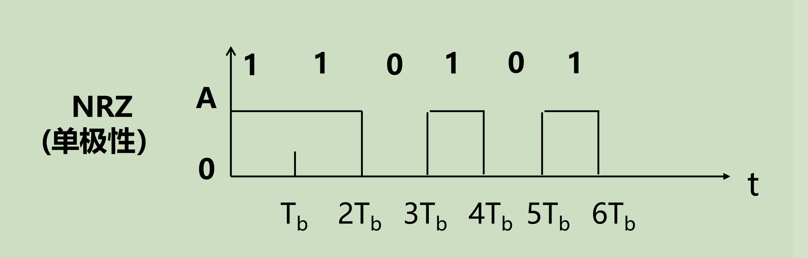

特点：

| 项目 | 结论 |
|---|---|
| 编码复杂度 | 简单 |
| 直流分量 | 有 |
| 同步能力 | 差 |
| 抗干扰能力 | 差 |
| 适用场景 | 极短距离、简单系统 |

主要缺点：

1. 长连 0 时，波形长时间为零；
2. 长连 1 时，波形长时间为高电平；
3. 跳变少，不容易提取同步信号；
4. 有直流分量，不适合某些交流耦合信道。

---

#### 3. 单极性归零码

单极性归零码也称单极性 RZ 码。

编码规则：

| 信息码 | 电平 |
|---|---|
| 1 | 码元周期的一部分为 $+A$，然后回到 $0$ |
| 0 | 整个码元周期为 $0$ |

若占空比为 $50\%$，则发送“1”时：

- 前半个码元周期为 $+A$；
- 后半个码元周期回到 $0$。

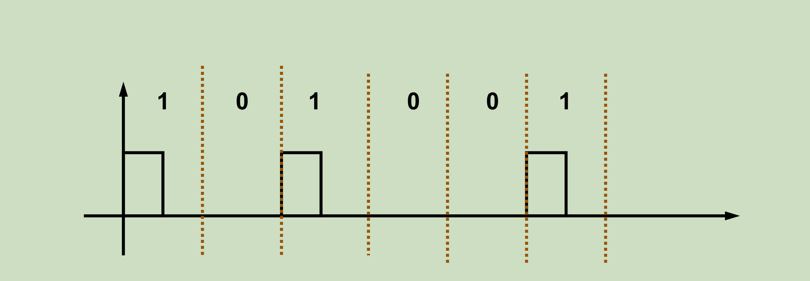

占空比定义为：

$$
D=\frac{\text{高电平持续时间}}{\text{码元持续时间}}
$$

若脉冲宽度为 $\tau$，码元间隔为 $T_s$，则：

$$
D=\frac{\tau}{T_s}
$$

单极性归零码的特点：

| 项目 | 结论 |
|---|---|
| 直流分量 | 有 |
| 同步能力 | 比单极性不归零码好 |
| 频带 | 比不归零码宽 |
| 抗干扰能力 | 仍然较差 |

为什么归零码频带更宽：

脉冲越窄，频谱越宽。

若不归零码：

$$
\tau=T_s
$$

第一个零点大约在：

$$
f=\frac{1}{\tau}=\frac{1}{T_s}
$$

若归零码占空比为 $50\%$：

$$
\tau=\frac{T_s}{2}
$$

第一个零点大约在：

$$
f=\frac{1}{\tau}=\frac{2}{T_s}
$$

所以归零码比不归零码占用更宽频带。

---

#### 4. 双极性不归零码

双极性不归零码用正、负两个电平表示二进制信息。

编码规则：

| 信息码 | 电平 |
|---|---|
| 1 | 正电平 $+A$ |
| 0 | 负电平 $-A$ |

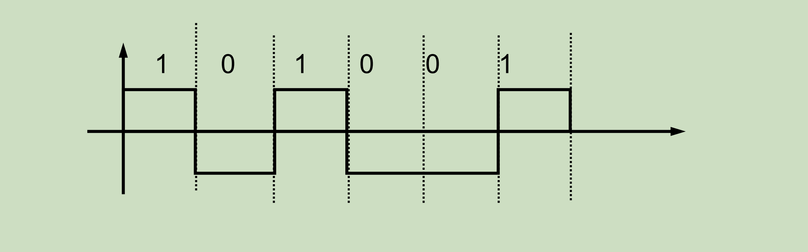

特点：

| 项目 | 结论 |
|---|---|
| 直流分量 | 当 1 和 0 等概率时无直流分量 |
| 抗干扰能力 | 比单极性码强 |
| 同步能力 | 仍然较差 |
| 极性反转问题 | 容易出错 |

为什么抗干扰能力增强：

单极性不归零码的判决通常是在 $0$ 和 $A$ 之间判决，判决电平常取：

$$
\frac{A}{2}
$$

双极性不归零码的两个电平是 $+A$ 和 $-A$，判决电平可以取：

$$
0
$$

两种电平距离更大，所以抗噪声能力更强。

---

#### 5. 双极性归零码

双极性归零码用正、负脉冲表示数字信息，并且每个脉冲只持续码元周期的一部分。

编码规则：

| 信息码 | 电平 |
|---|---|
| 1 | 正脉冲 $+A$ 后归零 |
| 0 | 负脉冲 $-A$ 后归零 |

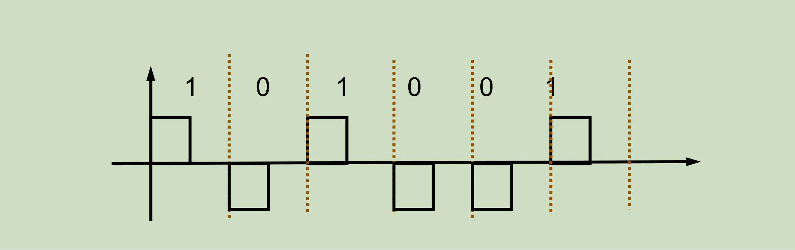

特点：

| 项目 | 结论 |
|---|---|
| 直流分量 | 当 1 和 0 等概率时无直流分量 |
| 同步能力 | 比双极性不归零码好 |
| 抗干扰能力 | 较好 |
| 频带 | 比不归零码宽 |

---

#### 6. 单极性码、双极性码、归零码、不归零码对比

| 码型 | 1 的表示 | 0 的表示 | 是否归零 | 直流分量 | 同步能力 | 频带 |
|---|---|---|---|---|---|---|
| 单极性不归零 | $+A$ | $0$ | 不归零 | 有 | 差 | 窄 |
| 单极性归零 | $+A$ 后回零 | $0$ | 归零 | 有 | 较好 | 宽 |
| 双极性不归零 | $+A$ | $-A$ | 不归零 | 等概时无 | 差 | 窄 |
| 双极性归零 | $+A$ 后回零 | $-A$ 后回零 | 归零 | 等概时无 | 较好 | 宽 |

---

#### 7. AMI 码

AMI 码称为信号交替反转码。

英文为：

$$
\text{Alternative Mark Inversion}
$$

编码规则：

| 信息码 | 线路码 |
|---|---|
| 0 | 零电平 |
| 1 | 正、负电平交替出现 |

例如，若第一个“1”取 $+A$，则信息码：

$$
1\ 0\ 1\ 1\ 0\ 0\ 1
$$

可编码为：

$$
+A\ 0\ -A\ +A\ 0\ 0\ -A
$$

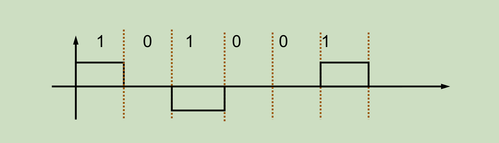

AMI 码的特点：

| 项目 | 结论 |
|---|---|
| 直流分量 | 无 |
| 低频分量 | 较小 |
| 同步能力 | 遇到长连零时较差 |
| 检错能力 | 可发现部分极性交替错误 |
| 适用场景 | 适合交流耦合线路 |

AMI 码的关键规律：

每出现一个“1”，其极性与上一个“1”的极性相反。

注意：

AMI 码不是差分码。

AMI 码只是让“1”的极性交替变化；差分码是用相邻码元之间“变或不变”来表示信息。两者思想不同。

---

#### 8. HDB3 码

HDB3 码称为三阶高密度双极性码，是 AMI 码的改进型。

AMI 码的主要缺点是：

连续 0 太多时，线路长时间没有脉冲，接收端不容易提取同步信号。

HDB3 码的目的：

在保持 AMI 码无直流分量优点的同时，限制连续 0 的个数，使线路中经常有跳变。

---

##### HDB3 编码规则

第一步：

先把原始信息码按 AMI 规则编码。

第二步：

检查 AMI 码中的连续 0。

如果连续 0 的个数少于 4，则不变。

如果出现 4 个连续 0，则用取代节替换。

常用取代节有两种：

$$
000V
$$

或：

$$
B00V
$$

其中：

| 符号 | 含义 |
|---|---|
| $V$ | 破坏 AMI 极性交替规律的脉冲 |
| $B$ | 调节脉冲，用于保持无直流分量 |
| $0$ | 零电平 |

---

##### $V$ 和 $B$ 的极性规律

$V$ 的作用是故意破坏 AMI 规律，因此：

$V$ 与前一个非零脉冲同极性。

在 $B00V$ 中：

$B$ 和 $V$ 同极性。

同时，$B$ 与它前面的非零脉冲反极性。

这样既能产生破坏点，便于识别，又能让正负脉冲总体平衡。

---

##### 选择 $000V$ 还是 $B00V$

判断相邻两个 $V$ 之间非零脉冲个数：

| 情况 | 取代节 |
|---|---|
| 相邻两个 $V$ 之间非零脉冲个数为奇数 | $000V$ |
| 相邻两个 $V$ 之间非零脉冲个数为偶数 | $B00V$ |

也可以理解为：

如果只加一个 $V$ 就能保持正负平衡，用 $000V$。

如果只加一个 $V$ 会破坏正负平衡，就加一个 $B$，用 $B00V$。

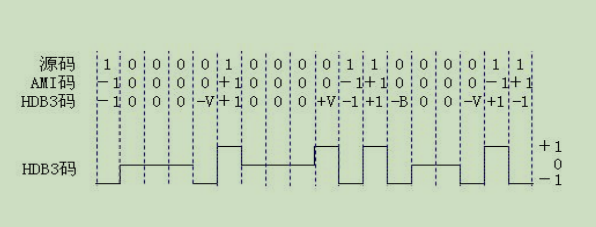

HDB3 码特点：

| 项目 | 结论 |
|---|---|
| 直流分量 | 无 |
| 同步能力 | 好 |
| 长连零问题 | 可以解决 |
| 检错能力 | 有一定检错能力 |
| 编码复杂度 | 比 AMI 复杂 |

---

#### 9. 差分码

差分码也称相对码。

差分码不是直接用电平的绝对值表示 0 和 1，而是用相邻码元之间是否发生变化表示信息。

常见约定之一：

| 信息码 | 差分表示 |
|---|---|
| 1 | 发生跳变 |
| 0 | 不发生跳变 |

也可以采用相反约定：

| 信息码 | 差分表示 |
|---|---|
| 0 | 发生跳变 |
| 1 | 不发生跳变 |

所以画差分码时必须先说明约定。

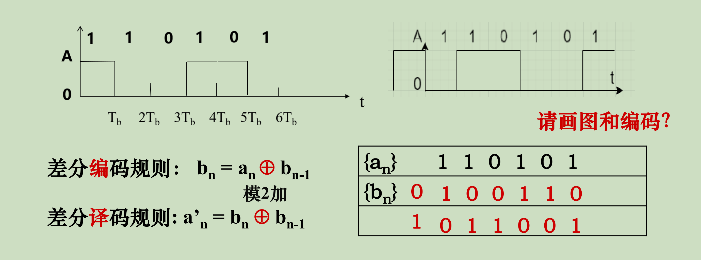

若采用“1 变，0 不变”，差分编码规则为：

$$
b_n=a_n\oplus b_{n-1}
$$

其中：

- $a_n$：原始绝对码；
- $b_n$：差分码；
- $\oplus$：模 2 加。

差分译码规则为：

$$
a_n=b_n\oplus b_{n-1}
$$

差分码特点：

| 项目 | 结论 |
|---|---|
| 表示方式 | 用变化关系表示信息 |
| 抗极性反转 | 可以 |
| 初始状态影响 | 可以消除 |
| 同步能力 | 取决于具体波形 |
| 主要优点 | 不怕整体极性反转 |

为什么差分码能抗极性反转：

如果整个接收波形正负反了，每个码元的绝对电平都会反，但相邻码元之间“变或不变”的关系不变，所以仍然能正确译码。

---

#### 10. AMI 码和差分码的区别

| 对比项 | AMI 码 | 差分码 |
|---|---|---|
| 核心规则 | “1”的极性交替 | 用相邻码元是否变化表示信息 |
| “0”的表示 | 零电平 | 取决于变化规则 |
| 是否抗极性反转 | 不主要依靠这个 | 可以抗极性反转 |
| 是否一定有零电平 | 有 | 不一定 |
| 主要作用 | 消除直流，减少低频 | 消除极性反转影响 |

AMI 码不是差分码。

AMI 的“交替”只发生在非零脉冲“1”之间；差分码关注的是相邻码元整体之间的变化关系。

---

#### 11. CMI 码

CMI 码称为传号反转码，也称 1B2B 码。

编码规则：

| 信息码 | 线路码 |
|---|---|
| 0 | 01 |
| 1 | 11 和 00 交替出现 |

例如，如果第一个“1”编码为 $11$，那么后面出现的“1”依次编码为 $00,11,00,\cdots$。

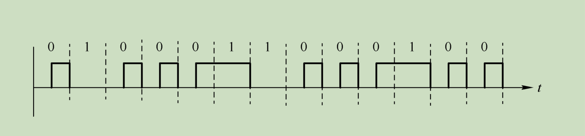

CMI 码特点：

| 项目 | 结论 |
|---|---|
| 直流分量 | 无 |
| 同步能力 | 好 |
| 检错能力 | 有一定检错能力 |
| 编码效率 | 低，1 bit 变成 2 bit |
| 所需带宽 | 较宽 |

CMI 码容易提取同步的原因：

每个信息码都变成两个线路码元，波形中跳变较多，接收端更容易从跳变中恢复定时信息。

---

#### 12. 曼彻斯特码

曼彻斯特码每个码元中间都有一次跳变。

常见约定之一：

| 信息码 | 跳变 |
|---|---|
| 1 | 高到低 |
| 0 | 低到高 |

也有教材采用相反约定，所以作图时要先说明。

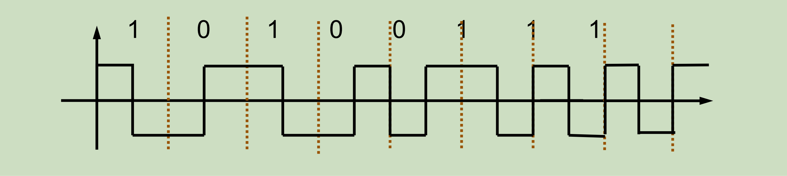

曼彻斯特码特点：

| 项目 | 结论 |
|---|---|
| 直流分量 | 无 |
| 同步能力 | 很好 |
| 抗极性反转 | 普通曼彻斯特不一定抗 |
| 带宽 | 较宽 |
| 编码效率 | 较低 |

为什么同步能力好：

每个码元中间必然有跳变，接收端可以利用这些跳变恢复时钟。

---

#### 13. 差分曼彻斯特码

差分曼彻斯特码结合了曼彻斯特码和差分码的思想。

一种常见约定：

| 规则 | 含义 |
|---|---|
| 码元中间 | 一定有跳变，用于同步 |
| 码元开始处有无跳变 | 用来表示信息 |

常见约定之一：

| 信息码 | 码元开始处 |
|---|---|
| 0 | 有跳变 |
| 1 | 无跳变 |

也有教材采用相反约定，所以作图必须先说明。

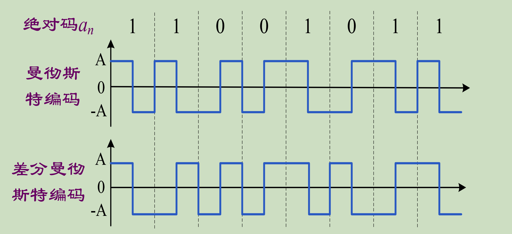

差分曼彻斯特码特点：

| 项目 | 结论 |
|---|---|
| 直流分量 | 无 |
| 同步能力 | 很好 |
| 抗极性反转 | 好 |
| 带宽 | 较宽 |
| 编码复杂度 | 比曼彻斯特码高 |

---

#### 14. 多元码

多元码是指一个码元可以取多个电平。

若一个码元有 $M$ 种可能取值，则每个码元携带的信息量为：

$$
\log_2 M
$$

单位是 bit/码元。

因此：

$$
R_b=R_B\log_2 M
$$

其中：

- $R_b$：信息传输速率；
- $R_B$：码元速率；
- $M$：进制数。

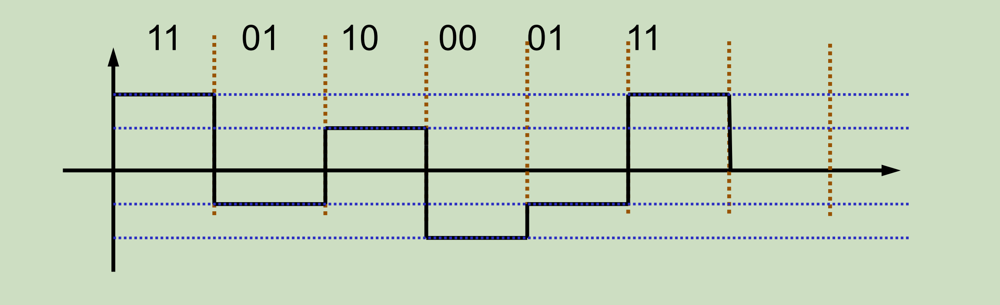

多元码特点：

| 项目 | 结论 |
|---|---|
| 信息速率 | 在相同码元速率下更高 |
| 码元速率 | 在相同信息速率下更低 |
| 频带利用率 | 高 |
| 抗干扰能力 | 较差 |
| 原因 | 电平间隔变小，容易误判 |

---

#### 15. 常见码型总对比

| 码型 | 直流分量 | 同步能力 | 抗极性反转 | 检错能力 | 频带占用 | 主要缺点 |
|---|---|---|---|---|---|---|
| 单极性不归零 | 有 | 差 | 差 | 无 | 窄 | 直流大，同步差 |
| 单极性归零 | 有 | 较好 | 差 | 无 | 宽 | 直流大，频带宽 |
| 双极性不归零 | 等概时无 | 差 | 差 | 无 | 窄 | 极性反转会错 |
| 双极性归零 | 等概时无 | 较好 | 差 | 无 | 宽 | 频带宽 |
| AMI | 无 | 长连零时差 | 一般 | 有一定能力 | 较窄 | 长连零问题 |
| HDB3 | 无 | 好 | 一般 | 有一定能力 | 较窄 | 编码复杂 |
| 差分码 | 视具体波形 | 视具体波形 | 好 | 无 | 视具体波形 | 需规定初态 |
| CMI | 无 | 好 | 一般 | 有一定能力 | 宽 | 编码效率低 |
| 曼彻斯特 | 无 | 很好 | 一般 | 有一定能力 | 宽 | 带宽较大 |
| 差分曼彻斯特 | 无 | 很好 | 好 | 有一定能力 | 宽 | 编码复杂 |
| 多元码 | 视编码而定 | 视编码而定 | 视编码而定 | 视编码而定 | 利用率高 | 抗噪声差 |

---

### 6.3 数字基带信号的功率谱

#### 1. 为什么要研究功率谱

数字基带信号是随机脉冲序列，不能简单用单个确定函数的傅里叶变换来描述。

因此通常研究它的功率谱密度。

功率谱可以回答：

1. 信号能量主要集中在哪些频率；
2. 信号是否含直流分量；
3. 信号是否含有定时分量；
4. 信号需要多大的传输带宽；
5. 码型是否适合某种信道。

---

#### 2. 随机数字基带信号的一般表达

数字基带信号可以写成：

$$
s(t)=\sum_{n=-\infty}^{+\infty}s_n(t)
$$

其中每个码元波形可能为：

$$
s_n(t)=
\begin{cases}
g_1(t-nT_s), & \text{概率为 }p\\
g_2(t-nT_s), & \text{概率为 }1-p
\end{cases}
$$

其中：

- $T_s$：码元间隔；
- $f_s=\dfrac{1}{T_s}$：码元速率；
- $g_1(t)$：一种码元波形；
- $g_2(t)$：另一种码元波形；
- $p$：出现 $g_1(t)$ 的概率；
- $1-p$：出现 $g_2(t)$ 的概率。

---

#### 3. 连续谱和离散谱

数字基带信号的功率谱通常由两部分组成：

| 类型 | 来源 | 图上表现 |
|---|---|---|
| 连续谱 | 随机变化部分 | 连续曲线 |
| 离散谱 | 确定性周期成分 | 竖直尖线 |

离散谱的尖线不是说幅度真的画成无穷高，而是表示冲激谱线，也就是某个频率上存在确定的周期成分。

常见离散谱：

| 位置 | 含义 |
|---|---|
| $f=0$ | 直流分量 |
| $f=f_s$ | 码元定时分量 |
| $f=2f_s,3f_s,\cdots$ | 高次定时谐波 |

---

#### 4. 什么时候会出现频谱尖线

判断是否有离散谱尖线，可以看信号中是否有确定的周期性成分。

| 情况 | 是否容易出现尖线 |
|---|---|
| 有非零平均值 | 容易在 $f=0$ 出现直流尖线 |
| 每个码元都有固定位置跳变 | 容易出现定时分量 |
| 波形完全随机且均值为零 | 离散谱可能没有 |
| 长连零导致无跳变 | 定时分量弱 |

例如：

单极性码中，若“1”和“0”等概率出现，平均值通常不为零，所以容易有直流分量。

双极性码中，若“1”和“0”等概率出现，平均值为零，所以通常无直流分量。

---

#### 5. $f$ 轴和 $\omega$ 轴的关系

频率 $f$ 和角频率 $\omega$ 的关系是：

$$
\omega=2\pi f
$$

所以：

$$
f=\frac{\omega}{2\pi}
$$

如果频谱图用 $\omega$ 作横轴，标出：

$$
\omega=\frac{2\pi}{T_s}
$$

对应的普通频率就是：

$$
f=\frac{1}{T_s}
$$

因此：

$$
\frac{2\pi}{T_s}
$$

不是“相当于”：

$$
\frac{1}{T_s}
$$

而是因为它们分别是角频率和普通频率表示。

---

#### 6. 脉冲宽度与频谱零点

矩形脉冲的频谱零点与脉冲宽度有关。

若脉冲宽度为：

$$
\tau
$$

则频谱第一个零点通常出现在：

$$
f=\frac{1}{\tau}
$$

如果用角频率表示，则是：

$$
\omega=\frac{2\pi}{\tau}
$$

所以：

| 码型 | 脉冲宽度 | 第一个频谱零点 |
|---|---|---|
| 不归零码 | $\tau=T_s$ | $f=\dfrac{1}{T_s}$ |
| 半占空归零码 | $\tau=\dfrac{T_s}{2}$ | $f=\dfrac{2}{T_s}$ |

这也是归零码比不归零码频带更宽的原因。

---

#### 7. 单极性码和双极性码的频谱区别

| 码型 | 平均值 | 直流分量 | 离散谱 | 说明 |
|---|---|---|---|---|
| 单极性码 | 通常不为零 | 有 | 可能有 | 容易出现直流尖线 |
| 双极性码 | 等概时为零 | 无 | 通常无 | 频谱主要为连续谱 |

如果“1”和“0”等概率出现，双极性码的正负电平平均抵消，所以无直流分量。

但如果“1”和“0”出现概率不等，即使是双极性码，也可能有直流分量。

---

#### 8. 如何判断是否容易提取同步信号

同步信号本质上来自码元定时信息。

判断一个码型是否容易提取同步，可以看：

1. 是否经常有电平跳变；
2. 长连 0 或长连 1 时是否仍有跳变；
3. 功率谱中是否有定时分量；
4. 是否存在固定的码元中间跳变。

| 码型 | 是否容易同步 | 原因 |
|---|---|---|
| 单极性不归零 | 不容易 | 长连 0 或长连 1 时无跳变 |
| 双极性不归零 | 不容易 | 长连同码时无跳变 |
| 单极性归零 | 较容易 | 发送 1 时有归零跳变 |
| 双极性归零 | 较容易 | 每个非零脉冲会回零 |
| AMI | 一般 | 长连 0 时无跳变 |
| HDB3 | 容易 | 消除了长连零 |
| CMI | 容易 | 线路码跳变较多 |
| 曼彻斯特 | 容易 | 每个码元中间必有跳变 |
| 差分曼彻斯特 | 容易 | 每个码元中间必有跳变 |

---

### 6.4 基带脉冲传输与码间串扰

#### 1. 码间串扰的含义

码间串扰是指：

一个码元经过系统后产生的波形拖尾，影响到相邻码元的抽样判决。

假设发送的是冲激序列：

$$
s_1(t)=\sum_{n=-\infty}^{+\infty}a_n\delta(t-nT_s)
$$

系统冲激响应为：

$$
h(t)
$$

则输出为：

$$
s_2(t)=\sum_{n=-\infty}^{+\infty}a_nh(t-nT_s)
$$

在抽样时刻，如果其他码元的波形拖尾不为零，就会干扰当前码元判决。

---

#### 2. 为什么会产生码间串扰

码间串扰产生的根本原因是系统传输特性不理想。

常见原因：

| 原因 | 结果 |
|---|---|
| 信道带宽有限 | 脉冲展宽 |
| 系统频率响应不平坦 | 波形失真 |
| 相频特性不理想 | 波形拖尾 |
| 滤波器设计不当 | 抽样点出现残留干扰 |
| 码元速率太高 | 相邻脉冲间隔太短 |

码元速率越高，码元间隔越小：

$$
T_s=\frac{1}{R_B}
$$

如果 $T_s$ 小到相邻脉冲尚未衰减到零，就会产生码间串扰。

---

#### 3. 无码间串扰的时域条件

无码间串扰要求系统冲激响应满足：

$$
h(0)\neq 0
$$

并且：

$$
h(kT_s)=0,\qquad k=\pm1,\pm2,\pm3,\cdots
$$

含义是：

| 位置 | 要求 |
|---|---|
| 当前码元自己的抽样点 | 响应不为零，用于判决 |
| 其他码元在该抽样点 | 响应必须为零，不能干扰 |

也就是说：

当前码元在自己的抽样时刻要有值，其他码元在这个时刻必须正好落在零点上。

---

#### 4. 码元间隔不是随便取的

无码间串扰不是只看波形有没有零点，而是要看码元间隔 $T_s$ 是否能让所有其他码元都落在零点上。

必须满足：

$$
h(T_s)=0
$$

$$
h(2T_s)=0
$$

$$
h(3T_s)=0
$$

以及所有整数倍位置都为零。

所以判断最高码元速率时，要找从主峰到最近一个真正零点的距离。

如果最近真正零点在：

$$
t=T_s
$$

则可取该 $T_s$ 作为最小码元间隔。

码元间隔越小，码元速率越高：

$$
R_B=\frac{1}{T_s}
$$

---

#### 5. 无码间串扰的频域条件

无码间串扰的频域条件为：

$$
\sum_{i=-\infty}^{+\infty}
H\left(\omega+\frac{2\pi i}{T_s}\right)
=T_s
$$

含义是：

把系统传输特性 $H(\omega)$ 每隔：

$$
\frac{2\pi}{T_s}
$$

平移一次，然后相加。

如果叠加结果为常数，就满足无码间串扰条件。

直观理解：

| 叠加结果 | 结论 |
|---|---|
| 平坦常数 | 无码间串扰 |
| 不平坦 | 有码间串扰 |

---

### 6.5 理想低通传输系统

#### 1. 什么是理想低通

理想低通指的是频域传输特性为矩形的系统。

也就是说，在低频范围内完全通过，在截止频率外完全截止。

理想低通的频域表达式可以写成：

$$
H(\omega)=
\begin{cases}
e^{-j\omega t_d}, & |\omega|\le \omega_H\\
0, & \text{其他}
\end{cases}
$$

若只看幅度特性，则为：

$$
|H(\omega)|=
\begin{cases}
1, & |\omega|\le \omega_H\\
0, & \text{其他}
\end{cases}
$$

注意：

理想低通的“矩形”是在频域中，不是说时域波形是矩形脉冲。

---

#### 2. 理想低通的冲激响应

理想低通的冲激响应为：

$$
h(t)=
\frac{\omega_H}{\pi}
\cdot
\frac{\sin\omega_H(t-t_d)}
{\omega_H(t-t_d)}
$$

这是一个 $\dfrac{\sin x}{x}$ 形状的波形。

它有一个主峰，左右两侧有逐渐衰减的振荡拖尾。

---

#### 3. 为什么理想低通时域拖尾明显

频域越“硬截断”，时域拖尾越长。

理想低通的频率特性在：

$$
|\omega|=\omega_H
$$

处突然从 1 变成 0。

这种频域突变对应到时域，就是 $\dfrac{\sin x}{x}$ 形式的长拖尾。

所以理想低通虽然理论上可以满足无码间串扰，但实际实现困难，而且对定时误差敏感。

---

#### 4. 理想低通的零点间隔

理想低通冲激响应为：

$$
h(t)=
\frac{\omega_H}{\pi}
\cdot
\frac{\sin\omega_H(t-t_d)}
{\omega_H(t-t_d)}
$$

零点由分子决定：

$$
\sin\omega_H(t-t_d)=0
$$

所以：

$$
\omega_H(t-t_d)=k\pi
$$

其中：

$$
k=\pm1,\pm2,\pm3,\cdots
$$

相邻零点间隔为：

$$
\Delta t=\frac{\pi}{\omega_H}
$$

又因为：

$$
\omega_H=2\pi f_H
$$

所以：

$$
\Delta t=
\frac{\pi}{2\pi f_H}
=
\frac{1}{2f_H}
$$

---

#### 5. 理想低通的最高码元速率

无码间串扰时，可取码元间隔为：

$$
T_s=\frac{1}{2f_H}
$$

所以最高码元速率为：

$$
R_B=\frac{1}{T_s}=2f_H
$$

若信道带宽记为：

$$
B=f_H
$$

则：

$$
R_B=2B
$$

这就是理想低通信道下的奈奎斯特速率。

---

#### 6. 奈奎斯特带宽

如果码元速率为 $R_B$，则理想低通信道中所需最小带宽为：

$$
B=\frac{R_B}{2}
$$

这个最小带宽称为奈奎斯特带宽。

频带利用率为：

$$
\eta=\frac{R_B}{B}
$$

代入：

$$
\eta=\frac{2B}{B}=2
$$

所以理想低通信道的极限频带利用率为：

$$
\eta=2\ \text{Baud/Hz}
$$

---

#### 7. 为什么码元速率不能无限增大

码元速率越大，码元间隔越小：

$$
T_s=\frac{1}{R_B}
$$

但系统冲激响应的零点位置由带宽决定。

无码间串扰要求：

$$
h(kT_s)=0
$$

如果 $R_B$ 太大，$T_s$ 太小，相邻码元抽样点就不会落在零点上，于是产生码间串扰。

所以给定信道带宽后，无码间串扰的码元速率有上限，不能无限增大。

---

### 6.6 升余弦滚降系统

#### 1. 为什么引入升余弦滚降系统

理想低通传输特性的频率响应是矩形的，边缘突然截止：

$$
H(\omega)=
\begin{cases}
1, & |\omega|\le \omega_H\\
0, & |\omega|>\omega_H
\end{cases}
$$

这种特性在理论上可以满足无码间串扰条件，但实际中存在两个问题：

| 问题 | 含义 |
|---|---|
| 物理上难以实现 | 频率响应从 1 突然变成 0，需要无限陡峭的滤波器 |
| 时域拖尾明显 | 理想低通的冲激响应是 $\sin x/x$ 型，拖尾较长，容易受定时误差影响 |

因此实际系统中常采用升余弦滚降特性。

升余弦滚降系统的核心思想是：

把理想低通在截止频率附近的突然截断，改成一段按余弦规律平滑下降的滚降区。

---

#### 2. 升余弦频谱的基本结构

升余弦频谱由三部分组成：

| 区域 | 频率范围 | 特点 |
|---|---|---|
| 平坦区 | $0\sim f_H-f_a$ | 完全通过 |
| 滚降区 | $f_H-f_a\sim f_H+f_a$ | 按余弦规律平滑下降 |
| 阻带区 | $f>f_H+f_a$ | 完全截止 |

其中：

| 符号 | 含义 |
|---|---|
| $f_H$ | 原理想低通的截止频率，也是滚降区的中心频率 |
| $f_a$ | 单边滚降宽度 |
| $f_H-f_a$ | 平坦区结束频率 |
| $f_H+f_a$ | 最终截止频率 |
| $\alpha$ | 滚降系数 |

注意：

$f_H$ 在理想低通中是截止频率；但在升余弦滚降系统中，它不再是最终截止频率，而是滚降区的中心频率。

升余弦滚降可以理解为：把原来理想低通在 $f_H$ 处突然下降的边缘，向左、向右各展开 $f_a$，变成一段平滑下降的滚降区。

所以：

$$
\text{平坦区结束频率}=f_H-f_a
$$

$$
\text{滚降区中心频率}=f_H
$$

$$
\text{最终截止频率}=f_H+f_a
$$

滚降区总宽度为：

$$
(f_H+f_a)-(f_H-f_a)=2f_a
$$

因此，图上看到的整个滚降区宽度不是 $f_a$，而是 $2f_a$。

---

#### 3. 滚降系数

滚降系数定义为：

$$
\alpha=\frac{f_a}{f_H}
$$

用角频率表示时：

$$
\alpha=\frac{\omega_a}{\omega_H}
$$

因为：

$$
\omega=2\pi f
$$

所以：

$$
\frac{\omega_a}{\omega_H}
=
\frac{2\pi f_a}{2\pi f_H}
=
\frac{f_a}{f_H}
$$

因此用 $f$ 或 $\omega$ 计算滚降系数，结果相同。

滚降系数的取值范围通常为：

$$
0\le \alpha\le 1
$$

不同 $\alpha$ 的含义：

| 滚降系数 | 含义 |
|---|---|
| $\alpha=0$ | 没有滚降区，退化为理想低通 |
| $0<\alpha<1$ | 有一定滚降区 |
| $\alpha=1$ | 全滚降，滚降区最宽 |

---

#### 4. 升余弦频谱表达式

升余弦传输特性常写为：

$$
H(\omega)=
\begin{cases}
1, & |\omega|<\omega_H-\omega_a \\[6pt]
\dfrac{1}{2}
\left[
1+\cos
\dfrac{\pi}{2\omega_a}
\left(|\omega|-\omega_H+\omega_a\right)
\right],
& \omega_H-\omega_a\le |\omega|\le \omega_H+\omega_a \\[10pt]
0, & |\omega|>\omega_H+\omega_a
\end{cases}
$$

其中：

| 符号 | 含义 |
|---|---|
| $\omega_H-\omega_a$ | 平坦区结束角频率 |
| $\omega_H$ | 滚降区中心角频率 |
| $\omega_H+\omega_a$ | 最终截止角频率 |

这说明升余弦频谱不是在 $\omega_H$ 处截止，而是在 $\omega_H+\omega_a$ 处截止。

---

#### 5. 升余弦系统的时域冲激响应

升余弦系统的冲激响应为：

$$
h(t)=
\frac{\omega_H}{\pi}
\cdot
\frac{\sin \omega_H t}{\omega_H t}
\cdot
\frac{\cos \omega_a t}
{1-\left(\dfrac{2\omega_a t}{\pi}\right)^2}
$$

这个式子可以理解成两部分相乘：

$$
h(t)
=
\text{理想低通冲激响应}
\times
\text{滚降修正项}
$$

其中：

$$
\frac{\sin \omega_H t}{\omega_H t}
$$

是理想低通对应的 $\sin x/x$ 型波形；

$$
\frac{\cos \omega_a t}
{1-\left(\dfrac{2\omega_a t}{\pi}\right)^2}
$$

是由升余弦滚降引入的修正项。

因此升余弦系统的时域波形仍然类似 $\sin x/x$，但拖尾衰减更快。

---

#### 6. 升余弦系统为什么能无码间串扰

无码间串扰要求接收端在抽样时刻：

$$
h(kT_s)=
\begin{cases}
1, & k=0\\
0, & k=\pm1,\pm2,\cdots
\end{cases}
$$

也就是说，当前码元在自己的抽样时刻达到最大值，而在其他码元的抽样时刻为零。

升余弦系统虽然频谱比理想低通宽一些，但它仍然满足奈奎斯特第一准则，所以可以实现无码间串扰传输。

---

#### 7. 升余弦系统带宽与码元速率

升余弦系统的最高通过频率为：

$$
B=f_H+f_a
$$

滚降系数为：

$$
\alpha=\frac{f_a}{f_H}
$$

所以：

$$
f_a=\alpha f_H
$$

代入带宽公式：

$$
B=f_H+\alpha f_H
$$

得到：

$$
B=(1+\alpha)f_H
$$

对于无码间串扰传输，码元速率满足：

$$
R_B=2f_H
$$

所以：

$$
f_H=\frac{R_B}{2}
$$

代入：

$$
B=(1+\alpha)\frac{R_B}{2}
$$

因此：

$$
B=\frac{1+\alpha}{2}R_B
$$

也可以写成：

$$
R_B=\frac{2B}{1+\alpha}
$$

---

#### 8. 频带利用率

若按码元速率计算频带利用率：

$$
\eta_B=\frac{R_B}{B}
$$

代入：

$$
R_B=\frac{2B}{1+\alpha}
$$

得到：

$$
\eta_B=\frac{2}{1+\alpha}
$$

不同滚降系数下：

| 滚降系数 $\alpha$ | 频带利用率 $\eta_B$ |
|---|---|
| $0$ | $2\text{ Baud/Hz}$ |
| $0.5$ | $\dfrac{4}{3}\text{ Baud/Hz}$ |
| $1$ | $1\text{ Baud/Hz}$ |

结论：

| $\alpha$ 的变化 | 影响 |
|---|---|
| $\alpha$ 越小 | 占用带宽越窄，频带利用率越高，但滤波器越难实现，时域拖尾更明显 |
| $\alpha$ 越大 | 占用带宽越宽，频带利用率越低，但滤波器更容易实现，时域拖尾减小 |

---

#### 9. 看图求 $R_B$ 和 $\alpha$ 的方法

如果题目给出升余弦滚降传输特性图，通常要先找正频率部分的两个关键点：

| 图上位置 | 对应表达式 |
|---|---|
| 平坦区右边界 | $f_H-f_a$ |
| 最终截止频率 | $f_H+f_a$ |

设：

$$
f_H-f_a=f_1
$$

$$
f_H+f_a=f_2
$$

则：

$$
f_H=\frac{f_1+f_2}{2}
$$

$$
f_a=\frac{f_2-f_1}{2}
$$

滚降系数为：

$$
\alpha=\frac{f_a}{f_H}
$$

码元速率为：

$$
R_B=2f_H
$$

也可以直接理解为：

$$
\text{滚降区中点}=f_H=\frac{R_B}{2}
$$

所以：

$$
R_B=2\times \text{滚降区中点}
$$

---

#### 10. 易错点总结

| 易错点 | 正确理解 |
|---|---|
| 把最高截止频率当作 $f_H$ | 最高截止频率是 $f_H+f_a$，不是 $f_H$ |
| 把整个滚降区宽度当作 $f_a$ | 整个滚降区宽度是 $2f_a$ |
| 把双边频谱总宽度当作系统带宽 | 基带系统带宽通常取正频率一侧 |
| 直接用 $R_B=2B$ | 只有理想低通，即 $\alpha=0$ 时，才有 $R_B=2B$ |
| 忽略滚降系数对带宽的影响 | 升余弦系统中 $B=\dfrac{1+\alpha}{2}R_B$ |

第 24 题这类图最重要的是记住：

$$
f_1=f_H-f_a
$$

$$
f_2=f_H+f_a
$$

所以：

$$
f_H=\frac{f_1+f_2}{2}
$$

$$
f_a=\frac{f_2-f_1}{2}
$$

然后：

$$
\alpha=\frac{f_a}{f_H}
$$

$$
R_B=2f_H
$$

### 6.7 眼图

#### 1. 什么是眼图

眼图是把接收端波形按码元周期反复叠加显示出来的图形。

因为图形形状像眼睛，所以称为眼图。

眼图主要用来观察数字基带信号经过传输后的质量。

---

#### 2. 眼图能看出什么

| 眼图特征 | 反映的问题 |
|---|---|
| 眼睛张开高度 | 噪声容限 |
| 眼睛张开宽度 | 定时误差容限 |
| 眼图闭合程度 | 码间串扰大小 |
| 斜边斜率 | 对定时误差的敏感程度 |
| 中央最佳位置 | 最佳抽样时刻 |
| 水平中线附近 | 最佳判决电平 |

---

#### 3. 眼图怎样判断系统好坏

| 眼图状态 | 系统性能 |
|---|---|
| 眼图张开大 | 噪声容限大，码间串扰小，判决可靠 |
| 眼图闭合 | 码间串扰严重，误码率高 |
| 横向开口大 | 定时误差容忍度高 |
| 纵向开口大 | 抗噪声能力强 |
| 斜边很陡 | 定时误差敏感 |

原则：

眼图张开越大，系统性能越好。

---

### 6.8 均衡

#### 1. 为什么要均衡

实际信道不可能完全理想。

信号通过实际信道后，可能出现：

1. 幅频失真；
2. 相频失真；
3. 波形拖尾；
4. 码间串扰。

均衡的目的就是补偿信道失真，使接收端抽样时刻尽量满足无码间串扰条件。

---

#### 2. 频域均衡

频域均衡从频率特性角度补偿信道。

设原系统频率特性为：

$$
H(\omega)
$$

均衡器频率特性为：

$$
H_B(\omega)
$$

均衡后总频率特性为：

$$
H(\omega)H_B(\omega)
$$

为了让系统在通带内尽量平坦，希望：

$$
H(\omega)H_B(\omega)=K
$$

其中 $K$ 为常数。

因此：

$$
H_B(\omega)=\frac{K}{H(\omega)}
$$

含义是：

| 原系统表现 | 均衡器补偿 |
|---|---|
| 某频率衰减大 | 均衡器在该频率增益大 |
| 某频率衰减小 | 均衡器在该频率增益小 |
| 总体目标 | 让乘积变成常数 |

---

#### 3. 时域均衡

时域均衡直接从抽样值入手，常用横向滤波器实现。

若输入抽样值为：

$$
x_k
$$

均衡器抽头系数为：

$$
c_i
$$

则输出为：

$$
y_k=\sum_{i=-N}^{N}c_ix_{k-i}
$$

迫零均衡的目标是：

$$
y_0=1
$$

并且：

$$
y_k=0,\qquad k\neq0
$$

含义是：

| 抽样点 | 目标 |
|---|---|
| 主抽样点 | 保留，取 1 |
| 其他抽样点 | 消除，取 0 |

这样就可以减小码间串扰。

---

#### 4. 频域均衡与时域均衡对比

| 对比项 | 频域均衡 | 时域均衡 |
|---|---|---|
| 出发点 | 频率特性 | 抽样波形 |
| 目标 | 使总频率响应平坦 | 使非主抽样点为零 |
| 常用场景 | 低速系统、频率选择性失真补偿 | 高速数据传输 |
| 设计方法 | 设计 $H_B(\omega)$ | 设计抽头系数 $c_i$ |
| 核心公式 | $H(\omega)H_B(\omega)=K$ | $y_k=\sum c_ix_{k-i}$ |

---

## 本章小结

### 1. 码型部分

常见数字基带码型对比：

| 码型 | 直流分量 | 同步能力 | 主要优点 | 主要缺点 |
|---|---|---|---|---|
| 单极性不归零 | 有 | 差 | 简单 | 直流大，同步差 |
| 单极性归零 | 有 | 较好 | 有归零跳变 | 频带宽 |
| 双极性不归零 | 等概时无 | 差 | 抗干扰较好 | 极性反转会错 |
| 双极性归零 | 等概时无 | 较好 | 同步较好 | 频带宽 |
| AMI | 无 | 长连零时差 | 无直流，低频小 | 长连零问题 |
| HDB3 | 无 | 好 | 克服长连零 | 编码复杂 |
| CMI | 无 | 好 | 同步好，有检错能力 | 带宽大 |
| 曼彻斯特 | 无 | 很好 | 同步能力强 | 带宽大 |
| 差分曼彻斯特 | 无 | 很好 | 抗极性反转 | 编码复杂 |
| 多元码 | 视情况 | 视情况 | 频带利用率高 | 抗噪声差 |

---

### 2. 频谱部分

数字基带信号功率谱可能包括：

| 类型 | 含义 |
|---|---|
| 连续谱 | 随机变化部分 |
| 离散谱 | 直流、定时等周期性成分 |

判断离散谱：

| 情况 | 结论 |
|---|---|
| 有平均值 | 可能有直流谱线 |
| 有固定跳变 | 可能有定时谱线 |
| 等概双极性 | 通常无直流 |
| 长连零 | 同步谱线弱 |

---

### 3. 码间串扰部分

无码间串扰时域条件：

$$
h(0)\neq0
$$

$$
h(kT_s)=0,\qquad k=\pm1,\pm2,\pm3,\cdots
$$

理想低通信道：

$$
R_B=2B
$$

奈奎斯特带宽：

$$
B=\frac{R_B}{2}
$$

---

### 4. 升余弦部分

升余弦系统带宽：

$$
B=\frac{1+\alpha}{2}R_B
$$

码元速率：

$$
R_B=\frac{2B}{1+\alpha}
$$

频带利用率：

$$
\eta=\frac{2}{1+\alpha}
$$

---

### 5. 眼图部分

眼图主要看：

| 眼图特征 | 含义 |
|---|---|
| 张开高度 | 噪声容限 |
| 张开宽度 | 定时容限 |
| 闭合程度 | 码间串扰 |
| 中心位置 | 最佳抽样时刻 |
| 水平位置 | 最佳判决电平 |

---

### 6. 均衡部分

频域均衡目标：

$$
H(\omega)H_B(\omega)=K
$$

时域均衡目标：

$$
y_0=1
$$

$$
y_k=0,\qquad k\neq0
$$

均衡的核心作用是：

减小码间串扰，提高抽样判决的可靠性。

---

## 课后习题

### 1.

什么是基带信号和频带信号？常用的数字基带信号有哪些？各有什么特点？

解：

基带信号是指信号频谱从低频或直流附近开始，占据较低频率范围的信号。数字基带信号就是未经载波调制，直接用电脉冲表示数字信息的信号。

频带信号是指通过调制后，把基带信号搬移到某个载波频率附近的信号。频带信号的频谱集中在某一较高频段附近，通常用于无线通信或需要频带搬移的场合。

常用数字基带信号如下：

| 码型 | 基本表示方法 | 主要特点 |
|---|---|---|
| 单极性不归零码 | 正电平表示“1”，零电平表示“0” | 简单，但含直流分量，抗干扰能力差，同步性能差 |
| 单极性归零码 | “1”只在码元前半段为正电平，后半段归零；“0”为零电平 | 同步性能比单极性不归零码好，但仍含直流分量，带宽较宽 |
| 双极性不归零码 | 正电平表示“1”，负电平表示“0” | 当“1”和“0”等概率时无直流分量，抗干扰能力较好，但长连“1”或长连“0”时同步性能差 |
| 双极性归零码 | 正、负电平表示“1”和“0”，每个码元中间归零 | 同步性能较好，但带宽较宽 |
| AMI码 | “0”为零电平，“1”交替用正、负电平表示 | 无直流分量，低频分量小，但长连“0”时同步困难 |
| HDB3码 | AMI码的改进型，用特殊取代节替换四连“0” | 保持无直流分量，同时避免长连“0”，同步性能较好 |
| 曼彻斯特码 | 每个码元中间都有跳变，用跳变方向表示信息 | 同步性能好，无直流分量，但所需带宽较大 |
| 差分曼彻斯特码 | 每个码元中间都有跳变，码元起始处是否跳变表示信息 | 同步性能好，不怕极性反转，但带宽较大 |
| CMI码 | “0”编码为“01”，“1”交替编码为“11”和“00” | 无直流分量，易于同步，有一定误码检测能力 |
| 多电平码 | 一个码元可表示多位二进制信息 | 频带利用率高，但抗干扰能力下降，判决更困难 |

---

### 2.

请画出数字基带传输系统的基本结构，并简述各部分功能。

解：

数字基带传输系统的基本结构可表示为：

发送端：

$$
\{a_n\}\rightarrow \text{码型变换器}\rightarrow \text{发送滤波器}
$$

信道部分：

$$
\text{发送滤波器}\rightarrow \text{信道}\rightarrow \text{接收滤波器}
$$

接收端：

$$
\text{接收滤波器}\rightarrow \text{均衡器}\rightarrow \text{抽样判决器}\rightarrow \{a_n'\}
$$

各部分功能如下：

| 部分 | 作用 |
|---|---|
| 码型变换器 | 把原始二进制序列变换为适合信道传输的基带码型 |
| 发送滤波器 | 限制发送信号频带，形成适合传输的脉冲波形 |
| 信道 | 传输信号，同时可能引入衰减、失真、噪声和码间串扰 |
| 接收滤波器 | 滤除带外噪声，改善接收信号质量 |
| 均衡器 | 补偿信道失真，减小码间串扰 |
| 抽样判决器 | 在最佳抽样时刻对信号进行判决，恢复数字序列 |
| 定时提取电路 | 从接收信号中提取同步信息，确定抽样时刻 |

系统总的传输特性通常写成：

$$
H(\omega)=H_T(\omega)H_C(\omega)H_R(\omega)
$$

其中：

$$
H_T(\omega)
$$

表示发送滤波器特性；

$$
H_C(\omega)
$$

表示信道特性；

$$
H_R(\omega)
$$

表示接收滤波器特性。

---

### 3.

画出 11100101 的各种信号波形，包括单极性不归零和归零码信号、双极性不归零和归零码信号、差分信号、CMI 和曼彻斯特编码信号。

解：

信息代码为：

$$
11100101
$$

各类码型波形如下。

#### 3.1 单极性不归零码

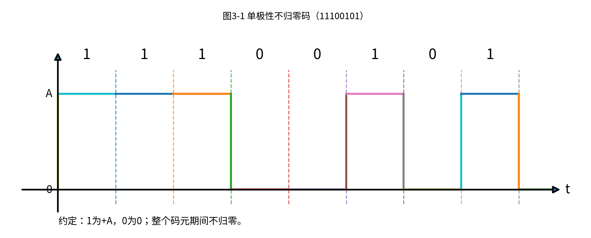

#### 3.2 单极性归零码

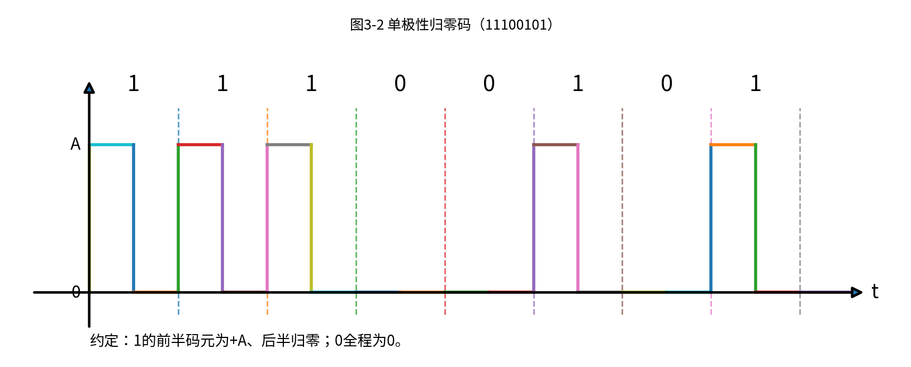

#### 3.3 双极性不归零码

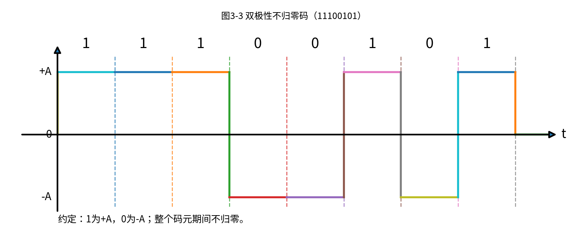

#### 3.4 双极性归零码

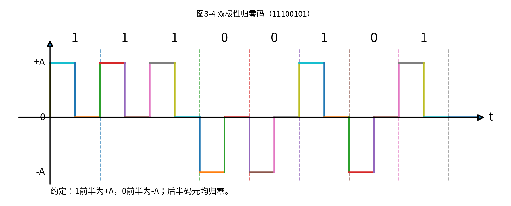

#### 3.5 差分码

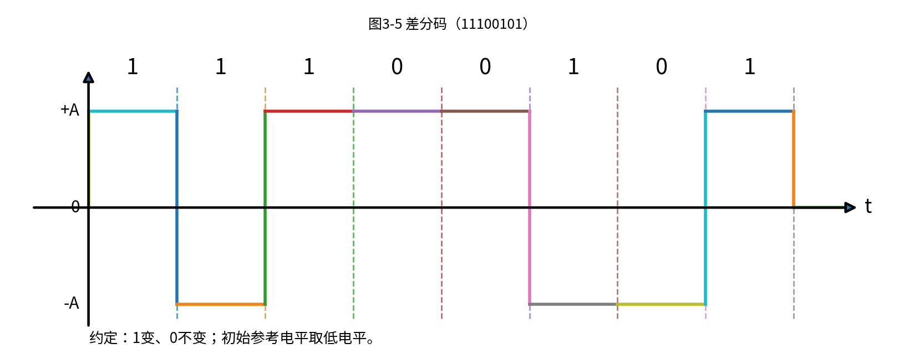

#### 3.6 CMI 码

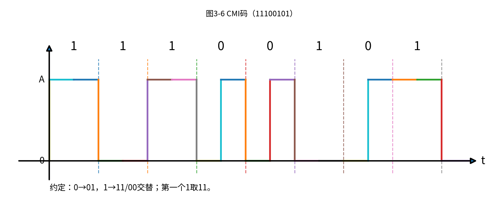

#### 3.7 曼彻斯特码

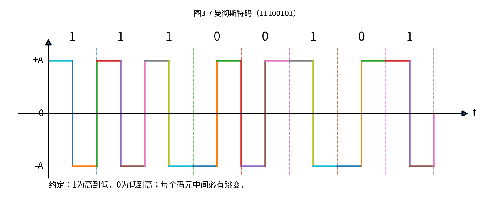

---

### 4.

AMI 码和 HDB3 码的编码规则是什么？它们各有什么优缺点？

解：

#### AMI 码

AMI 码又称传号交替反转码。

编码规则：

| 信息码 | AMI码 |
|---|---|
| 0 | 0 |
| 1 | 正、负电平交替出现 |

例如，信息序列中的“1”依次表示为：

$$
+A,-A,+A,-A,\cdots
$$

而“0”始终表示为零电平。

AMI 码的优点：

1. 无直流分量。
2. 低频分量较小。
3. 可以通过变压器耦合传输。
4. 具有一定误码检测能力，如果连续两个非零脉冲同极性，则说明可能发生误码。

AMI 码的缺点：

1. 当信息序列中出现长连“0”时，线路中长时间没有电平跳变。
2. 不利于提取同步信号。
3. 同步性能较差。

#### HDB3 码

HDB3 码是 AMI 码的改进型，全称为三阶高密度双极性码。

基本思想：

当 AMI 码中连续“0”的个数小于 4 时，HDB3 码与 AMI 码相同；当出现四连“0”时，用特殊取代节替换。

常用取代规则为：

| 情况 | 四连“0”的取代形式 |
|---|---|
| 两个相邻 V 之间非零脉冲个数为奇数 | 000V |
| 两个相邻 V 之间非零脉冲个数为偶数 | B00V |

其中：

1. V 称为破坏脉冲，它破坏 AMI 码的极性交替规律。
2. B 称为调节脉冲，用来保证加入 V 后仍然没有直流分量。
3. B 符号的极性应符合 AMI 的交替规律。
4. V 符号的极性与前一个非零脉冲同极性，因此产生极性破坏。

HDB3 码的优点：

1. 保留 AMI 码无直流分量的优点。
2. 避免长连“0”，便于提取同步信号。
3. 低频分量小，适合基带传输。
4. 具有一定误码检测能力。

HDB3 码的缺点：

1. 编码规则比 AMI 复杂。
2. 接收端译码也比 AMI 复杂。

---

### 5.

已知信息代码为 100000000011，画出相应的单极性归零码、AMI 码和 HDB3 码。

解：

信息代码为：

$$
100000000011
$$

#### 5.1 单极性归零码

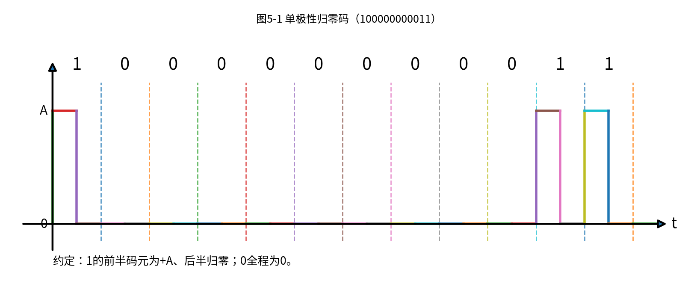

#### 5.2 AMI 码

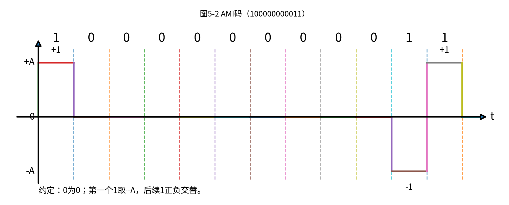

#### 5.3 HDB3 码

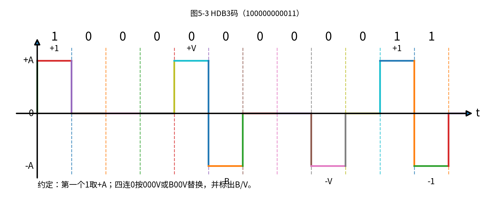

---

### 6.

已知信息代码为 10000000001110010000010，试给出曼彻斯特编码和差分曼彻斯特编码的波形图。

解：

信息代码为：

$$
10000000001110010000010
$$

#### 6.1 曼彻斯特码

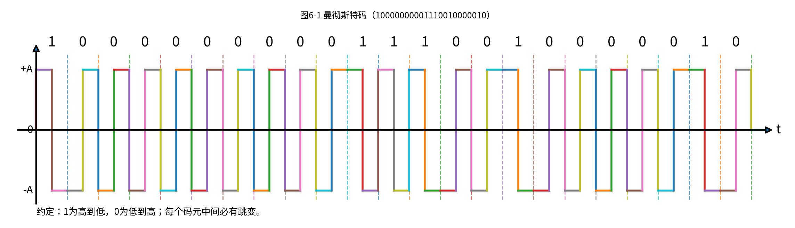

#### 6.2 差分曼彻斯特码

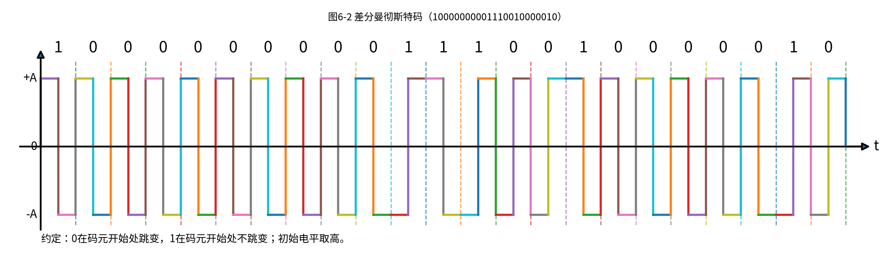

---

### 7.

什么叫作码间串扰？产生码间串扰的原因是什么？有什么不好的影响？应该怎样消除和减少？

解：

码间串扰是指由于系统传输特性不理想，使得一个码元的波形拖尾延伸到其他码元的抽样时刻，从而影响相邻码元判决的现象。

产生码间串扰的主要原因：

1. 信道带宽有限。
2. 系统频率特性不理想。
3. 系统相频特性不理想。
4. 发送滤波器、信道、接收滤波器共同造成波形展宽和拖尾。
5. 码元速率过高，码元间隔过短。

码间串扰的不良影响：

1. 使抽样判决值偏离理想值。
2. 增大误码概率。
3. 降低传输可靠性。
4. 限制数字基带系统的最高传输速率。

消除或减少码间串扰的方法：

1. 使系统满足奈奎斯特第一准则。
2. 采用合适的成形滤波器，如升余弦滚降滤波器。
3. 降低码元速率。
4. 增加系统带宽。
5. 采用均衡器补偿信道失真。
6. 选择最佳抽样时刻和最佳判决电平。

---

### 8.

能满足无码间串扰条件的传输特性的冲激响应 h(t) 是怎样的？为什么说能满足无码间串扰条件的 h(t) 不是唯一的？

解：

如果系统总的冲激响应为：

$$
h(t)
$$

在接收端以码元间隔：

$$
T_s
$$

进行抽样，最佳抽样时刻为：

$$
t_d
$$

则无码间串扰条件为：

$$
h(kT_s+t_d)=
\begin{cases}
1, & k=0\\
0, & k\ne 0
\end{cases}
$$

也就是说，在本码元的抽样时刻，响应应取得最大值；在其他码元的抽样时刻，响应必须为零。

因此，满足无码间串扰的 h(t) 应具有如下特点：

1. 在本码元抽样时刻不为零。
2. 在相邻码元的抽样时刻为零。
3. 相邻码元的拖尾不会影响当前码元的判决。

满足无码间串扰条件的 h(t) 不是唯一的，因为只要求它在一系列离散抽样点上满足零点条件，并没有要求整个连续波形完全相同。

例如：

1. 理想低通系统对应的 sinc 形冲激响应可以满足无码间串扰。
2. 升余弦滚降系统对应的冲激响应也可以满足无码间串扰。
3. 其他满足奈奎斯特准则的传输特性也可以满足无码间串扰。

所以，满足无码间串扰条件的 h(t) 有无穷多种。

---

### 9.

基带传输系统中传输特性的带宽是怎样定义的？与信号带宽的定义有什么不同？

解：

基带传输系统的传输特性带宽，是指系统总传输特性：

$$
H(\omega)
$$

允许信号通过的有效频率范围。

如果系统频率响应在：

$$
|\omega|\le \omega_H
$$

范围内有效，而在此范围外衰减很大或为零，则可认为系统的角频率带宽为：

$$
\omega_H
$$

若用普通频率表示，则系统带宽为：

$$
B=f_H=\frac{\omega_H}{2\pi}
$$

系统带宽和信号带宽的区别如下：

| 项目 | 系统带宽 | 信号带宽 |
|---|---|---|
| 含义 | 系统允许信号通过的频率范围 | 信号本身频谱占据的频率范围 |
| 决定因素 | 信道、发送滤波器、接收滤波器等 | 码型、脉冲波形、码元速率 |
| 作用 | 决定系统能传多快 | 决定信号需要占用多宽频带 |
| 关系 | 系统带宽应能容纳信号主要频率成分 | 信号带宽过大时，系统可能产生失真 |

简单理解：

信号带宽是“信号自己需要多宽的路”；

系统带宽是“系统实际提供多宽的路”。

---

### 10.

什么叫作奈奎斯特速率和奈奎斯特带宽？

解：

在理想低通传输系统中，如果系统带宽为：

$$
B
$$

则无码间串扰传输时允许的最高码元速率为：

$$
R_{B,\max}=2B
$$

这个最高码元速率称为奈奎斯特速率。

即：

$$
R_{B,\max}=2B
$$

单位为 Baud。

反过来，如果要求以码元速率：

$$
R_B
$$

进行无码间串扰传输，则所需的最小系统带宽为：

$$
B_{\min}=\frac{R_B}{2}
$$

这个最小带宽称为奈奎斯特带宽。

即：

$$
B_{\min}=\frac{R_B}{2}
$$

单位为 Hz。

两者关系为：

$$
R_B=2B
$$

或：

$$
B=\frac{R_B}{2}
$$

---

### 11.

在码元速率相同的条件下，为什么多元码信号与二进制信号具有相同的带宽？此时信息速率是否相同？

解：

信号带宽主要取决于码元速率和码元波形，而不是每个码元表示多少位信息。

若二进制信号和多元码信号具有相同的码元速率：

$$
R_B
$$

并且采用相同或相近的码元波形，则它们的频谱主瓣宽度基本相同，所以带宽也基本相同。

但是信息速率不一定相同。

对于 M 进制信号，每个码元携带的信息量为：

$$
\log_2 M
$$

bit。

所以信息速率为：

$$
R_b=R_B\log_2 M
$$

对于二进制信号：

$$
M=2
$$

因此：

$$
R_b=R_B\log_2 2=R_B
$$

对于多元码信号：

$$
M>2
$$

因此：

$$
R_b=R_B\log_2 M
$$

所以，在码元速率相同的条件下：

1. 二进制信号和多元码信号的带宽可以相同。
2. 多元码信号的信息速率通常更高。
3. 多元码用更高的电平判决复杂度换取更高的信息传输速率。

---

### 12.

对于某 PCM 系统采用二进制传输，已知信息传输速率为 2048 kbit/s，若满足奈奎斯特准则，系统的带宽是多少？

解：

因为采用二进制传输，所以每个码元携带 1 bit 信息。

因此：

$$
R_B=R_b
$$

已知信息传输速率为：

$$
R_b=2048\text{ kbit/s}
$$

所以码元速率为：

$$
R_B=2048\text{ kBaud}
$$

根据奈奎斯特准则：

$$
R_B=2B
$$

所以：

$$
B=\frac{R_B}{2}
$$

代入：

$$
B=\frac{2048}{2}=1024\text{ kHz}
$$

因此系统最小带宽为：

$$
B=1024\text{ kHz}=1.024\text{ MHz}
$$

---

### 13.

对于理想低通信道，以 2/Ts 波特的速率进行传输。当 $\omega_H=\pi/T_s$ 时，在抽样点处是否存在码间串扰？而当 $\omega_H=4\pi/T_s$ 时，是否存在码间串扰？为什么？

解：

已知码元速率为：

$$
R_B=\frac{2}{T_s}
$$

所以码元间隔为：

$$
T=\frac{1}{R_B}
$$

代入：

$$
T=\frac{T_s}{2}
$$

理想低通信道的冲激响应为 sinc 形，其相邻零点间隔为：

$$
\Delta t=\frac{\pi}{\omega_H}
$$

#### 第一种情况

当：

$$
\omega_H=\frac{\pi}{T_s}
$$

时，零点间隔为：

$$
\Delta t=\frac{\pi}{\omega_H}
=\frac{\pi}{\pi/T_s}
=T_s
$$

但是实际码元间隔为：

$$
T=\frac{T_s}{2}
$$

由于：

$$
T\ne \Delta t
$$

并且抽样点没有落在相邻码元响应的零点上，所以存在码间串扰。

也可以从最大无码间串扰码元速率判断：

$$
R_{B,\max}=\frac{\omega_H}{\pi}
$$

代入：

$$
R_{B,\max}=\frac{\pi/T_s}{\pi}=\frac{1}{T_s}
$$

而实际码元速率为：

$$
R_B=\frac{2}{T_s}
$$

因为：

$$
R_B>R_{B,\max}
$$

所以存在码间串扰。

#### 第二种情况

当：

$$
\omega_H=\frac{4\pi}{T_s}
$$

时，零点间隔为：

$$
\Delta t=\frac{\pi}{\omega_H}
=\frac{\pi}{4\pi/T_s}
=\frac{T_s}{4}
$$

实际码元间隔为：

$$
T=\frac{T_s}{2}
$$

所以：

$$
T=2\Delta t
$$

也就是说，抽样点仍然落在相邻码元响应的零点上，因此不存在码间串扰。

也可以从最大无码间串扰码元速率判断：

$$
R_{B,\max}=\frac{\omega_H}{\pi}
$$

代入：

$$
R_{B,\max}=\frac{4\pi/T_s}{\pi}=\frac{4}{T_s}
$$

而实际码元速率为：

$$
R_B=\frac{2}{T_s}
$$

因为：

$$
R_B<R_{B,\max}
$$

并且码元间隔正好为零点间隔的整数倍，所以可以无码间串扰传输。

结论：

当：

$$
\omega_H=\frac{\pi}{T_s}
$$

时，存在码间串扰。

当：

$$
\omega_H=\frac{4\pi}{T_s}
$$

时，不存在码间串扰。

---

### 14.

什么是眼图？它有什么用处？

解：

眼图是用示波器观察数字基带信号时，将多个码元周期的波形重叠显示形成的图形。因为图形中间的开口部分像眼睛，所以称为眼图。

眼图的作用：

1. 观察码间串扰大小。
2. 观察噪声对信号的影响。
3. 判断最佳抽样时刻。
4. 判断最佳判决电平。
5. 估计定时误差灵敏度。
6. 观察系统传输质量。

眼图中常见信息如下：

| 眼图特征 | 含义 |
|---|---|
| 眼睛张开越大 | 噪声容限越大，判决越可靠 |
| 眼睛闭合越严重 | 码间串扰越严重 |
| 中间竖直线位置 | 最佳抽样时刻 |
| 中间水平线位置 | 最佳判决电平 |
| 眼图斜边越陡 | 定时误差越敏感 |
| 上下阴影间距 | 反映噪声容限 |

简单来说：

眼图张开越大，系统性能越好；

眼图闭合越严重，误码可能性越大。

---

### 15.

一基带传输系统具有升余弦传输特性，试求：

1. 系统的最高码元速率。
2. 单位频带的码元传输速率。

解：

对于升余弦滚降系统，系统带宽、码元速率和滚降系数的关系为：

$$
B=\frac{1+\alpha}{2}R_B
$$

其中：

$$
B
$$

为系统带宽；

$$
R_B
$$

为码元速率；

$$
\alpha
$$

为滚降系数。

因此最高码元速率为：

$$
R_{B,\max}=\frac{2B}{1+\alpha}
$$

单位频带的码元传输速率为：

$$
\eta_B=\frac{R_B}{B}
$$

代入最高码元速率：

$$
\eta_B=\frac{2}{1+\alpha}
$$

所以：

$$
R_{B,\max}=\frac{2B}{1+\alpha}
$$

$$
\eta_B=\frac{2}{1+\alpha}\text{ Baud/Hz}
$$

特殊情况：

当：

$$
\alpha=0
$$

时，为理想低通特性，此时：

$$
R_{B,\max}=2B
$$

$$
\eta_B=2\text{ Baud/Hz}
$$

当：

$$
\alpha=1
$$

时，为全滚降升余弦特性，此时：

$$
R_{B,\max}=B
$$

$$
\eta_B=1\text{ Baud/Hz}
$$

---

### 16.

在基带传输系统中，为什么要引入滚降函数来修正矩形理想低通滤波器特性？对滚降函数有什么要求？

解：

理想低通传输特性在频域中是矩形特性，即在通带内完全通过，在截止频率处突然变为零。

这种理想低通特性的问题是：

1. 频率响应在截止频率处突变。
2. 物理上很难实现。
3. 对应的时域冲激响应是 sinc 形。
4. sinc 波形拖尾很长，衰减较慢。
5. 对定时误差比较敏感。

因此，实际系统中常用滚降函数把理想矩形特性的边缘变平滑，使频率响应从通带到阻带逐渐过渡。

引入滚降函数的目的：

1. 使滤波器更容易实现。
2. 减小时域冲激响应的拖尾。
3. 降低码间串扰。
4. 提高系统对定时误差的容忍能力。
5. 在可接受的带宽增加下改善传输性能。

对滚降函数的基本要求：

1. 应满足奈奎斯特第一准则。
2. 应保证抽样时刻无码间串扰。
3. 频率特性应平滑过渡，不能出现剧烈突变。
4. 滚降部分应具有对称互补特性。
5. 增加的带宽应尽量小。

升余弦滚降特性就是常用的一种滚降特性。

---

### 17.

数字通信系统为什么要进行均衡？何谓频域均衡和时域均衡？

解：

数字通信系统需要均衡，是因为实际信道的幅频特性和相频特性并不理想，会导致信号波形失真，从而产生码间串扰。

均衡器的作用是补偿信道失真，使系统总传输特性尽可能满足无码间串扰条件。

#### 频域均衡

频域均衡是从频率特性角度出发，设计均衡器的频率响应：

$$
H_B(\omega)
$$

使其补偿原系统频率响应：

$$
H'(\omega)
$$

即使：

$$
H'(\omega)H_B(\omega)=k
$$

其中：

$$
k
$$

为常数。

这个条件表示：均衡后的系统在有效频带内幅频特性尽量平坦，相频特性尽量满足无失真要求。

频域均衡主要用于补偿频率选择性衰落。

#### 时域均衡

时域均衡是直接从接收波形的抽样值出发，通过横向滤波器调整各抽头系数，使抽样时刻的码间串扰尽可能小。

时域均衡的基本形式为：

$$
y_k=\sum_{i=-N}^{N}c_i x_{k-i}
$$

其中：

$$
c_i
$$

为均衡器抽头系数；

$$
x_{k-i}
$$

为输入抽样值；

$$
y_k
$$

为均衡器输出抽样值。

时域均衡常用于高速数据传输系统。

---

### 18.

在数字通信系统中，对均衡波形为什么要采用时域分析方法？均衡波形为什么不需要与发送的脉冲波形完全相同？

解：

数字通信系统最终关心的是抽样判决是否正确，而不是连续时间波形是否完全恢复。

接收端只在特定抽样时刻进行判决，因此只要求均衡后的波形在抽样时刻满足：

$$
h(kT_s+t_d)=
\begin{cases}
1, & k=0\\
0, & k\ne 0
\end{cases}
$$

也就是说，只要本码元在抽样时刻贡献最大，而其他码元在该抽样时刻贡献为零，就可以无码间串扰判决。

因此，均衡波形不需要和发送脉冲波形完全相同。

原因如下：

1. 接收端只关心抽样点的值。
2. 抽样点之间的波形形状不会直接影响判决。
3. 只要抽样时刻没有码间串扰，就能正确恢复数字信息。
4. 时域分析能直接反映抽样点处的码间串扰情况。

所以，时域均衡的目标不是恢复原始波形，而是使抽样点满足无码间串扰条件。

---

### 19.

已知一基带传输系统的传输特性为

$$
H(\omega)=
\begin{cases}
\tau_0(1+\cos \omega\tau_0), & |\omega|\le \frac{\pi}{\tau_0}\\
0, & \text{其他}
\end{cases}
$$

试确定该系统最高的传输速率 $R_B$ 及相应码元间隔 $T_0$。

解：

这题不能只看频谱截止频率直接套公式，还要看系统冲激响应的零点位置。

由傅里叶反变换可得系统冲激响应为：

$$
h(t)=\frac{\sin(\pi t/\tau_0)}{\pi t/\tau_0}\cdot \frac{1}{1-(t/\tau_0)^2}
$$

观察这个表达式的零点。

当：

$$
t=n\tau_0
$$

时，分子：

$$
\sin(\pi t/\tau_0)
$$

可能为零。

但是当：

$$
t=\pm \tau_0
$$

时，分母：

$$
1-(t/\tau_0)^2
$$

也为零，因此这里不是零点，而是可去奇点。

所以第一个真正的零点出现在：

$$
t=\pm 2\tau_0
$$

为了无码间串扰，码元间隔应取冲激响应的第一个零点间隔：

$$
T_0=2\tau_0
$$

因此最高码元速率为：

$$
R_B=\frac{1}{T_0}
$$

代入：

$$
R_B=\frac{1}{2\tau_0}
$$

所以：

$$
T_0=2\tau_0
$$

$$
R_B=\frac{1}{2\tau_0}
$$

---

### 20.

若上题中：

$$
H(\omega)=
\begin{cases}
\frac{T_s}{2}\left(1+\cos\frac{\omega T_s}{2}\right), & |\omega|\le \frac{2\pi}{T_s}\\
0, & \text{其他}
\end{cases}
$$

试证其单位脉冲响应为：

$$
h(t)=
\frac{\sin(\pi t/T_s)}{\pi t/T_s}
\cdot
\frac{\cos(\pi t/T_s)}{1-4t^2/T_s^2}
$$

解：

与第 19 题比较可知：

$$
\tau_0=\frac{T_s}{2}
$$

第 19 题的单位脉冲响应为：

$$
h(t)=
\frac{\sin(\pi t/\tau_0)}{\pi t/\tau_0}
\cdot
\frac{1}{1-(t/\tau_0)^2}
$$

代入：

$$
\tau_0=\frac{T_s}{2}
$$

得：

$$
h(t)=
\frac{\sin(2\pi t/T_s)}{2\pi t/T_s}
\cdot
\frac{1}{1-4t^2/T_s^2}
$$

利用恒等式：

$$
\sin 2x=2\sin x\cos x
$$

令：

$$
x=\frac{\pi t}{T_s}
$$

则：

$$
\sin\frac{2\pi t}{T_s}
=
2\sin\frac{\pi t}{T_s}\cos\frac{\pi t}{T_s}
$$

所以：

$$
\frac{\sin(2\pi t/T_s)}{2\pi t/T_s}
=
\frac{\sin(\pi t/T_s)}{\pi t/T_s}
\cos\frac{\pi t}{T_s}
$$

因此：

$$
h(t)=
\frac{\sin(\pi t/T_s)}{\pi t/T_s}
\cdot
\frac{\cos(\pi t/T_s)}{1-4t^2/T_s^2}
$$

证毕。

---

### 21.

已知信息速率为 64 kbit/s，若采用 $\alpha=0.4$ 的升余弦滚降频谱信号，求其时域表达式。

解：

若采用二进制传输，则信息速率等于码元速率：

$$
R_B=R_b
$$

已知：

$$
R_b=64\text{ kbit/s}
$$

所以：

$$
R_B=64\text{ kBaud}
$$

码元间隔为：

$$
T_s=\frac{1}{R_B}
$$

代入：

$$
T_s=\frac{1}{64000}\text{ s}
$$

升余弦滚降信号的时域表达式可写为：

$$
h(t)=
\frac{\sin(\pi t/T_s)}{\pi t/T_s}
\cdot
\frac{\cos(\alpha\pi t/T_s)}{1-(2\alpha t/T_s)^2}
$$

代入：

$$
\alpha=0.4
$$

以及：

$$
T_s=\frac{1}{64000}
$$

得到：

$$
h(t)=
\frac{\sin(64000\pi t)}{64000\pi t}
\cdot
\frac{\cos(0.4\times 64000\pi t)}{1-(2\times0.4\times64000t)^2}
$$

整理：

$$
h(t)=
\frac{\sin(64000\pi t)}{64000\pi t}
\cdot
\frac{\cos(25600\pi t)}{1-(51200t)^2}
$$

所以时域表达式为：

$$
h(t)=
\frac{\sin(64000\pi t)}{64000\pi t}
\cdot
\frac{\cos(25600\pi t)}{1-(51200t)^2}
$$

说明：

如果题目没有明确说明采用二进制传输，则应先根据进制数 M 把信息速率换算为码元速率：

$$
R_B=\frac{R_b}{\log_2 M}
$$

本题通常按二进制传输处理。

---

### 22.

已知输入波形 $x(t)$ 在各抽样点的值依次为

$$
x_{-2}=\frac{1}{8},\quad x_{-1}=0,\quad x_0=1,\quad x_1=\frac{1}{4},\quad x_2=\frac{1}{16}
$$

在其他抽样点均为零。试设计一个三抽头的时域均衡器以减少码间串扰。

解：

三抽头均衡器取：

$$
N=1
$$

输出抽样值为：

$$
y_k=\sum_{i=-1}^{1}c_i x_{k-i}
$$

即：

$$
y_k=c_{-1}x_{k+1}+c_0x_k+c_1x_{k-1}
$$

迫零均衡要求：

$$
y_0=1
$$

$$
y_{-1}=0
$$

$$
y_1=0
$$

分别代入已知抽样值。

由：

$$
y_0=c_{-1}x_1+c_0x_0+c_1x_{-1}=1
$$

得：

$$
\frac{1}{4}c_{-1}+c_0=1
$$

由：

$$
y_{-1}=c_{-1}x_0+c_0x_{-1}+c_1x_{-2}=0
$$

得：

$$
c_{-1}+\frac{1}{8}c_1=0
$$

由：

$$
y_1=c_{-1}x_2+c_0x_1+c_1x_0=0
$$

得：

$$
\frac{1}{16}c_{-1}+\frac{1}{4}c_0+c_1=0
$$

联立方程：

$$
\begin{cases}
\frac{1}{4}c_{-1}+c_0=1\\
c_{-1}+\frac{1}{8}c_1=0\\
\frac{1}{16}c_{-1}+\frac{1}{4}c_0+c_1=0
\end{cases}
$$

解得：

$$
c_{-1}=\frac{1}{32}
$$

$$
c_0=\frac{127}{128}
$$

$$
c_1=-\frac{1}{4}
$$

所以三抽头均衡器的抽头系数为：

$$
c_{-1}=\frac{1}{32},\quad c_0=\frac{127}{128},\quad c_1=-\frac{1}{4}
$$

近似为：

$$
c_{-1}=0.03125,\quad c_0=0.99219,\quad c_1=-0.25
$$

---

### 23.

设有一个三抽头的迫零均衡器，输入信号 $x(t)$ 在各个抽样点的值分别为

$$
x_{-1}=0.2,\quad x_0=1.0,\quad x_1=-0.3,\quad x_2=0.1
$$

其他 $x_k$ 值均为零，求 3 个抽头的最佳增益。

解：

三抽头迫零均衡器输出为：

$$
y_k=c_{-1}x_{k+1}+c_0x_k+c_1x_{k-1}
$$

迫零条件为：

$$
y_0=1
$$

$$
y_{-1}=0
$$

$$
y_1=0
$$

由：

$$
y_0=c_{-1}x_1+c_0x_0+c_1x_{-1}=1
$$

得：

$$
-0.3c_{-1}+c_0+0.2c_1=1
$$

由：

$$
y_{-1}=c_{-1}x_0+c_0x_{-1}+c_1x_{-2}=0
$$

且：

$$
x_{-2}=0
$$

得：

$$
c_{-1}+0.2c_0=0
$$

由：

$$
y_1=c_{-1}x_2+c_0x_1+c_1x_0=0
$$

得：

$$
0.1c_{-1}-0.3c_0+c_1=0
$$

联立方程：

$$
\begin{cases}
-0.3c_{-1}+c_0+0.2c_1=1\\
c_{-1}+0.2c_0=0\\
0.1c_{-1}-0.3c_0+c_1=0
\end{cases}
$$

解得：

$$
c_{-1}=-\frac{50}{281}
$$

$$
c_0=\frac{250}{281}
$$

$$
c_1=\frac{80}{281}
$$

近似为：

$$
c_{-1}=-0.1779
$$

$$
c_0=0.8897
$$

$$
c_1=0.2847
$$

所以 3 个抽头的最佳增益为：

$$
c_{-1}=-0.1779,\quad c_0=0.8897,\quad c_1=0.2847
$$

---

### 24.

某数字基带系统的传输特性如下图所示。试计算：

1. 按奈奎斯特准则发送数据，其码元速率为多少波特？滚降系数为多少？
2. 采用四电平传输时，信息速率为多少？
3. 频带利用率为多少？

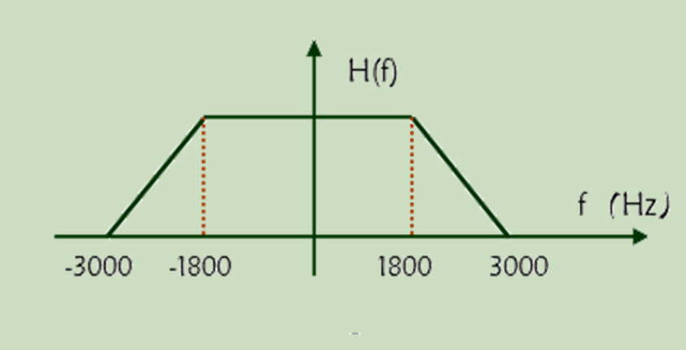

解：

由图可知，该系统的传输特性为升余弦滚降特性。

图中频率范围为：

$$
-3000\text{ Hz}\sim 3000\text{ Hz}
$$

这是双边频谱范围。基带系统的带宽通常取正频率一侧，所以系统带宽为：

$$
B=3000\text{ Hz}
$$

不能把双边总宽度：

$$
3000-(-3000)=6000\text{ Hz}
$$

作为这里的系统带宽。

---

先求码元速率。

从图中正频率部分可以看出：

$$
0\sim 1800\text{ Hz}
$$

为平坦部分，

$$
1800\sim 3000\text{ Hz}
$$

为滚降部分。

对于升余弦滚降特性，滚降区是围绕原来理想低通的奈奎斯特频率展开的，因此滚降区的中点对应：

$$
\frac{R_B}{2}
$$

本题滚降区为：

$$
1800\text{ Hz}\sim 3000\text{ Hz}
$$

其中点为：

$$
\frac{1800+3000}{2}=2400\text{ Hz}
$$

因此：

$$
\frac{R_B}{2}=2400
$$

所以码元速率为：

$$
R_B=4800\text{ Baud}
$$

---

再求滚降系数。

滚降区中心频率为：

$$
2400\text{ Hz}
$$

滚降区右边界为：

$$
3000\text{ Hz}
$$

所以滚降宽度为：

$$
3000-2400=600\text{ Hz}
$$

滚降系数表示滚降宽度相对于滚降区中心频率的比例，所以：

$$
\alpha=\frac{600}{2400}=0.25
$$

因此第一问答案为：

$$
R_B=4800\text{ Baud}
$$

$$
\alpha=0.25
$$

---

采用四电平传输时：

$$
M=4
$$

每个码元携带的信息量为：

$$
\log_2 4=2\text{ bit/码元}
$$

所以信息速率为：

$$
R_b=R_B\log_2 M
$$

代入：

$$
R_b=4800\times 2=9600\text{ bit/s}
$$

因此：

$$
R_b=9.6\text{ kbit/s}
$$

---

频带利用率按信息速率计算为：

$$
\eta=\frac{R_b}{B}
$$

代入：

$$
\eta=\frac{9600}{3000}=3.2\text{ bit}/(\text{s}\cdot\text{Hz})
$$

所以频带利用率为：

$$
\eta=3.2\text{ bit}/(\text{s}\cdot\text{Hz})
$$

补充说明：

如果教材要求的是单位频带的码元传输速率，则应按码元速率计算：

$$
\eta_B=\frac{R_B}{B}
$$

代入：

$$
\eta_B=\frac{4800}{3000}=1.6\text{ Baud/Hz}
$$

本题第 2 问已经要求四电平传输的信息速率，因此第 3 问通常按信息频带利用率写为：

$$
\eta=3.2\text{ bit}/(\text{s}\cdot\text{Hz})
$$