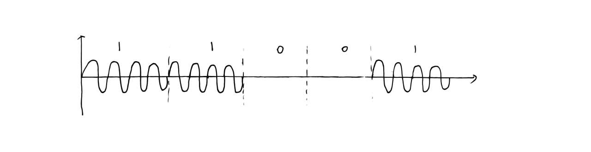
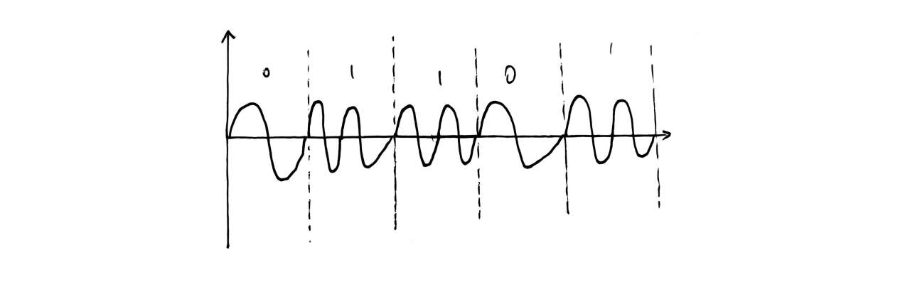
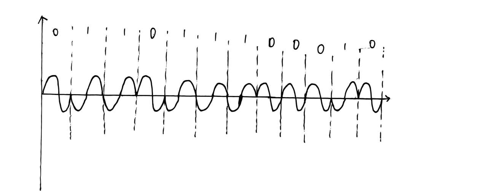
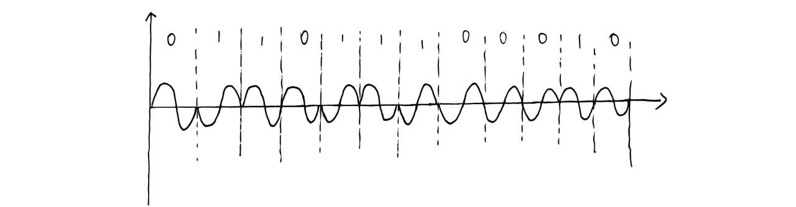

# 第7章 数字频带传输

## 7.1 引言

### 7.1.1 数字频带传输的概念

数字基带传输是将数字基带信号直接送入信道传输。

数字频带传输是先用数字基带信号去控制载波的某个参数，使基带信号变成适合带通信道传输的频带信号。

基本过程为：

$$
数字基带信号 \rightarrow 调制 \rightarrow 数字频带信号
$$

接收端再进行反过程：

$$
数字频带信号 \rightarrow 解调 \rightarrow 数字基带信号
$$

数字频带传输适用于无线信道、电话信道等带通信道。

---

### 7.1.2 为什么要进行数字调制

数字基带信号通常频率较低，不能直接适合所有信道传输。通过调制，可以把数字基带信号搬移到适合信道传输的频率范围内。

数字调制的主要作用如下。

| 作用 | 说明 |
|---|---|
| 适合带通信道传输 | 将低频基带信号搬移到载波频率附近 |
| 便于无线发送 | 高频信号波长较短，便于天线辐射 |
| 便于频分复用 | 不同信号可调制到不同载频上 |
| 提高抗干扰能力 | 可选择较合适的频段和调制方式 |

载波一般写成：

$$
A\cos(\omega_c t+\varphi)
$$

其中：

| 符号 | 含义 |
|---|---|
| $A$ | 载波幅度 |
| $\omega_c$ | 载波角频率 |
| $\varphi$ | 载波初相位 |

数字调制就是用数字基带信号去控制载波的某个参数。

---

### 7.1.3 数字调制的基本方式

载波有三个基本参数：幅度、频率、相位。因此数字调制基本方式有三类。

| 调制方式 | 中文名称 | 控制对象 | 基本含义 |
|---|---|---|---|
| ASK | 振幅键控 | 幅度 | 用数字信号控制载波幅度 |
| FSK | 频移键控 | 频率 | 用数字信号控制载波频率 |
| PSK | 相移键控 | 相位 | 用数字信号控制载波相位 |

二进制调制中，每个码元只携带 1 bit。

多进制调制中，每个码元可以携带多个 bit。

如果调制状态数为 $M$，则每个码元携带的信息量为：

$$
k=\log_2 M
$$

比特率和码元速率的关系为：

$$
R_b=R_B\log_2 M
$$

其中：

| 符号 | 含义 |
|---|---|
| $R_b$ | 信息速率，单位 bit/s |
| $R_B$ | 码元速率，单位 Baud |
| $M$ | 调制状态数 |

---

### 7.1.4 数字频带传输系统结构

数字频带传输系统的一般结构为：

$$
信源 \rightarrow 数字基带信号 \rightarrow 调制器 \rightarrow 信道 \rightarrow 解调器 \rightarrow 数字基带信号
$$

其中：

| 模块 | 作用 |
|---|---|
| 调制器 | 把数字基带信号变成数字频带信号 |
| 信道 | 传输频带信号 |
| 解调器 | 从频带信号中恢复数字基带信号 |
| 判决器 | 根据抽样值判定发送码元 |

数字频带传输的核心问题是：

1. 采用什么调制方式；
2. 频带宽度是多少；
3. 接收端如何解调；
4. 抗噪声性能如何；
5. 频带利用率如何。

---

## 7.2 二进制振幅键控 2ASK

### 7.2.1 2ASK 的基本思想

2ASK 是二进制振幅键控，用数字基带信号控制载波的幅度。

最简单的 2ASK 是 OOK，即通断键控。

| 码元 | 载波状态 |
|---|---|
| 1 | 有载波 |
| 0 | 无载波 |

因此 2ASK 波形特点是：

1. 发送 1 时，输出一段正弦载波；
2. 发送 0 时，输出为 0 或低幅度载波；
3. 载波频率不变，变化的是幅度。

---

### 7.2.2 2ASK 的表达式

设数字基带信号为 $s(t)$，载波为：

$$
A\cos(\omega_c t+\theta_c)
$$

则 2ASK 信号为：

$$
e_{ASK}(t)=s(t)A\cos(\omega_c t+\theta_c)
$$

对于 OOK，有：

发送“1”时：

$$
s(t)=1
$$

发送“0”时：

$$
s(t)=0
$$

所以：

$$
e_1(t)=A\cos(\omega_c t+\theta_c)
$$

$$
e_0(t)=0
$$

也就是：

$$
1\rightarrow A\cos(\omega_c t+\theta_c)
$$

$$
0\rightarrow 0
$$

---

### 7.2.3 2ASK 的频谱特点

2ASK 是基带信号乘以载波。

根据频移性质，$s(t)\cos\omega_c t$ 会使基带信号频谱搬移到 $+f_c$ 和 $-f_c$ 附近。

2ASK 的频谱特点如下。

| 特点 | 说明 |
|---|---|
| 有连续谱 | 由随机数字基带信号产生 |
| 可能有离散谱 | 单极性基带信号含直流分量，会形成载波谱线 |
| 有上下边带 | 基带频谱搬移到载频两侧 |
| 带宽较宽 | 双边带传输，频带利用率不高 |

---

### 7.2.4 2ASK 的带宽

若基带信号的主要带宽为 $f_s$，则 2ASK 调制后有上下两个边带。

因此 2ASK 带宽近似为：

$$
B_{2ASK}=2f_s
$$

其中 $f_s$ 在本章语境中通常理解为码元速率对应的频率量级。

频带利用率为：

$$
\eta=\frac{R_b}{B}
$$

带宽 $B$ 越大，在相同信息速率 $R_b$ 下，频带利用率越低。

2ASK 因为使用双边带传输相同信息，所以频带利用率不高。

---

### 7.2.5 2ASK 的产生方法

2ASK 信号的产生方法主要有两种。

| 方法 | 说明 |
|---|---|
| 键控法 | 用数字基带信号控制开关，有载波或无载波 |
| 模拟调制法 | 使数字基带信号与载波相乘，得到 ASK 信号 |

键控法中，数字码元直接控制载波通断：

$$
1\rightarrow \text{开关闭合，有载波}
$$

$$
0\rightarrow \text{开关断开，无载波}
$$

模拟调制法中：

$$
e_{ASK}(t)=s(t)A\cos\omega_c t
$$

---

### 7.2.6 2ASK 的非相干解调法

2ASK 可以采用非相干解调法，常见为包络检波法。

基本流程为：

$$
2ASK信号 \rightarrow 带通滤波器 \rightarrow 包络检波器 \rightarrow 低通滤波器 \rightarrow 抽样判决
$$

各部分作用如下。

| 环节 | 作用 |
|---|---|
| 带通滤波器 | 滤除带外噪声 |
| 包络检波器 | 提取载波包络 |
| 低通滤波器 | 平滑包络，恢复基带波形 |
| 抽样判决 | 在判决时刻恢复数字码元 |

包络检波器中常出现 $RC$ 时间常数。

要求为：

$$
\frac{1}{f_c}\ll RC \ll \frac{1}{f_s}
$$

其中：

| 条件 | 含义 |
|---|---|
| $RC\gg 1/f_c$ | 不跟随载波快速振荡，滤除载波 |
| $RC\ll 1/f_s$ | 能跟随码元包络变化 |

---

### 7.2.7 2ASK 的相干解调法

2ASK 也可以采用相干解调法。

设接收信号为：

$$
e_{ASK}(t)=s(t)A\cos\omega_c t
$$

接收端用同频同相本地载波相乘：

$$
e_{ASK}(t)\cos\omega_c t=s(t)A\cos^2\omega_c t
$$

利用：

$$
\cos^2\omega_c t=\frac{1+\cos2\omega_c t}{2}
$$

可得：

$$
s(t)A\cos^2\omega_c t
=
\frac{A}{2}s(t)+\frac{A}{2}s(t)\cos2\omega_c t
$$

经过低通滤波，滤去高频项：

$$
\frac{A}{2}s(t)
$$

因此相干解调的目的就是恢复与 $s(t)$ 成正比的基带信号，再经过抽样判决恢复 0 和 1。

---

### 7.2.8 单边带与残留边带

2ASK 是双边带调制，调制后有上边带和下边带。两个边带携带的信息具有重复性。

为了提高频带利用率，可以只保留一个边带，这就是单边带调制。

单边带调制的特点如下。

| 项目 | 说明 |
|---|---|
| 优点 | 节省带宽，频带利用率高 |
| 缺点 | 滤波器设计困难 |

残留边带调制是在单边带和双边带之间折中：

1. 一个边带大部分保留；
2. 另一个边带只残留一小部分；
3. 滤波器实现比单边带容易。

残留边带滤波器满足条件：

$$
H_v(\omega+\omega_c)+H_v(\omega-\omega_c)=c
$$

其含义是：一个边带被削弱的部分由另一个残留边带补偿，使解调后能够无失真恢复基带信号。

---

## 7.3 二进制频移键控 2FSK

### 7.3.1 2FSK 的基本思想

2FSK 是二进制频移键控，用两个不同频率表示二进制信息。

通常规定：

$$
1\rightarrow f_1
$$

$$
0\rightarrow f_2
$$

或反过来，具体以题目为准。

2FSK 的特点如下。

| 项目 | 说明 |
|---|---|
| 幅度 | 基本不变 |
| 相位 | 可连续或不连续 |
| 频率 | 随码元变化 |
| 判决依据 | 当前收到的是哪个频率 |

---

### 7.3.2 2FSK 的表达式

2FSK 信号可写成：

发送“1”时：

$$
e_{FSK}(t)=A\cos(2\pi f_1t+\theta_1)
$$

发送“0”时：

$$
e_{FSK}(t)=A\cos(2\pi f_2t+\theta_2)
$$

其中：

| 符号 | 含义 |
|---|---|
| $f_1$ | 发送 1 时的频率 |
| $f_2$ | 发送 0 时的频率 |
| $\theta_1,\theta_2$ | 对应载波初相位 |

标称载频通常定义为：

$$
f_0=\frac{f_1+f_2}{2}
$$

频移宽度为：

$$
\Delta f=f_2-f_1
$$

---

### 7.3.3 相位不连续 2FSK

相位不连续 2FSK 是指码元转换时，载波频率从 $f_1$ 切换到 $f_2$，但相位不一定连续衔接。

相位不连续 2FSK 可以看成两个不同频率的 2ASK 信号相加：

$$
2FSK=2ASK_1+2ASK_0
$$

其中：

- $2ASK_1$：只在发送 1 时出现，频率为 $f_1$；
- $2ASK_0$：只在发送 0 时出现，频率为 $f_2$。

---

### 7.3.4 2FSK 的产生方法

2FSK 主要有两种产生方法。

| 方法 | 说明 |
|---|---|
| 频率选择法 | 用数字基带信号控制开关，从两个振荡器中选择一路输出 |
| 模拟调频法 | 用数字基带信号控制振荡器频率，使其输出 $f_1$ 或 $f_2$ |

频率选择法中，发送 1 时选择 $f_1$ 振荡器；发送 0 时选择 $f_2$ 振荡器。

模拟调频法中，数字基带信号作为控制信号，使调频器输出不同频率。

---

### 7.3.5 2FSK 的频谱和带宽

2FSK 有两个载频，因此频谱通常在 $f_1$ 和 $f_2$ 附近各有一组频谱。

若 $f_1$ 和 $f_2$ 相隔较远，频谱呈双峰结构。

若 $f_1$ 和 $f_2$ 相隔较近，两个频谱可能重叠较多。

2FSK 信号带宽近似为：

$$
\Delta F=|f_2-f_1|+2f_s
$$

其中：

| 符号 | 含义 |
|---|---|
| $\Delta F$ | 2FSK 系统带宽 |
| $f_s$ | 码元速率对应的频率量级 |

上式中的 $|f_2-f_1|$ 表示两个发送频率之间的间隔。

频移指数定义为：

$$
D=\frac{|f_2-f_1|}{f_s}
$$

所以：

$$
\Delta F=(D+2)f_s
$$

2FSK 的频带利用率通常低于 2ASK 和 2PSK，因为它需要两个频率分量分开传输。

---

### 7.3.6 2FSK 的过零检测法

过零检测法是 2FSK 的一种非相干解调方法。

基本思想：

频率越高，单位时间内过零次数越多；频率越低，单位时间内过零次数越少。

流程为：

$$
2FSK信号 \rightarrow 限幅器 \rightarrow 微分器 \rightarrow 全波整流 \rightarrow 脉冲展宽 \rightarrow 低通滤波器
$$

各环节作用如下。

| 环节 | 作用 |
|---|---|
| 限幅器 | 把输入信号变成幅度稳定的方波 |
| 微分器 | 在过零跳变处产生尖脉冲 |
| 全波整流 | 把正负脉冲变成同向脉冲 |
| 脉冲展宽 | 便于后续滤波平均 |
| 低通滤波器 | 得到与过零密度有关的电压 |

判决依据如下。

| 频率 | 过零次数 | 输出电平 |
|---|---|---|
| 高频 | 多 | 较高 |
| 低频 | 少 | 较低 |

---

### 7.3.7 2FSK 的非相干解调法

2FSK 可采用普通分路滤波器进行非相干解调。

基本流程为：

$$
2FSK信号 \rightarrow 两个带通滤波器 \rightarrow 包络检波器 \rightarrow 抽样比较判决
$$

两个带通滤波器分别以 $f_1$ 和 $f_2$ 为中心频率。

如果当前发送的是 $f_1$，则 $f_1$ 支路输出大，$f_2$ 支路输出小。

如果当前发送的是 $f_2$，则 $f_2$ 支路输出大，$f_1$ 支路输出小。

判决规则如下。

| 支路输出 | 判决 |
|---|---|
| $f_1$ 支路大 | 判为 $f_1$ 对应的码元 |
| $f_2$ 支路大 | 判为 $f_2$ 对应的码元 |

---

### 7.3.8 2FSK 的相干解调法

2FSK 相干解调也采用两路结构。

一路用本地载波：

$$
\cos\omega_1 t
$$

另一路用本地载波：

$$
\cos\omega_2 t
$$

分别与接收信号相乘，然后低通滤波，最后比较两路输出大小。

基本流程为：

$$
2FSK信号 \rightarrow 两路相干解调 \rightarrow 低通滤波 \rightarrow 抽样比较判决
$$

相干解调性能较好，但接收端需要提供与 $f_1$、$f_2$ 同频同相的本地载波，电路较复杂。

---

## 7.4 二进制数字相位调制2PSK

### 7.4.1 2PSK 的基本表达式

2PSK 又称二进制相移键控。它不是改变载波的幅度，也不是改变载波的频率，而是用载波的相位变化表示数字信息。

一般表达式为：

$$
e_{PSK}(t)=A\cos(\omega_c t+\varphi_n)
$$

其中，$\varphi_n$ 表示第 $n$ 个码元对应波形的绝对相位。

通常规定：

发送“0”码时：

$$
\varphi_n=0
$$

发送“1”码时：

$$
\varphi_n=\pi
$$

所以 2PSK 信号也可以写成：

发送“0”码时：

$$
e_{PSK}(t)=A\cos\omega_c t
$$

发送“1”码时：

$$
e_{PSK}(t)=-A\cos\omega_c t
$$

因为：

$$
A\cos(\omega_c t+\pi)=-A\cos\omega_c t
$$

所以 2PSK 的本质就是：用两个相差 $\pi$ 的载波相位表示 0 和 1。

---

### 7.4.2 2PSK 与 2ASK 的关系

2PSK 可以看成是用双极性基带信号对载波进行幅度调制。

若双极性基带信号为 $m(t)$，取值为 $+1$ 或 $-1$，则：

$$
e_{PSK}(t)=m(t)A\cos\omega_c t
$$

当 $m(t)=+1$ 时：

$$
e_{PSK}(t)=A\cos\omega_c t
$$

当 $m(t)=-1$ 时：

$$
e_{PSK}(t)=-A\cos\omega_c t=A\cos(\omega_c t+\pi)
$$

所以 2PSK 也可以理解为用双极性基带信号对载波进行二进制幅度键控。

---

### 7.4.3 2PSK 信号的频谱特点

因为 2PSK 可以看成双极性基带信号调制载波，所以它的频谱结构与抑制载波双边带信号类似。

其功率谱密度可以写成：

$$
P_s(f)=\frac{f_s}{2}\left[\left|G(f+f_c)\right|^2+\left|G(f-f_c)\right|^2\right]
$$

其中：

- $f_c$：载波频率；
- $f_s$：码元速率；
- $G(f)$：基带码元波形的频谱。

由于双极性基带信号中，“1”和“0”等概率出现时没有直流分量，所以 2PSK 功率谱中通常没有离散载波分量。

---

### 7.4.4 2PSK 信号的产生

2PSK 常用两种产生方法。

| 方法 | 说明 |
|---|---|
| 调相法 | 用数字基带信号直接控制载波相位 |
| 相位选择法 | 预先产生相位相反的两路载波，再由数据选择输出哪一路 |

相位选择法中，两路载波为：

$$
A\cos\omega_c t
$$

$$
-A\cos\omega_c t
$$

由数字基带信号选择其中一路输出。

---

### 7.4.5 2PSK 信号的解调

2PSK 只能采用相干解调法。

解调基本过程为：

$$
2PSK信号 \rightarrow 鉴相器 \rightarrow 低通滤波器 \rightarrow 抽样判决
$$

相干解调时，需要在接收端产生与发送端同频同相的本地载波：

$$
A\cos\omega_c t
$$

设接收到的 2PSK 信号为：

$$
m(t)\cos\omega_c t
$$

与本地相干载波相乘：

$$
m(t)\cos\omega_c t \cdot A\cos\omega_c t
$$

利用公式：

$$
\cos^2\omega_c t=\frac{1}{2}+\frac{1}{2}\cos 2\omega_c t
$$

可得：

$$
m(t)\cos\omega_c t \cdot A\cos\omega_c t
=
m(t)\left[\frac{A}{2}+\frac{A}{2}\cos2\omega_c t\right]
$$

经过低通滤波器后，高频项被滤除，剩下：

$$
\frac{A}{2}m(t)
$$

所以低通输出与原双极性基带信号 $m(t)$ 成正比。

---

### 7.4.6 倒 $\pi$ 现象

2PSK 相干解调的主要问题是倒 $\pi$ 现象。

载波提取电路恢复出来的载波可能是：

$$
\cos\omega_c t
$$

也可能是：

$$
-\cos\omega_c t=\cos(\omega_c t+\pi)
$$

这两个载波频率一样，只是相位相差 $\pi$。

如果接收端用相位相反的本地载波去解调，则原来的判决极性会完全相反。

例如本来低通输出应该是：

$$
+\frac{A}{2}m(t)
$$

但如果本地载波反相，则会变成：

$$
-\frac{A}{2}m(t)
$$

于是原来判为 0 的可能变成 1，原来判为 1 的可能变成 0。

这就是倒 $\pi$ 现象。

---

### 7.4.7 2DPSK 的基本思想

2DPSK 又称二进制差分相移键控。

2PSK 是用载波的绝对相位表示信息；2DPSK 是用前后相邻码元之间的相位变化表示信息。

定义：

$$
\Delta\theta_i=\theta_i-\theta_{i-1}
$$

常见规定为：

$$
\Delta\theta_i=0
$$

表示发送“0”。

$$
\Delta\theta_i=\pi
$$

表示发送“1”。

也就是说：

- 前后相位不变，表示 0；
- 前后相位改变 $\pi$，表示 1。

2DPSK 的关键不是某个码元本身相位是 0 还是 $\pi$，而是看当前码元与前一码元相比相位有没有改变。

---

### 7.4.8 2DPSK 为什么可以克服倒 $\pi$ 现象

如果本地载波发生倒 $\pi$，那么所有码元的相位都会整体反相。

虽然每一个码元的绝对相位都变了，但是相邻码元之间的相位变化没有变。

所以 2DPSK 判断的是“变不变”，而不是“当前是正还是反”。

因此，2DPSK 可以避免 2PSK 中由于载波提取相位不确定造成的倒 $\pi$ 问题。

---

### 7.4.9 2DPSK 的产生

2DPSK 常用间接产生法。

基本过程为：

$$
绝对码 \rightarrow 码变换 \rightarrow 相对码 \rightarrow 2PSK调制 \rightarrow 2DPSK信号
$$

码变换关系通常为：

$$
b_k=a_k\oplus b_{k-1}
$$

其中：

- $a_k$：输入绝对码；
- $b_k$：变换后的相对码；
- $\oplus$：模 2 加，即异或。

当 $a_k=0$ 时：

$$
b_k=b_{k-1}
$$

说明相邻相位不变。

当 $a_k=1$ 时：

$$
b_k=\overline{b_{k-1}}
$$

说明相邻相位反相。

---

### 7.4.10 2DPSK 的解调

2DPSK 解调有两种常见方法。

| 方法 | 说明 |
|---|---|
| 相位比较法 | 直接比较当前码元和前一码元的相位差 |
| 极性比较法 | 先按 2PSK 相干解调得到相对码，再码变换得到绝对码 |

相位比较法：

$$
2DPSK信号 \rightarrow 延迟T_s \rightarrow 相位检波器 \rightarrow 低通滤波器 \rightarrow 判决
$$

极性比较法：

$$
2DPSK信号 \rightarrow 2PSK解调 \rightarrow 相对码 \rightarrow 码变换 \rightarrow 绝对码
$$

---

## 7.5 多进制数字调制与解调

### 7.5.1 多进制调制的基本概念

二进制调制中，每个码元只表示 1 bit 信息。

多进制调制中，每个码元可以表示多个 bit。

若调制状态数为 $M$，则每个码元携带的信息量为：

$$
k=\log_2 M
$$

比特率和码元速率的关系为：

$$
R_b=R_B\log_2 M
$$

所以：

$$
R_B=\frac{R_b}{\log_2 M}
$$

---

### 7.5.2 多进制调制的特点

多进制调制的主要特点：

1. 相同码元速率下，信息传输率更高；
2. 相同信息速率下，码元速率更低；
3. 可以提高频带利用率；
4. 抗噪声性能下降。

原因是 $M$ 增大后，信号状态之间距离变小，更容易被噪声扰动而判错。

---

### 7.5.3 多进制振幅调制 MASK

多进制振幅调制是二进制 ASK 的推广。

它用 $M$ 个不同振幅表示 $M$ 种码元状态。

表达式为：

$$
s_M(t)=\left[\sum_n b_n g(t-nT_s)\right]\cos\omega_c t
$$

其中 $b_n$ 可取：

$$
b_n=0,1,2,\cdots,M-1
$$

特点：

- 带宽与二进制 ASK 相同；
- 频带利用率较高；
- 幅度电平多，容易受噪声和衰落影响；
- 判决门限较多，解调复杂。

---

### 7.5.4 多进制频移键控 MFSK

MFSK 是二进制 FSK 的推广。

它用 $M$ 个不同载波频率表示 $M$ 个码元符号。

第 1 个码元符号对应：

$$
A\cos(\omega_1t+\theta_1)
$$

第 2 个码元符号对应：

$$
A\cos(\omega_2t+\theta_2)
$$

第 $M$ 个码元符号对应：

$$
A\cos(\omega_Mt+\theta_M)
$$

MFSK 常用频率选择法产生。

解调时常采用非相干解调：

$$
MFSK信号 \rightarrow M个接收滤波器 \rightarrow 检波器 \rightarrow 抽样比较判决
$$

MFSK 信号带宽近似为：

$$
\Delta F=|f_M-f_1|+2f_s
$$

MFSK 的抗衰落性能较好，但频带利用率较低。

---

### 7.5.5 多进制相移键控 MPSK

MPSK 用 $M$ 种不同载波相位表示 $M$ 种码元状态。

表达式为：

$$
e_{MPSK}(t)=A\cos(\omega_c t+\theta_n)
$$

其中 $\theta_n$ 可取 $M$ 个不同相位值。

若每 $k$ bit 编成一组，则：

$$
M=2^k
$$

$$
k=\log_2M
$$

---

### 7.5.6 4PSK

4PSK 又称四相绝对移相调制。

它用四种不同载波相位表示四种双比特码元。

一般表达式为：

$$
e_{4PSK}(t)=\sum_n a_n g(t-nT_s)\cos\omega_c t-\sum_n b_n g(t-nT_s)\sin\omega_c t
$$

也可以理解为 4PSK 是两个正交载波上的双边带调制信号之和。

两个正交载波分别为：

$$
\cos\omega_c t
$$

$$
-\sin\omega_c t
$$

判决时，本质上是判断 $\cos\theta_n$ 和 $\sin\theta_n$ 的极性。

---

### 7.5.7 4PSK 的产生和解调

4PSK 常用两种产生方法。

| 方法 | 说明 |
|---|---|
| 调相法 | 将输入序列串并转换，分成 A、B 两路，分别控制正交载波 |
| 相位选择法 | 预先产生四种不同相位的载波，再由数据选择输出 |

4PSK 只能采用相干解调法。

接收信号为：

$$
A\cos(\omega_c t+\theta_n)
$$

上支路与 $\cos\omega_c t$ 相乘，经低通滤波后得到：

$$
\frac{A}{2}\cos\theta_n
$$

下支路与 $-\sin\omega_c t$ 相乘，经低通滤波后得到：

$$
\frac{A}{2}\sin\theta_n
$$

所以 4PSK 解调的本质是分别判断 $\cos\theta_n$ 和 $\sin\theta_n$ 的正负。

---

### 7.5.8 4DPSK

4DPSK 是四相相对移相调制。

4PSK 用载波的绝对相位表示双比特码元；4DPSK 用前后码元之间的相位差表示双比特码元。

定义：

$$
\Delta\theta_i=\theta_i-\theta_{i-1}
$$

常见 A 方式为：

| 双比特码元 | $\Delta\theta$ |
|---|---:|
| 00 | $0^\circ$ |
| 01 | $90^\circ$ |
| 11 | $180^\circ$ |
| 10 | $270^\circ$ |

4DPSK 与 2DPSK 的思想相同，不看当前绝对相位是多少，只看当前相位相对于前一码元变化了多少。

---

### 7.5.9 4DPSK 的产生和解调

4DPSK 的产生过程为：

$$
二进制数据 \rightarrow 串并转换 \rightarrow 码变换 \rightarrow 4PSK信号产生器 \rightarrow 4DPSK
$$

4DPSK 解调常用两种方法。

| 方法 | 说明 |
|---|---|
| 相位比较法 | 直接比较当前码元与前一码元的相位差 |
| 极性比较法 | 先进行绝对移相解调，得到相对码，再进行码变换 |

相位比较法：

$$
\Delta\theta_i=\theta_i-\theta_{i-1}
$$

极性比较法：

$$
4DPSK \rightarrow 绝对移相解调 \rightarrow 相对码 \rightarrow 码变换 \rightarrow 绝对码
$$

---

### 7.5.10 调制解调总结

ASK、FSK、PSK、DPSK 的基本比较如下。

| 调制方式 | 控制的载波参数 | 可用解调方法 | 主要特点 |
|---|---|---|---|
| ASK | 幅度 | 相干或非相干 | 实现简单，但抗噪声和抗衰落较差 |
| FSK | 频率 | 相干或非相干 | 抗衰落较好，但频带利用率低 |
| PSK | 相位 | 相干解调 | 抗噪声性能好，但有倒 $\pi$ 问题 |
| DPSK | 相对相位 | 相位比较法或极性比较法 | 避免倒 $\pi$，实际中常用 |

---

## 7.6 正交振幅调制 QAM

### 7.6.1 QAM 的基本思想

QAM 是 Quadrature Amplitude Modulation，即正交振幅调制。

它用两个相互正交的载波分别传输两路基带信号。

两个正交载波为：

$$
\cos\omega_c t
$$

$$
\sin\omega_c t
$$

QAM 的基本思想是同时改变载波的振幅和相位来表示数字信息。

因此 QAM 可以看成 ASK 和 PSK 的结合。

---

### 7.6.2 QAM 的表达式

QAM 信号可以写成：

$$
s(t)=x(t)\cos\omega_c t+y(t)\sin\omega_c t
$$

其中：

- $x(t)$：同相分量，I 路；
- $y(t)$：正交分量，Q 路。

也可以写成：

$$
s(t)=\left[\sum_n a_n g(t-nT_s)\cos\theta_n\right]\cos\omega_c t
+
\left[-\sum_n a_n g(t-nT_s)\sin\theta_n\right]\sin\omega_c t
$$

---

### 7.6.3 QAM 的调制和解调

QAM 调制过程为：

$$
二进制序列 \rightarrow 串并转换 \rightarrow 多电平转换 \rightarrow 低通滤波 \rightarrow 正交调制 \rightarrow 相加
$$

QAM 解调过程为：

$$
接收信号 \rightarrow 正交相干解调 \rightarrow 低通滤波 \rightarrow 多电平判决 \rightarrow 并串转换
$$

解调时，接收信号分别乘以：

$$
\cos\omega_c t
$$

和：

$$
\sin\omega_c t
$$

经过低通滤波后恢复 $x(t)$ 和 $y(t)$。

---

### 7.6.4 QAM 与 PSK 的区别

PSK 只改变相位，星座点通常分布在同一个圆周上。

QAM 同时改变幅度和相位，星座点可以分布在平面上的多个位置。

当 $M=4$ 时，4QAM 和 4PSK 的星座图本质上可以相同。

当 $M>4$ 时，QAM 的抗噪声性能通常优于 MPSK。

原因是：在相同平均功率下，QAM 星座点之间的最小距离通常比 MPSK 更大。

课件中给出：

$$
d_{MQAM}=\frac{\sqrt{2}}{\sqrt{M}-1}
$$

$$
d_{MPSK}=2\sin\frac{\pi}{M}
$$

---

## 7.7 正交频分多路复用 OFDM

### 7.7.1 OFDM 的基本思想

OFDM 是正交频分多路复用。

它把高速串行数据流分成多路低速并行数据流，然后分别调制到多个互相正交的子载波上。

核心思想是用多个正交子载波并行传输数据。

这样可以增大码元持续时间，减小码间串扰，并提高频谱利用率。

---

### 7.7.2 OFDM 为什么能节省带宽

传统频分复用中，不同子信道之间通常要留保护间隔，否则频谱重叠会互相干扰。

OFDM 中，各个子载波虽然频谱可以重叠，但因为子载波之间满足正交条件，所以在接收端仍然可以分离出来。

因此 OFDM 可以：

1. 允许子载波频谱重叠；
2. 提高频谱利用率；
3. 节省系统带宽。

---

### 7.7.3 OFDM 系统中的 IFFT 和 FFT

OFDM 发射端使用 IFFT。

IFFT 的作用是把频域上的多个子载波数据变换成时域发送信号。

OFDM 接收端使用 FFT。

FFT 的作用是把接收到的时域信号分解回频域，提取每个子载波上的幅度和相位信息。

所以：

$$
IFFT：频域 \rightarrow 时域
$$

$$
FFT：时域 \rightarrow 频域
$$

---

### 7.7.4 循环前缀的作用

循环前缀是把 OFDM 符号尾部的一段复制到符号前面。

它的主要作用：

1. 减小多径引起的码间串扰；
2. 保持子载波之间的正交性；
3. 降低接收端均衡复杂度。

---

### 7.7.5 导频、同步和信道校正

OFDM 系统中通常要插入导频。

导频的作用是帮助接收端估计信道状态，从而进行同步和信道校正。

同步包括：

- 定时同步；
- 频率同步。

信道校正的作用是根据导频估计信道失真，然后尽量恢复原始发送信号。

---

# 课后习题

### 1

数字调制的基本方式有哪些？其时间波形各有什么特点？

解：

数字调制的基本方式有三种：

1. 振幅键控 ASK；
2. 频移键控 FSK；
3. 相移键控 PSK。

其时间波形特点如下：

ASK 是用载波振幅表示数字信息。二进制 ASK 中，发送 1 时有载波，发送 0 时无载波或低幅度载波。

FSK 是用载波频率表示数字信息。二进制 FSK 中，发送 1 时用频率 $f_1$，发送 0 时用频率 $f_2$。

PSK 是用载波相位表示数字信息。二进制 PSK 中，发送 0 和 1 时载波相位相差 $\pi$。

若采用 DPSK，则不是用绝对相位表示信息，而是用前后码元之间的相位差表示信息。

---

### 2

基带信号为什么要经过调制才能通过载波信道？

解：

基带信号通常是低频信号，频谱集中在零频附近，而实际无线信道或带通信道通常只能传输某一频带范围内的信号。

因此需要把基带信号调制到高频载波上，使信号频谱搬移到适合信道传输的频带。

调制的主要作用有：

1. 使基带信号适合带通信道传输；
2. 便于天线辐射和无线传输；
3. 便于实现频分复用；
4. 可以提高抗干扰能力和传输效率。

---

### 3

基带信号调幅后频谱有什么特点？

解：

基带信号调幅后，原来集中在零频附近的频谱会被搬移到载波频率 $f_c$ 附近。

调幅后的频谱主要特点是：

1. 频谱以 $f_c$ 为中心左右展开；
2. 形成上边带和下边带；
3. 带宽通常为基带信号带宽的两倍；
4. 如果基带信号有直流分量，则已调信号中会出现载波离散谱线。

对于 2ASK，如果基带信号是单极性信号，则一般含有直流分量，因此频谱中可能含有离散载波分量。

---

### 4

2ASK 和 2FSK 信号可以用哪些方法产生和解调？

解：

2ASK 信号的产生方法有：

1. 键控法；
2. 模拟调制法。

2ASK 信号的解调方法有：

1. 非相干解调法；
2. 相干解调法。

其中，非相干解调法通常采用包络检波。

2FSK 信号的产生方法有：

1. 频率选择法；
2. 模拟调频法。

2FSK 信号的解调方法有：

1. 非相干解调法；
2. 相干解调法。

其中，非相干解调法通常采用普通分路滤波器检测解调。

---

### 5

2PSK 信号和 2DPSK 信号可以用哪些方法产生和解调？

解：

2PSK 信号的产生方法有：

1. 调相法；
2. 相位选择法。

2PSK 信号只能采用相干解调法。

2PSK 解调时需要提取相干载波，但载波提取可能存在 0 或 $\pi$ 两种相位不确定性，因此会产生倒 $\pi$ 现象。

2DPSK 信号的产生方法有：

1. 间接产生法；
2. 相对移相法。

2DPSK 信号的解调方法有：

1. 相位比较法；
2. 极性比较法。

相位比较法直接比较前后码元的相位差；极性比较法先解调出相对码，再经过码变换恢复绝对码。

---

### 6

何谓多进制数字调制？与二进制数字调制相比，多进制的数字调制有哪些优缺点？

解：

多进制数字调制是指用 $M$ 种不同的载波状态表示数字信息的调制方式。

若 $M=2^k$，则每个码元可以携带 $k$ bit 信息：

$$
k=\log_2M
$$

多进制数字调制的优点：

1. 相同码元速率下，信息传输速率更高；
2. 相同信息速率下，码元速率更低；
3. 码元持续时间较长，有利于减小码间串扰；
4. 频带利用率较高。

多进制数字调制的缺点：

1. 信号状态数增多，接收判决更复杂；
2. 相邻信号状态之间距离变小，抗噪声能力下降；
3. 对同步、滤波和判决电路要求更高。

---

### 7

设 ASK 系统的码元传输速率为 200 Baud，已调信号的载频为 800 Hz，设发送的数字信息为 11001，试画出 2ASK 信号的波形。

解：

已知：

$$
R_B=200\text{ Baud}
$$

$$
f_c=800\text{ Hz}
$$

码元周期为：

$$
T_s=\frac{1}{R_B}=\frac{1}{200}\text{ s}
$$

载波周期为：

$$
T_c=\frac{1}{f_c}=\frac{1}{800}\text{ s}
$$

每个码元内包含的载波周期数为：

$$
N=\frac{T_s}{T_c}=f_cT_s=\frac{800}{200}=4
$$

所以发送数字信息 11001 时，码元为 1 的位置画 4 个载波周期，码元为 0 的位置画零电平。

---

### 8

一频移键控信号，传送消息“1”时，发送频率为 $f_1=0.6\text{ kHz}$ 的载波信号；传送消息“0”时，发送频率为 $f_2=2.4\text{ kHz}$ 的载波信号。码元速率为 600 Baud，采用普通分路滤波器检测解调，问需多少系统带宽？

解：

已知：

$$
f_1=0.6\text{ kHz}
$$

$$
f_2=2.4\text{ kHz}
$$

$$
R_B=600\text{ Baud}=0.6\text{ kHz}
$$

2FSK 信号带宽近似为：

$$
B=|f_2-f_1|+2R_B
$$

代入：

$$
B=|2.4-0.6|+2\times0.6
$$

$$
B=1.8+1.2=3.0\text{ kHz}
$$

所以所需系统带宽为：

$$
B=3.0\text{ kHz}
$$

---

### 9

一频移键控信号，码元速率为 1200 Baud，试问发送频率 $f_1$ 和 $f_2$ 之间的间隔最小应为多少？所需系统带宽为多少？

解：

已知：

$$
R_B=1200\text{ Baud}
$$

采用普通分路滤波器检测解调时，为使两个频率对应的频谱主瓣基本不重叠，通常取最小频率间隔为：

$$
|f_2-f_1|_{\min}=2R_B
$$

所以：

$$
|f_2-f_1|_{\min}=2\times1200=2400\text{ Hz}
$$

2FSK 信号带宽近似为：

$$
B=|f_2-f_1|+2R_B
$$

代入：

$$
B=2400+2\times1200
$$

$$
B=4800\text{ Hz}
$$

所以：

$$
|f_2-f_1|_{\min}=2400\text{ Hz}
$$

$$
B=4800\text{ Hz}
$$

---

### 10

采用 8PSK 调制传输 4800 bit/s 数据，求传输该 8PSK 信号的系统带宽至少应为多少？

解：

8PSK 中：

$$
M=8
$$

每个码元携带的信息量为：

$$
k=\log_2 8=3
$$

已知信息速率：

$$
R_b=4800\text{ bit/s}
$$

则码元速率为：

$$
R_B=\frac{R_b}{\log_2M}
$$

$$
R_B=\frac{4800}{3}=1600\text{ Baud}
$$

PSK 信号的系统带宽近似为：

$$
B=2R_B
$$

所以：

$$
B=2\times1600=3200\text{ Hz}
$$

传输该 8PSK 信号的系统带宽至少约为：

$$
B=3200\text{ Hz}
$$

---

### 11

某电话调制解调器使用 QAM 方式，采用 $0^\circ$、$90^\circ$、$180^\circ$、$270^\circ$ 四种相位和 2 种振幅值，问在波特率为 2400 的情况下，该调制解调器的数据传输率是多少？

解：

该 QAM 信号共有：

$$
M=4\times2=8
$$

种状态。

每个码元携带的信息量为：

$$
k=\log_2 8=3
$$

已知波特率为：

$$
R_B=2400\text{ Baud}
$$

数据传输率为：

$$
R_b=R_B\log_2M
$$

$$
R_b=2400\times3=7200\text{ bit/s}
$$

所以该调制解调器的数据传输率为：

$$
R_b=7200\text{ bit/s}
$$

---

### 12

已知两条弦波 $3\cos\omega t$ 和 $3\cos(\omega t+30^\circ)$，试画出它们的向量图及它们之和的向量图。

解：

两条弦波对应的相量分别为：

$$
\vec A=3\angle 0^\circ
$$

$$
\vec B=3\angle 30^\circ
$$

由于两个相量幅度相等，其和相量的相位在二者中间，因此：

$$
\varphi=\frac{0^\circ+30^\circ}{2}=15^\circ
$$

和相量幅度为：

$$
|\vec A+\vec B|=\sqrt{3^2+3^2+2\times3\times3\cos30^\circ}
$$

$$
|\vec A+\vec B|=3\sqrt{2+\sqrt3}\approx5.80
$$

所以：

$$
3\cos\omega t+3\cos(\omega t+30^\circ)
=3\sqrt{2+\sqrt3}\cos(\omega t+15^\circ)
$$

向量图如下。

---

### 13

设 2FSK 调制系统的码元传输速率为 1000 Baud，已调信号的载频为 1000 Hz 或 2000 Hz，设发送的数字信息为 01101，试画出 FSK 信号波形。

解：

已知：

$$
R_B=1000\text{ Baud}
$$

码元周期为：

$$
T_s=\frac{1}{R_B}=\frac{1}{1000}\text{ s}=1\text{ ms}
$$

若用 $f_0=1000\text{ Hz}$ 表示 0，用 $f_1=2000\text{ Hz}$ 表示 1，则每个码元内的载波周期数分别为：

$$
N_0=f_0T_s=1000\times\frac{1}{1000}=1
$$

$$
N_1=f_1T_s=2000\times\frac{1}{1000}=2
$$

所以数字信息 01101 对应的 2FSK 波形中，0 码元画 1 个载波周期，1 码元画 2 个载波周期。

---

### 14

设发送的二进制信息为 011011100010，试分别画出 OOK、2FSK、2PSK 及 2DPSK 信号的波形示意图，并说明各波形各有何特点。

解：

本题取码元周期与载波周期为 $1:1$。

发送二进制信息为：

$$
011011100010
$$

OOK 波形如下。OOK 用载波有无表示信息，发送 1 时有载波，发送 0 时无载波。

2PSK 波形如下。2PSK 用两个相差 $\pi$ 的绝对相位表示 0 和 1，因此相邻码元边界处可能出现相位突变。

2DPSK 采用相邻码元之间的相位变化表示信息，取：

$$
0\rightarrow \Delta\varphi=0
$$

$$
1\rightarrow \Delta\varphi=\pi
$$

初始参考相位取 $0$，各码元对应的相位变化和发送相位如下。

| 项目 | 1 | 2 | 3 | 4 | 5 | 6 | 7 | 8 | 9 | 10 | 11 | 12 |
|---|---:|---:|---:|---:|---:|---:|---:|---:|---:|---:|---:|---:|
| 码元 | 0 | 1 | 1 | 0 | 1 | 1 | 1 | 0 | 0 | 0 | 1 | 0 |
| $\Delta\varphi$ | 0 | $\pi$ | $\pi$ | 0 | $\pi$ | $\pi$ | $\pi$ | 0 | 0 | 0 | $\pi$ | 0 |
| $\varphi$ | 0 | $\pi$ | 0 | 0 | $\pi$ | 0 | $\pi$ | $\pi$ | $\pi$ | $\pi$ | 0 | 0 |

2DPSK 波形如下。2DPSK 的特点是信息由相位差表示，能够避免 2PSK 相干解调中的倒 $\pi$ 现象。

---

### 15

在二进制相位调制中，已知载波频率 $f_c=19.2\text{ kHz}$，码元速率为 4800 Baud，数字信息为 0101，试按下表规定的两种编码方式分别画出 2PSK 波形图。

| 数字信息 | 0 | 1 |
|---|---:|---:|
| A 方式相位偏移 | $180^\circ$ | $0^\circ$ |
| B 方式相位偏移 | $270^\circ$ | $90^\circ$ |

解：

已知：

$$
f_c=19.2\text{ kHz}
$$

$$
R_B=4800\text{ Baud}
$$

每个码元中包含的载波周期数为：

$$
N=\frac{f_c}{R_B}=\frac{19.2\times10^3}{4800}=4
$$

数字信息为：

$$
0101
$$

2PSK 用绝对相位表示数字信息，各码元对应相位如下。

| 项目 | 1 | 2 | 3 | 4 |
|---|---:|---:|---:|---:|
| 数字信息 | 0 | 1 | 0 | 1 |
| A 方式相位 | $\pi$ | $0$ | $\pi$ | $0$ |
| B 方式相位 | $\frac{3\pi}{2}$ | $\frac{\pi}{2}$ | $\frac{3\pi}{2}$ | $\frac{\pi}{2}$ |

---

### 16

若载频为 1800 Hz，码元速率为 1200 Baud，发送数字信息为 01101，试画出 $\Delta\varphi=270^\circ$ 代表“0”、$\Delta\varphi=90^\circ$ 代表“1”的 2DPSK 信号波形。

解：

已知：

$$
f_c=1800\text{ Hz}
$$

$$
R_B=1200\text{ Baud}
$$

每个码元中包含的载波周期数为：

$$
N=\frac{f_c}{R_B}=\frac{1800}{1200}=1.5
$$

数字信息为：

$$
01101
$$

2DPSK 用相邻码元之间的相位变化表示信息，本题规定：

$$
0\rightarrow \Delta\varphi=270^\circ=\frac{3\pi}{2}
$$

$$
1\rightarrow \Delta\varphi=90^\circ=\frac{\pi}{2}
$$

初始参考相位取 $0$，逐码元累加得到发送相位。

| 项目 | 1 | 2 | 3 | 4 | 5 |
|---|---:|---:|---:|---:|---:|
| 数字信息 | 0 | 1 | 1 | 0 | 1 |
| $\Delta\varphi$ | $\frac{3\pi}{2}$ | $\frac{\pi}{2}$ | $\frac{\pi}{2}$ | $\frac{3\pi}{2}$ | $\frac{\pi}{2}$ |
| $\varphi$ | $\frac{3\pi}{2}$ | $0$ | $\frac{\pi}{2}$ | $0$ | $\frac{\pi}{2}$ |

---

### 17

设有一个 4DPSK 信号，其信息速率为 2400 bit/s，载波频率为 1800 Hz，试问每个码元中包含多少个载波周期？

解：

4DPSK 是四进制调制，所以：

$$
M=4
$$

每个码元携带的信息量为：

$$
k=\log_2 4=2
$$

已知信息速率为：

$$
R_b=2400\text{ bit/s}
$$

所以码元速率为：

$$
R_B=\frac{R_b}{k}
$$

$$
R_B=\frac{2400}{2}=1200\text{ Baud}
$$

码元持续时间为：

$$
T_s=\frac{1}{R_B}
$$

$$
T_s=\frac{1}{1200}\text{ s}
$$

载波频率为：

$$
f_c=1800\text{ Hz}
$$

每个码元中包含的载波周期数为：

$$
N=f_cT_s
$$

$$
N=1800\times\frac{1}{1200}=1.5
$$

所以每个码元中包含：

$$
1.5
$$

个载波周期。

---

### 18

假设“1”$\rightarrow\Delta\varphi=180^\circ$，“0”$\rightarrow\Delta\varphi=0^\circ$，试画出 DPSK 用极性比较法解调的波形图，包括载波相位反相的情况。

---

### 19

设在一个 2DPSK 传输系统中，输入信号码元序列为 0111001101000，试写出其变成相对码后的码元序列，以及采用 A 方式编码时发送载波的相对相位和绝对相位。

解：

已知输入绝对码为：

$$
a_k=0111001101000
$$

2DPSK 码变换关系为：

$$
b_k=a_k\oplus b_{k-1}
$$

取初始参考码元：

$$
b_0=0
$$

逐位计算如下。

| $a_k$ | $b_{k-1}$ | $b_k=a_k\oplus b_{k-1}$ |
|---:|---:|---:|
| 0 | 0 | 0 |
| 1 | 0 | 1 |
| 1 | 1 | 0 |
| 1 | 0 | 1 |
| 0 | 1 | 1 |
| 0 | 1 | 1 |
| 1 | 1 | 0 |
| 1 | 0 | 1 |
| 0 | 1 | 1 |
| 1 | 1 | 0 |
| 0 | 0 | 0 |
| 0 | 0 | 0 |
| 0 | 0 | 0 |

所以相对码为：

$$
b_k=0101110110000
$$

采用 A 方式编码时，通常规定：

$$
0\rightarrow \Delta\varphi=0^\circ
$$

$$
1\rightarrow \Delta\varphi=180^\circ
$$

因此输入序列 $0111001101000$ 对应的相对相位变化为：

$$
0^\circ,\ 180^\circ,\ 180^\circ,\ 180^\circ,\ 0^\circ,\ 0^\circ,\ 180^\circ,\ 180^\circ,\ 0^\circ,\ 180^\circ,\ 0^\circ,\ 0^\circ,\ 0^\circ
$$

若初始绝对相位取 $0^\circ$，则发送载波的绝对相位序列为：

$$
0^\circ,\ 180^\circ,\ 0^\circ,\ 180^\circ,\ 180^\circ,\ 180^\circ,\ 0^\circ,\ 180^\circ,\ 180^\circ,\ 0^\circ,\ 0^\circ,\ 0^\circ,\ 0^\circ
$$

---

### 20

设发送信息序列为 01011000110100，试按下表要求，分别画出相应的 4PSK 和 4DPSK 的所有可能波形。

| 方式 | $\Delta\varphi$ | $0^\circ$ | $90^\circ$ | $180^\circ$ | $270^\circ$ |
|---|---|---:|---:|---:|---:|
| A 方式 | 数字信息 | 00 | 01 | 11 | 10 |

| 方式 | $\Delta\varphi$ | $45^\circ$ | $135^\circ$ | $225^\circ$ | $315^\circ$ |
|---|---|---:|---:|---:|---:|
| B 方式 | 数字信息 | 00 | 01 | 11 | 10 |

解：

发送信息序列按每 2 bit 分为一组：

$$
01011000110100 \rightarrow 01\ 01\ 10\ 00\ 11\ 01\ 00
$$

本题不画波形，列出各码元对应的发送相位。4PSK 直接由码元查表得到绝对相位；4DPSK 由相邻码元的相位变化 $\Delta\varphi$ 表示信息，初始参考相位取 $0$，逐个码元累加得到发送相位。

| 项目 | 1 | 2 | 3 | 4 | 5 | 6 | 7 |
|---|---:|---:|---:|---:|---:|---:|---:|
| 双比特码元 | 01 | 01 | 10 | 00 | 11 | 01 | 00 |
| A 方式 4PSK 绝对相位 | $\frac{\pi}{2}$ | $\frac{\pi}{2}$ | $\frac{3\pi}{2}$ | $0$ | $\pi$ | $\frac{\pi}{2}$ | $0$ |
| B 方式 4PSK 绝对相位 | $\frac{3\pi}{4}$ | $\frac{3\pi}{4}$ | $\frac{7\pi}{4}$ | $\frac{\pi}{4}$ | $\frac{5\pi}{4}$ | $\frac{3\pi}{4}$ | $\frac{\pi}{4}$ |
| A 方式 4DPSK 发送相位 | $\frac{\pi}{2}$ | $\pi$ | $\frac{\pi}{2}$ | $\frac{\pi}{2}$ | $\frac{3\pi}{2}$ | $0$ | $0$ |
| B 方式 4DPSK 发送相位 | $\frac{3\pi}{4}$ | $\frac{3\pi}{2}$ | $\frac{5\pi}{4}$ | $\frac{3\pi}{2}$ | $\frac{3\pi}{4}$ | $\frac{3\pi}{2}$ | $\frac{7\pi}{4}$ |

---

### 21

设某 2FSK 传输系统的码元速率为 1000 Baud，已调信号的载频分别为 1000 Hz 和 2000 Hz，发送数字信息为 011010。

（1）试画出一种 2FSK 信号调制器原理图，并画出 2FSK 信号的时间波形。

（2）试讨论此时的 2FSK 信号应选择怎样的解调器解调。

解：

第（1）问为作图题，此处按要求只保留题目。

第（2）问：

此时 2FSK 信号可以采用非相干解调器解调。

因为 2FSK 是用两个不同频率表示 0 和 1，所以可以设置两个接收滤波器：

- 一个滤波器中心频率为 1000 Hz；
- 另一个滤波器中心频率为 2000 Hz。

接收信号分别进入两个滤波器，滤出对应频率分量后，再经过包络检波器，得到两路包络输出。

然后在每个码元判决时刻进行抽样比较：

- 若 1000 Hz 支路输出较大，则判为该频率对应的码元；
- 若 2000 Hz 支路输出较大，则判为该频率对应的码元。

因此可采用：

$$
接收滤波器 \rightarrow 包络检波器 \rightarrow 抽样比较判决
$$

这种普通分路滤波器非相干解调方式。

---

### 22

简述 QAM 调制解调原理，该技术有何特点？

解：

QAM 是正交振幅调制，它用两个相互正交的载波分别传输两路基带信号。

两个正交载波为：

$$
\cos\omega_c t
$$

$$
\sin\omega_c t
$$

QAM 信号可以表示为：

$$
s(t)=x(t)\cos\omega_c t+y(t)\sin\omega_c t
$$

其中：

- $x(t)$ 为同相分量；
- $y(t)$ 为正交分量。

QAM 调制时，输入二进制数据先经过串并转换，分成两路数据，然后分别进行多电平转换。两路信号分别调制两个正交载波，最后相加形成 QAM 信号。

QAM 解调时，接收信号分别与本地正交载波相乘，再经过低通滤波，恢复出 $x(t)$ 和 $y(t)$，然后进行多电平判决和并串转换，恢复原始二进制数据。

QAM 的特点：

1. 同时利用载波的幅度和相位表示信息；
2. 频带利用率高；
3. 适合高速数据传输；
4. 当 $M>4$ 时，在相同平均功率下，QAM 通常比 MPSK 具有更好的抗噪声性能；
5. 调制和解调电路较复杂，对同步和线性度要求较高。
