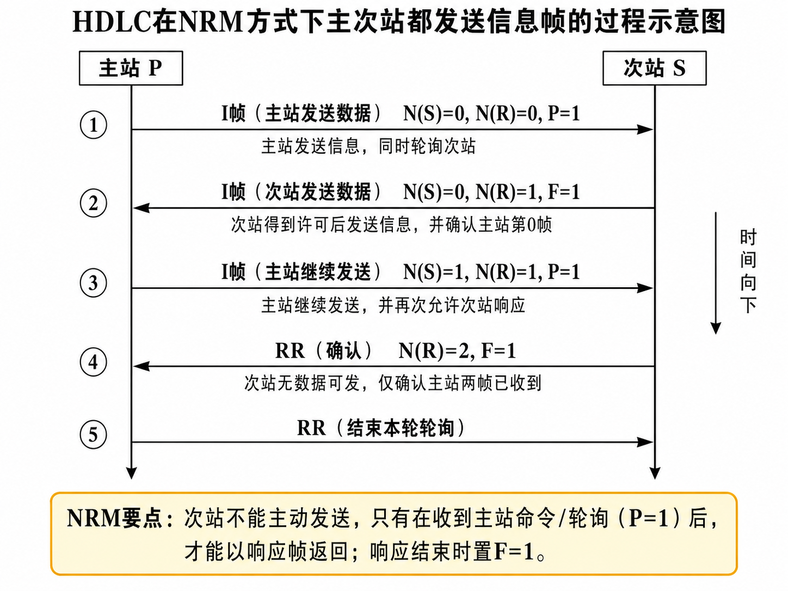

# 第10章 数据通信的接口及规程

## 10.1 串行通信接口标准

数据通信接口和规程主要对应 OSI 参考模型中的物理层和数据链路层。

物理层主要规定接口的四类特性：

| 特性 | 含义 |
|---|---|
| 机械特性 | 规定连接器形状、尺寸、引脚排列等 |
| 电气特性 | 规定电压范围、电平含义、信号方向等 |
| 过程特性 | 规定各控制信号出现的先后顺序 |
| 功能特性 | 规定每根线、每个引脚所表示的功能 |

数据链路层主要规定信息格式、编码、差错控制、同步、顺序控制、流量控制和链路管理等内容。

---

### 10.1.1 RS-232C 接口

RS-232C 是一种串行通信接口标准。

其中：

| 名称 | 含义 |
|---|---|
| RS | Recommended Standard，推荐标准 |
| 232 | 标准编号 |
| C | 版本号 |

RS-232C 规定通信双方传输的是串行二进制数据，同时还规定一些用于协调通信过程的控制信号。

RS-232C 常用于 DTE 与 DCE 之间的连接。

| 缩写 | 英文 | 含义 |
|---|---|---|
| DTE | Data Terminal Equipment | 数据终端设备，如计算机、终端 |
| DCE | Data Circuit-terminating Equipment | 数据通信设备，如 Modem |

RS-232C 的传输速率较低，典型范围为 $0\sim 20\text{ kbps}$。它曾经被广泛使用，但现在许多应用已经被 USB 等接口取代。

---

### RS-232C 常用引脚

25 针 RS-232C 接口中常见引脚如下。

| 引脚号 | 缩写 | 英文 | 中文含义 | 方向理解 |
|---|---|---|---|---|
| 1 | PG | Protective Ground | 保护地 | 保护接地 |
| 2 | TxD | Transmitted Data | 发送数据 | DTE 向 DCE 发送数据 |
| 3 | RxD | Received Data | 接收数据 | DTE 从 DCE 接收数据 |
| 4 | RTS | Request To Send | 请求发送 | DTE 请求 DCE 允许发送 |
| 5 | CTS | Clear To Send | 允许发送 | DCE 通知 DTE 可以发送 |
| 6 | DSR | Data Set Ready | 数据设备准备好 | DCE 通知 DTE 自己已准备好 |
| 7 | SG | Signal Ground | 信号地 | 信号公共参考地 |
| 8 | DCD | Data Carrier Detect | 载波检测 | DCE 通知 DTE 检测到载波 |
| 20 | DTR | Data Terminal Ready | 数据终端准备好 | DTE 通知 DCE 自己已准备好 |
| 22 | RI | Ring Indicator | 振铃提示 | DCE 通知 DTE 有呼叫到来 |

这些引脚中，最常考的是 TxD、RxD、RTS、CTS、DTR、DSR、DCD、RI。

---

### RTS、CTS、DTR、DSR 的作用

RTS 和 CTS 是一组发送控制信号。

DTE 要发送数据时，先向 DCE 发出 RTS，表示“我请求发送”。如果 DCE 可以接收或允许发送，就返回 CTS。DTE 收到 CTS 后，才开始通过 TxD 发送数据。

过程可以写成：

$$
\text{DTE 发 RTS} \rightarrow \text{DCE 回 CTS} \rightarrow \text{DTE 经 TxD 发送数据}
$$

DTR 和 DSR 是一组设备就绪信号。

DTE 准备好工作后，向 DCE 发出 DTR，表示“数据终端已准备好”。DCE 准备好后，向 DTE 返回 DSR，表示“数据通信设备已准备好”。

过程可以写成：

$$
\text{DTE 发 DTR} \rightarrow \text{DCE 回 DSR}
$$

所以：

| 信号组 | 作用 |
|---|---|
| RTS / CTS | 解决“能不能发送数据” |
| DTR / DSR | 解决“设备是否已经准备好” |

DTR、DSR 是设备状态确认；RTS、CTS 是发送动作许可。两组信号不能混为一谈。

---

### 使用 Modem 时的连接

使用 Modem 时，典型链路为：

$$
\text{DTE} \rightarrow \text{DCE} \rightarrow \text{信道} \rightarrow \text{DCE} \rightarrow \text{DTE}
$$

其中，DTE 通常是计算机或终端，DCE 通常是 Modem 或其他通信设备。

发送数据时，DTE 通过 TxD 把数据交给 DCE；接收数据时，DCE 通过 RxD 把数据交给 DTE。

---

### 两接口直接相连时的连接

如果两个 DTE 设备直接连接，通常需要交叉连接。

最基本的数据线交叉关系为：

| 一端 | 另一端 | 作用 |
|---|---|---|
| TxD | RxD | 发送数据接到对方接收数据 |
| RxD | TxD | 接收数据接到对方发送数据 |

如果控制线也需要使用，则 RTS、CTS、DTR、DSR 等也要按通信要求进行交叉或适当连接。

---

## 10.1.2 通用串行总线 USB

USB 是 Universal Serial Bus 的缩写，即通用串行总线。

USB 也是一种串行通信接口标准，主要应用于 PC 与外部设备之间的连接。

USB 的主要优点包括：

1. 速度快。
2. 成本低。
3. 使用方便。
4. 支持热插拔。
5. 可连接多个设备。
6. 不需要外接电源即可为一些设备供电。

---

### USB 电缆

标准 USB 电缆通常包括四根线。

| 线名 | 含义 |
|---|---|
| $V_{BUS}$ | 电源线 |
| D+ | 数据正线 |
| D- | 数据负线 |
| GND | 地线 |

其中 D+ 和 D- 构成差分信号线，用于传输数据。

---

### USB 接口类型

USB 物理接口常见类型包括：

| 类型 | 常见位置或用途 |
|---|---|
| Type-A | 通常出现在 PC、主机端 |
| Type-B | 通常出现在打印机等外设端 |
| Mini USB | 小型设备早期常用 |
| Micro USB | 手机、移动设备曾经常用 |
| Type-C | 新型接口，支持正反插 |

---

### 上行端口和下行端口

USB 设备通常有“上行”和“下行”之分。

| 端口 | 含义 |
|---|---|
| 上行端口 | 连接主机方向的端口 |
| 下行端口 | 连接外设方向的端口 |

A 系列接口通常出现在 PC 主机上，B 系列接口通常出现在 USB 设备上。

---

### USB 编码方式

USB 采用 NRZI 编码方式，即翻转不归零制。

NRZI 的基本思想是用电平是否翻转来表示数据，而不是直接用高低电平表示 $0$ 和 $1$。

在 USB 中还会使用位填充技术，以保证信号中有足够的跳变，便于接收端同步。

---

### USB 系统的软件组成

USB 系统的软件部分通常包括：

| 软件 | 作用 |
|---|---|
| 主控制器驱动程序 | 调度 USB 交换，并通过 HUB 完成交换初始化 |
| 设备驱动程序 | 驱动具体 USB 设备 |
| USB 芯片驱动程序 | 读取设备描述信息，并根据设备特征组织数据传输 |

USB 设备要正常工作，不仅要物理连接正确，还需要主机能够识别设备、加载相应驱动，并完成设备配置。

---

### USB 传输方式

USB 总线采用轮询方式。

USB 支持四类数据流：

| 数据流 | 对应传输方式 | 特点 |
|---|---|---|
| 控制信号流 | 控制传输方式 | 用于设备配置、命令和状态信息 |
| 批量数据流 | 批量传输方式 | 可靠传输，适合大量数据，对实时性要求不高 |
| 中断数据流 | 中断传输方式 | 小规模、低延迟、固定周期访问 |
| 实时数据流 | 实时传输方式 | 周期性、连续传输，适合音频、视频等实时数据 |

四种传输方式如下：

| 传输方式 | 主要用途 | 特点 |
|---|---|---|
| 控制传输 | 设备配置、命令请求、状态响应 | 主机发起，用于管理 |
| 中断传输 | 鼠标、键盘等小数据量设备 | 延迟小，数据量小 |
| 实时传输 | 音频、视频 | 保证实时性，但对差错恢复要求较低 |
| 批量传输 | 打印、文件传输等 | 可靠，发现错误可重传 |

---

## 10.2 数据链路传输控制规程

数据链路传输控制规程的主要功能包括：

| 功能 | 含义 |
|---|---|
| 帧同步 | 使接收端能确定一帧的开始和结束 |
| 差错控制 | 发现或纠正传输错误 |
| 流量控制 | 控制发送速率，避免接收方来不及处理 |
| 链路管理 | 建立连接、维持连接、释放连接 |

其中，帧同步和差错控制是最核心的内容。

---

### 为什么要数据成帧

数据在物理线路上传输时，本质上是一串连续的比特流。接收端如果不知道哪里是一帧的开始，哪里是一帧的结束，就无法正确解释数据。

因此需要把连续比特流划分为一个个数据帧。

常用的成帧方法有：

1. 字节计数法。
2. 字符或比特填充的首尾定界符法。
3. 违例编码法。

---

## 面向字符型传输控制规程

面向字符型传输控制规程以字符为信息传输的基本单位，常见代表是 BSC 规程。

它使用一组 ASCII 控制字符来完成帧定界、确认、否认、询问、同步等控制功能。

---

### 常用的 10 个 ASCII 控制字符

| 控制字符 | 英文 | 编码 | 含义 | 类型 |
|---|---|---|---|---|
| SOH | Start of Head | 0000001 | 报头开始 | 格式控制 |
| STX | Start of Text | 0000010 | 文本开始 | 格式控制 |
| ETX | End of Text | 0000011 | 文本结束 | 格式控制 |
| EOT | End of Transmission | 0000100 | 传输结束 | 规程控制 |
| ENQ | Enquiry | 0000101 | 询问对方，并要求回答 | 规程控制 |
| ACK | Acknowledge | 0000110 | 确认应答 | 规程控制 |
| NAK | Negative Acknowledge | 0010101 | 否认应答 | 规程控制 |
| DLE | Data Link Escape | 0010000 | 转义字符 | 格式控制 |
| SYN | Synchronous | 0010110 | 同步 | 规程控制 |
| ETB | End of Transmission Block | 0010111 | 文本信息块结束 | 格式控制 |

一般来说，SOH、STX、ETX、DLE、ETB 更偏向格式控制；EOT、ENQ、ACK、NAK、SYN 更偏向规程控制。

---

### 面向字符型规程的特点

面向字符型传输控制规程具有以下特点：

1. 以字符作为信息传输的基本单位。
2. 发送一组信息前，通常要得到对方许可和认可。
3. 只能半双工传输。
4. 可以采用同步传输，也可以采用异步传输。
5. 必须考虑信息编码，例如 ISO 的基本型规程采用国际标准 5 号码。

它的不足主要有：

1. 通信线路利用率较低。
2. 可靠性较差。
3. 数据传输不够透明。
4. 对非字符型数据不够方便。

面向比特型规程对这些不足进行了改进，尤其是用比特定界和比特填充提高了透明性。

---

### 字符填充

面向字符型规程中，如果用户数据中出现了与控制字符相同的内容，就可能被接收方误认为是控制信息。

例如，若用：

$$
\text{DLE STX}
$$

表示正文开始，用：

$$
\text{DLE ETX}
$$

表示正文结束，那么当正文中本身出现 DLE 时，就需要进行字符填充。

基本规则是：

在正文数据中，每出现一个 DLE，就在其前面再插入一个 DLE。

接收端收到数据后，如果在正文中看到连续两个 DLE，就删除其中一个，把另一个作为普通数据处理。

---

## 面向比特型传输控制规程

面向比特型传输控制规程以比特为基本处理单位，典型代表是 HDLC。

与面向字符型规程相比，面向比特型规程的优点是：

1. 不依赖具体字符集。
2. 数据透明性更好。
3. 传输效率更高。
4. 适合二进制数据通信。
5. 差错控制能力较强。

---

## HDLC 规程

HDLC 是 High-level Data Link Control 的缩写，即高级数据链路控制规程。

HDLC 是一种面向比特型的数据链路控制规程。

---

### HDLC 基本特征

HDLC 协议具有以下基本特征：

1. 适用于点到点链路和点到多点链路。
2. 适用于长距离链路和短距离链路。
3. 采用统一的帧格式。
4. 使用唯一的标志符 F 作为帧定界符。
5. 允许连续发送。
6. 支持半双工或全双工操作。
7. 所有数据和控制信息都采用差错控制校验。

HDLC 使用的帧标志符为：

$$
F = 01111110
$$

该标志符出现在帧的开始和结束处，用于帧同步和帧定界。

---

### HDLC 的站点类型

HDLC 中有三种类型的站点。

| 站点 | 含义 |
|---|---|
| 主站 | 负责链路全面管理，可以发起传输、组织数据流、执行差错控制和恢复 |
| 次站 | 受主站控制，只能按照主站命令执行响应操作 |
| 组合站 | 既能发送命令帧，又能接收命令帧和响应帧，并负责链路控制 |

记忆方式：

主站主动管理，次站被动响应，组合站两者兼有。

---

### HDLC 的链路结构

HDLC 有三种链路结构。

| 链路结构 | 特点 |
|---|---|
| 非平衡集中式 | 一个主站控制一个或多个次站 |
| 对称结构 | 两端各有主站和次站功能 |
| 平衡结构 | 两端都是组合站 |

其中，非平衡结构常用于主从式通信；平衡结构常用于对等通信。

---

### HDLC 的数据传输方式

HDLC 有三种数据传输方式。

| 方式 | 英文 | 适用场景 | 特点 |
|---|---|---|---|
| NRM | Normal Response Mode | 非平衡数据链路 | 主站启动传输，次站只有收到主站命令后才能发送 |
| ARM | Asynchronous Response Mode | 非平衡数据链路 | 信道空闲时，从站可以不经主站许可而发起传输 |
| ABM | Asynchronous Balanced Mode | 平衡数据链路 | 每个站都是组合站，都可以启动传输 |

其中，NRM 是正常响应方式，常用于主从结构；ABM 是异步平衡方式，常用于对等结构。

---

## HDLC 帧结构

HDLC 的一般帧格式为：

$$
F \quad A \quad C \quad I \quad FCS \quad F
$$

各字段含义如下。

| 字段 | 名称 | 含义 |
|---|---|---|
| F | 标志字段 | 帧开始和帧结束的标志，固定为 01111110 |
| A | 地址字段 | 表示站点地址 |
| C | 控制字段 | 表示帧类型、命令或响应、序号等 |
| I | 信息字段 | 传输用户数据或管理信息 |
| FCS | 帧校验序列 | 用于差错检测，通常采用 CRC |
| F | 标志字段 | 帧结束标志 |

---

### 标志字段 F

标志字段 F 固定为：

$$
01111110
$$

作用是确定帧的边界。

如果两个 HDLC 帧连续发送，前一帧的结束 F 可以同时作为后一帧的开始 F。

---

### 地址字段 A

地址字段 A 用于指出站点地址。

在主从方式中：

1. 主站发出的命令帧中，地址字段通常表示目的从站地址。
2. 从站发出的响应帧中，地址字段通常表示该从站自己的地址。

在对等方式中，地址字段一般表示目的站地址。

教材中一般把 A 字段看作 8 位地址字段，但也可以扩展为多字节地址字段。

---

### 控制字段 C

控制字段 C 是判断 HDLC 帧类型的关键字段。

HDLC 有三类帧：

| 帧类型 | 名称 | 作用 |
|---|---|---|
| I 帧 | 信息帧 | 传输用户数据，并可捎带确认 |
| S 帧 | 监控帧 | 进行差错控制和流量控制 |
| U 帧 | 无序号帧 | 进行链路建立、拆除和其他管理功能 |

控制字段的开头可以用来判断帧类型：

| 控制字段特征 | 帧类型 |
|---|---|
| 第 1 位为 0 | I 帧 |
| 第 1、2 位为 10 | S 帧 |
| 第 1、2 位为 11 | U 帧 |

注意：教材和课件中讲 HDLC 控制字段时，可能按“控制字段比特编号顺序”解释，而不是按普通二进制数的最高位、最低位来理解。做题时要按题目和表格给出的比特顺序判断，不要把 F 字段的 01111110 和 C 字段的开头混在一起。

---

### I 帧

I 帧用于传输用户数据，也可以捎带确认。

I 帧控制字段一般包含：

| 项目 | 含义 |
|---|---|
| $N(S)$ | 发送帧序号 |
| P/F | 询问/终止位 |
| $N(R)$ | 接收帧序号，也就是确认序号 |

其中：

1. $N(S)$ 表示本帧的发送序号。
2. $N(R)$ 表示期望接收的下一帧序号，因此可以起到确认作用。
3. P/F 位在命令帧中称为 P 位，在响应帧中称为 F 位。

I 帧一定可以携带用户数据。

---

### S 帧

S 帧称为监控帧，无信息字段，主要用于差错控制和流量控制。

常见 S 帧包括：

| 名称 | 英文 | 功能 |
|---|---|---|
| RR | Receive Ready | 接收就绪 |
| REJ | Reject | 拒绝接收，用于要求重发 |
| RNR | Receive Not Ready | 接收未就绪 |
| SREJ | Selective Reject | 选择拒绝 |

S 帧没有发送帧序号 $N(S)$，但通常有确认序号 $N(R)$。

---

### U 帧

U 帧称为无序号帧，主要用于链路管理。

U 帧通常没有发送序号和确认序号。

常见 U 帧包括：

| 名称 | 英文 | 功能 |
|---|---|---|
| UI | Unnumbered Information | 无编号信息 |
| SNRM | Set Normal Response Mode | 置正常响应方式 |
| DISC | Disconnect | 断链 |
| UA | Unnumbered Acknowledgement | 无编号确认 |
| TEST | Test | 测试 |
| SABM | Set Asynchronous Balanced Mode | 置异步平衡方式 |
| XID | Exchange Identification | 交换标识 |

U 帧一般用于链路建立、链路释放、方式设置、无编号信息传输等。

做题时，如果题目要求判断 U 帧具体命令，一般需要查控制字段编码表；如果教材没有给表，通常只要求识别常见命令或根据题图提示判断。

---

### 信息字段 I

信息字段的含义取决于帧类型。

| 帧类型 | 信息字段 |
|---|---|
| I 帧 | 包含用户数据 |
| S 帧 | 一般没有信息字段 |
| U 帧 | 一般用于管理信息，有些 U 帧可以带管理数据 |

所以判断“是否携带用户数据”时，重点看是不是 I 帧。

判断“是否携带管理数据”时，重点看是不是 U 帧，以及题目中是否给出了 U 帧对应的管理命令。

---

### 帧校验序列 FCS

FCS 是 Frame Check Sequence，即帧校验序列。

HDLC 中 FCS 通常采用 CRC 校验。

校验范围一般从地址字段 A 的第 1 位开始，到信息字段 I 的最后 1 位结束。由透明传输而插入的 $0$ 不属于校验范围。

常见 CRC 生成多项式形式为：

$$
g(x)=x^{16}+x^{12}+x^5+1
$$

---

## “0”比特插入与删除

由于 HDLC 使用：

$$
01111110
$$

作为标志字段，如果在帧的数据内容中也出现 01111110，接收端就可能误认为这是帧结束。

为避免这种情况，HDLC 使用 “0” 比特插入与删除技术。

发送端规则：

在两个标志字段之间的帧内容中，每当连续发送 5 个 $1$ 后，就自动插入一个 $0$。

接收端规则：

接收端在帧内容中检查到连续 5 个 $1$ 后，如果下一位是 $0$，就删除这个 $0$；如果后续形成 01111110，则识别为标志字段。

---

### 例：0 比特插入

原始比特串为：

$$
01000001111110101111110
$$

检查连续 5 个 $1$：

$$
0100000\underline{11111}1010\underline{11111}10
$$

每个连续 5 个 $1$ 后插入一个 $0$，得到：

$$
0100000111110101011111010
$$

---

## HDLC 中的无效帧、放弃和帧间填充

与帧结构相关的常见概念如下。

| 概念 | 含义 |
|---|---|
| 无效帧 | 没有用两个标志序列定界的帧，或帧内容少于 32 比特 |
| 放弃 | 帧结尾出现不少于 7 个连续 $1$ 时，表示该帧应丢弃 |
| 帧间填充 | 帧与帧之间可以连续发送标志序列 F，或发送连续高电平作为空闲信号 |
| 工作状态 | 某站正在发送数据帧，或发送连续标志符，或出现连续 7 个 $1$ |
| 空闲状态 | 接收端检测到连续 15 个以上的 $1$，表示链路空闲 |

注意：HDLC 一帧内部必须连续传输，不能有空隙和停顿。

---

## HDLC 操作规程

HDLC 的基本操作过程可以分为：

1. 建立连接。
2. 传送数据。
3. 释放连接。

建立连接时，可以通过发送“置方式命令”，并收到 UA 响应来完成。

传输数据时，使用 I 帧发送用户数据。

释放连接时，可以通过 DISC 命令和 UA 响应完成链路拆除。

---

## 10.3 规程应用举例

### 链路建立与拆除过程

典型过程为：

1. A 站向 B 站发送 SABM 命令，请求建立异步平衡方式。
2. 如果超时未收到响应，A 站可以重发 SABM。
3. B 站收到后返回 UA 响应。
4. 数据传输完成后，一方发送 DISC 命令请求拆链。
5. 对方返回 UA 响应，链路释放。

---

### 全双工数据交换过程

在全双工方式下，双方可以同时发送和接收数据。

I 帧中的 $N(S)$ 用于表示本端发送帧序号，$N(R)$ 用于确认对方已经正确收到的帧。

例如，如果某帧中：

$$
N(S)=2,\quad N(R)=4
$$

则表示：

1. 本帧是发送方的第 2 号信息帧。
2. 发送方已经正确收到对方 0、1、2、3 号帧，下一帧期望接收 4 号帧。

---

### 用 REJ 进行差错恢复

REJ 是拒绝接收帧。

如果接收方发现某个帧出错，可以发送 REJ，并在 $N(R)$ 中指出希望对方从哪一帧开始重发。

例如：

$$
\text{REJ},\quad N(R)=4
$$

表示接收方要求发送方从第 4 号帧开始重发。

---

### 多点链路控制

在多点链路中，主站可以通过轮询、选择等方式控制各从站。

常见命令有：

| 命令 | 功能 |
|---|---|
| RR | 接收就绪 |
| RNR | 接收未就绪 |
| REJ | 要求重发 |
| SREJ | 选择性重发 |

---

## 10.4 HDLC 的子集与相关协议

HDLC 的命令和响应非常丰富，能够适应多种应用环境。但在具体应用中，通常不必实现全部功能。

常见的基于 HDLC 的数据链路控制协议有：

| 协议 | 含义 |
|---|---|
| LAP | Link Access Procedure，链路访问协议 |
| LAPB | Link Access Procedure Balanced，平衡链路访问协议 |
| LAPD | Link Access Procedure on the D channel，D 通道链路访问协议 |
| LLC | Logical Link Control，逻辑链路控制协议 |

这些协议可以看作 HDLC 的子集或相关协议。

---

# 课后习题

## 1. 传输控制规程主要包括哪些内容？你认为最关键的是什么？

传输控制规程主要包括：

1. 帧同步。
2. 差错控制。
3. 流量控制。
4. 链路管理。

其中最关键的是帧同步和差错控制。

帧同步保证接收端知道一帧从哪里开始、到哪里结束；差错控制保证接收端能够发现传输错误。若没有帧同步，数据无法正确分组；若没有差错控制，数据可靠性无法保证。

---

## 2. 面向字符的控制规程中常用的 10 个通信控制字符是什么？哪些用于格式控制？哪些用于规程控制？

常用 10 个通信控制字符如下：

| 控制字符 | 含义 | 作用分类 |
|---|---|---|
| SOH | 报头开始 | 格式控制 |
| STX | 文本开始 | 格式控制 |
| ETX | 文本结束 | 格式控制 |
| EOT | 传输结束 | 规程控制 |
| ENQ | 询问对方，并要求回答 | 规程控制 |
| ACK | 确认应答 | 规程控制 |
| NAK | 否认应答 | 规程控制 |
| DLE | 转义字符 | 格式控制 |
| SYN | 同步 | 规程控制 |
| ETB | 文本信息块结束 | 格式控制 |

格式控制字符主要用于划分报文结构；规程控制字符主要用于询问、应答、同步和结束传输。

---

## 3. 简述 USB 接口的特点。

USB 接口的主要特点有：

1. 传输速度较快。
2. 使用方便。
3. 支持热插拔。
4. 可连接多个外设。
5. 成本较低。
6. 可为部分外部设备供电。
7. 即插即用，便于主机自动识别和配置设备。

---

## 4. USB 总线由哪几个主要部分组成？

USB 总线主要由以下几部分组成：

1. USB 主机。
2. USB 设备。
3. USB 集线器 HUB。
4. USB 连接电缆和接口。
5. USB 软件系统，包括主控制器驱动程序、设备驱动程序和 USB 芯片驱动程序。

从物理连接看，USB 电缆一般包括 $V_{BUS}$、D+、D- 和 GND 四根线。

---

## 5. 一个 USB 设备要正常工作，必须满足哪些条件？

一个 USB 设备要正常工作，一般需要满足：

1. 物理接口连接正确。
2. 设备获得合适的供电。
3. 主机能够识别该 USB 设备。
4. 主机完成设备枚举和配置。
5. 系统加载相应的设备驱动程序。
6. 主机和设备之间建立正确的数据传输通道。

---

## 6. 为什么要数据成帧，有哪些常用的方法？

数据在物理线路上传输时表现为连续比特流。为了让接收端能识别数据的开始和结束，必须进行数据成帧。

常用成帧方法有：

1. 字节计数法。
2. 字符或比特填充的首尾定界符法。
3. 违例编码法。

其中 HDLC 采用标志字段加“0”比特插入/删除的方法进行帧定界和透明传输。

---

## 7. 数据链路控制对于保证数据通过物理线路传输的正确性是非常重要的。数据链路控制的功能主要包括哪几方面的内容？

数据链路控制的主要功能包括：

1. 帧同步。
2. 差错控制。
3. 流量控制。
4. 链路管理。

其中，帧同步用于确定帧边界；差错控制用于发现或恢复错误；流量控制用于防止发送方发送过快；链路管理用于建立、维持和释放数据链路。

---

## 8. 在数据帧的传输过程中，为什么要采用“0”比特插入/删除技术？试说明它的基本工作原理。

HDLC 使用：

$$
01111110
$$

作为帧标志。如果帧内容中也出现这个比特序列，接收端会误以为帧已经结束。

因此需要采用“0”比特插入/删除技术。

发送端规则：

在两个标志字段之间，每当出现连续 5 个 $1$ 后，发送端自动插入一个 $0$。

接收端规则：

接收端检测到连续 5 个 $1$ 后，如果下一位是 $0$，就删除这个 $0$，恢复原始数据；如果后续形成标志字段，则作为帧边界处理。

---

## 9. 下列字符是字符型控制规程从相邻高层接收来的数据，准备组帧交给物理层发送，为了能够以透明方式传送，必须进行字符填充。问字符填充后的输出是什么？

题目给出的数据为：

$$
\text{DLE STX DLE A DLE ETX}
$$

字符填充规则是：正文中每出现一个 DLE，就在它前面再插入一个 DLE。

因此，加上帧开始和帧结束控制字符后，输出为：

$$
\text{DLE STX DLE DLE STX DLE DLE A DLE DLE ETX DLE ETX}
$$

其中，最前面的 DLE STX 表示正文开始，最后的 DLE ETX 表示正文结束，中间被加倍的 DLE 是为了保证透明传输。

---

## 10. 若 HDLC 帧数据段中出现比特串“01000001111110101111110”，问比特填充后的输出是什么？

原比特串为：

$$
01000001111110101111110
$$

对连续 5 个 $1$ 后插入 $0$：

$$
0100000\underline{11111}1010\underline{11111}10
$$

因此，填充后的输出为：

$$
0100000111110101011111010
$$

---

## 11. 面向字符的传输控制规程有哪些特点和不足？有哪些不足在面向比特的传输控制规程中得到改进？

面向字符的传输控制规程的特点有：

1. 以字符为传输单位。
2. 使用特定控制字符完成同步、确认、结束等功能。
3. 可以采用同步或异步方式。
4. 通常用于半双工通信。
5. 需要考虑字符编码。

不足有：

1. 依赖具体字符集。
2. 透明传输能力较差。
3. 通信线路利用率较低。
4. 对任意二进制数据不够方便。

面向比特的传输控制规程改进了这些不足：

1. 以比特为处理单位，不依赖具体字符集。
2. 使用标志字段和比特填充实现透明传输。
3. 支持连续发送，效率较高。
4. 差错控制能力更强。

---

## 12. HDLC 的地址字段中包含的是哪个站的地址？

HDLC 地址字段 A 的含义与通信方式有关。

在主从方式中：

1. 主站发送命令帧时，地址字段通常是目的从站地址。
2. 从站发送响应帧时，地址字段通常是该从站自己的地址。

在对等方式中，地址字段通常表示目的站地址。

因此，不能简单说地址字段永远表示发送站或接收站，要结合链路结构和帧方向判断。

---

## 13. 在 HDLC 规程的 NRM 方式下，试画出主次站都发送信息帧的过程示意图。

---

## 14. 主站点向从站点发送如图 P10-1 所示的三种 HDLC 帧。分别回答如下问题：

题目给出的三种帧可按 HDLC 帧结构理解为：

$$
F \quad A \quad C \quad I \quad FCS \quad F
$$

其中：

| 字段 | 含义 |
|---|---|
| $F$ | 标志字段，固定为 $01111110$ |
| $A$ | 地址字段 |
| $C$ | 控制字段，用来判断帧类型、序列号等 |
| $I$ | 信息字段，可能是用户数据或管理数据 |
| $FCS$ | 帧校验序列 |

做题时，先把每一帧拆成：

$$
F \mid A \mid C \mid I \mid FCS \mid F
$$

然后根据 $C$ 字段判断帧类型。

---

### （1）图 a

图 a 的帧为：

$$
01111110\quad 00001111\quad 10001011\quad FCS\quad 01111110
$$

因此：

| 字段 | 内容 |
|---|---|
| $F$ | $01111110$ |
| $A$ | $00001111$ |
| $C$ | $10001011$ |
| $FCS$ | $FCS$ |
| $F$ | $01111110$ |

由于主站点向从站点发送，所以地址字段 $A$ 表示从站点地址：

$$
A=00001111
$$

控制字段为：

$$
C=10001011
$$

按 HDLC 控制字段判断：

$$
C=10\ 00\ 1\ 011
$$

其中：

| 部分 | 含义 |
|---|---|
| $10$ | 表示该帧为 $S$ 帧，即监控帧 |
| $00$ | 监控功能码，表示 $RR$，即接收就绪 |
| $1$ | $P/F$ 位 |
| $011$ | 确认序列号 $N(R)$ |

所以：

$$
N(R)=011=3
$$

图 a 的结论为：

| 问题 | 答案 |
|---|---|
| 从站点地址 | $00001111$ |
| 帧的类型 | $S$ 帧，监控帧 |
| 发送方序列号 $N(S)$ | 无 |
| 确认序列号 $N(R)$ | $011$，即 $3$ |
| 是否携带用户数据 | 否 |
| 是否携带管理数据 | 无独立信息字段；控制字段表示 $RR$，即接收就绪 |

---

### （2）图 b

图 b 的帧为：

$$
01111110\quad 00000111\quad 00101011\quad 00101110010100001011\quad FCS\quad 01111110
$$

因此：

| 字段 | 内容 |
|---|---|
| $F$ | $01111110$ |
| $A$ | $00000111$ |
| $C$ | $00101011$ |
| $I$ | $00101110010100001011$ |
| $FCS$ | $FCS$ |
| $F$ | $01111110$ |

地址字段为：

$$
A=00000111
$$

所以从站点地址为：

$$
00000111
$$

控制字段为：

$$
C=00101011
$$

按 HDLC 控制字段判断：

$$
C=0\ 010\ 1\ 011
$$

其中：

| 部分 | 含义 |
|---|---|
| $0$ | 表示该帧为 $I$ 帧，即信息帧 |
| $010$ | 发送序列号 $N(S)$ |
| $1$ | $P/F$ 位 |
| $011$ | 确认序列号 $N(R)$ |

所以：

$$
N(S)=010=2
$$

$$
N(R)=011=3
$$

信息字段为：

$$
I=00101110010100001011
$$

因为这是 $I$ 帧，所以该信息字段是用户数据。

图 b 的结论为：

| 问题 | 答案 |
|---|---|
| 从站点地址 | $00000111$ |
| 帧的类型 | $I$ 帧，信息帧 |
| 发送方序列号 $N(S)$ | $010$，即 $2$ |
| 确认序列号 $N(R)$ | $011$，即 $3$ |
| 是否携带用户数据 | 是 |
| 用户数据的值 | $00101110010100001011$ |
| 是否携带管理数据 | 否 |

---

### （3）图 c

图 c 的帧为：

$$
01111110\quad 10000111\quad 11001011\quad 00101\cdots 00001011\quad FCS\quad 01111110
$$

因此：

| 字段 | 内容 |
|---|---|
| $F$ | $01111110$ |
| $A$ | $10000111$ |
| $C$ | $11001011$ |
| $I$ | $00101\cdots 00001011$ |
| $FCS$ | $FCS$ |
| $F$ | $01111110$ |

地址字段为：

$$
A=10000111
$$

所以从站点地址为：

$$
10000111
$$

控制字段为：

$$
C=11001011
$$

按 HDLC 控制字段判断：

$$
C=11\ 001011
$$

其中开头为 $11$，所以该帧为 $U$ 帧，即无序号帧。

$U$ 帧没有发送序列号 $N(S)$，也没有确认序列号 $N(R)$。

信息字段为：

$$
I=00101\cdots 00001011
$$

由于 $U$ 帧主要用于链路管理，因此这里的信息字段不是用户数据，而是管理数据。

图 c 的结论为：

| 问题 | 答案 |
|---|---|
| 从站点地址 | $10000111$ |
| 帧的类型 | $U$ 帧，无序号帧 |
| 发送方序列号 $N(S)$ | 无 |
| 确认序列号 $N(R)$ | 无 |
| 是否携带用户数据 | 否 |
| 是否携带管理数据 | 是 |
| 管理数据的值 | $00101\cdots 00001011$ |

---

### 第 14 题汇总表

| 图号 | 地址字段 $A$ | 控制字段 $C$ | 帧类型 | $N(S)$ | $N(R)$ | 用户数据 | 管理数据 |
|---|---|---|---|---|---|---|---|
| a | $00001111$ | $10001011$ | $S$ 帧 | 无 | $011=3$ | 无 | 无独立信息字段，控制字段表示 $RR$ |
| b | $00000111$ | $00101011$ | $I$ 帧 | $010=2$ | $011=3$ | $00101110010100001011$ | 无 |
| c | $10000111$ | $11001011$ | $U$ 帧 | 无 | 无 | 无 | $00101\cdots 00001011$ |

---

### 本题易错点

本题最容易错在只判断帧类型，而没有继续把 $N(S)$ 和 $N(R)$ 写出来。

判断方法是：

1. 若 $C$ 字段开头是 $0$，则为 $I$ 帧。

$$
C=0\ N(S)\ P/F\ N(R)
$$

2. 若 $C$ 字段开头是 $10$，则为 $S$ 帧。

$$
C=10\ SS\ P/F\ N(R)
$$

3. 若 $C$ 字段开头是 $11$，则为 $U$ 帧。

$$
C=11\ \text{功能编码}
$$

因此：

- $I$ 帧有 $N(S)$ 和 $N(R)$；
- $S$ 帧没有 $N(S)$，但有 $N(R)$；
- $U$ 帧没有 $N(S)$，也没有 $N(R)$。